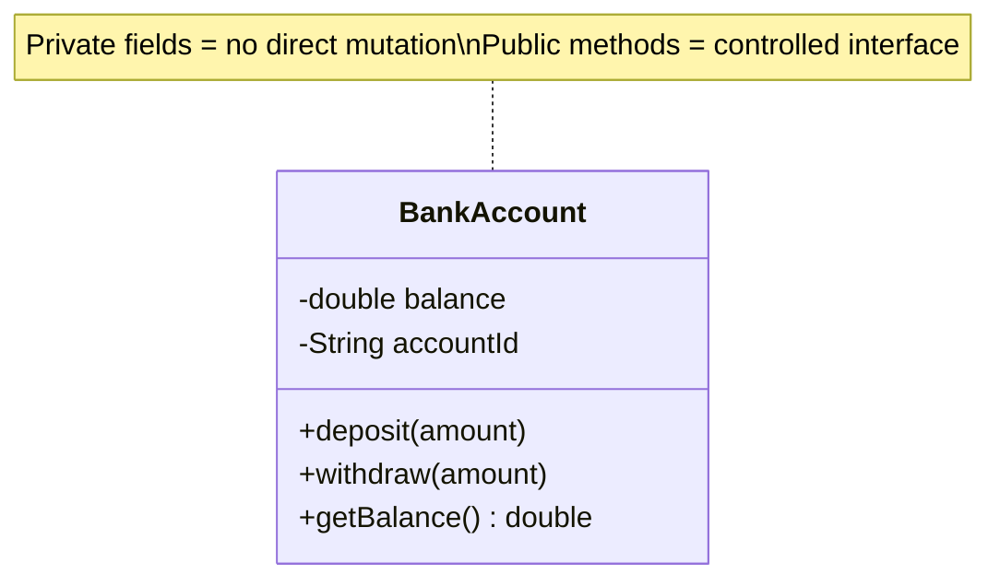
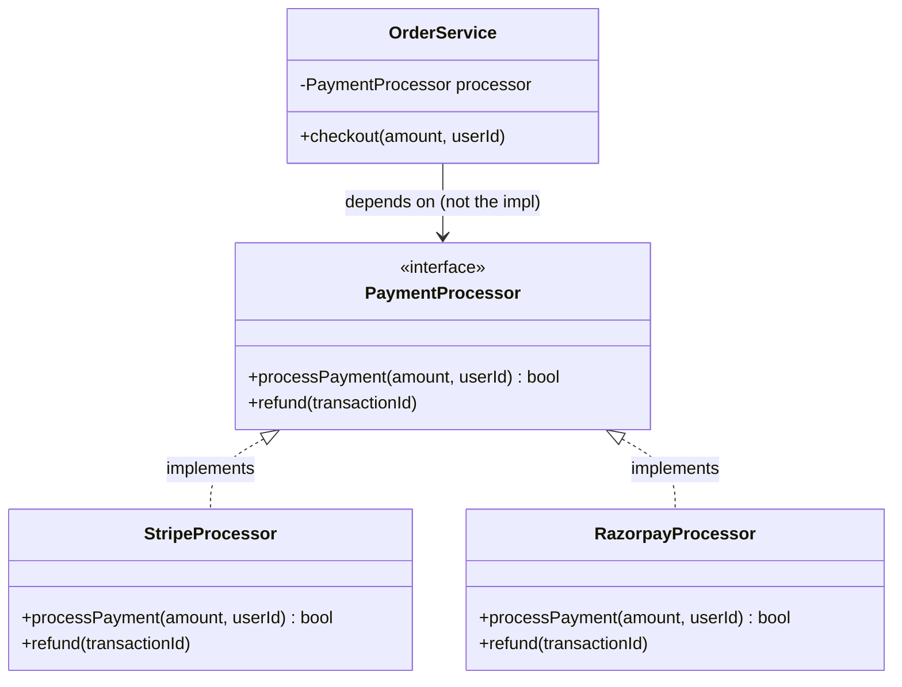
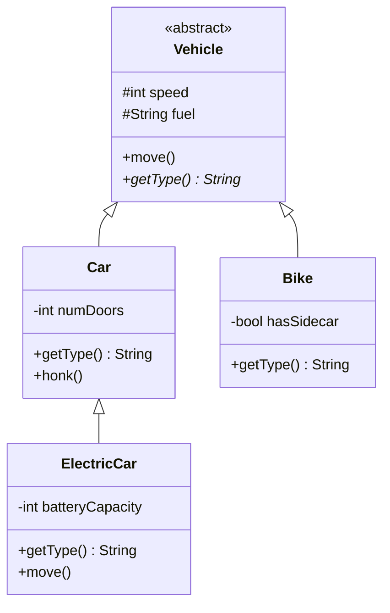
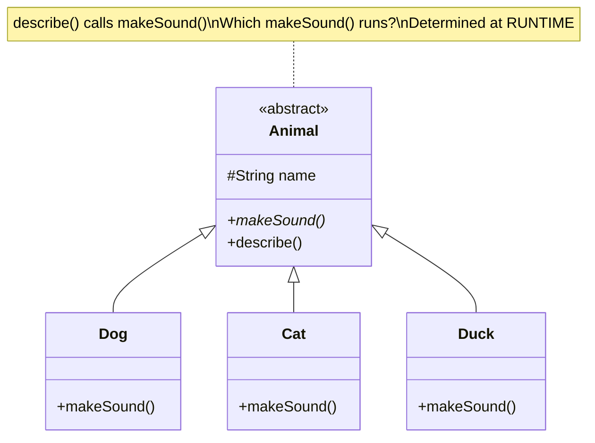
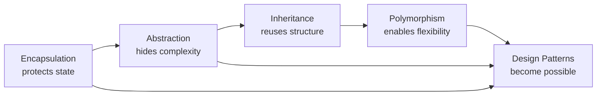

# Module 01 — OOP Foundations

> **Prerequisites**: None  
> **Next**: [Module 02 → SOLID Principles](./02_SOLID_Principles.md)

---

## Why Does This Module Exist?

Before you can understand *why* design patterns work, you need to deeply understand the 4 pillars of OOP — not their textbook definitions, but **what problems each pillar solves**.

Most engineers know OOP. But when asked "why would you use composition over inheritance here?", many struggle. This module fixes that.

---

## Table of Contents

1. [The Core Idea: Modelling the Real World](#1-the-core-idea-modelling-the-real-world)
2. [Pillar 1: Encapsulation](#2-pillar-1-encapsulation)
3. [Pillar 2: Abstraction](#3-pillar-2-abstraction)
4. [Pillar 3: Inheritance](#4-pillar-3-inheritance)
5. [Pillar 4: Polymorphism](#5-pillar-4-polymorphism)
6. [The Big Trap: Inheritance vs Composition](#6-the-big-trap-inheritance-vs-composition)
7. [Quick Revision Cheatsheet](#7-quick-revision-cheatsheet)

---

## 1. The Core Idea: Modelling the Real World

Before OOP, code was just a list of instructions — **procedural programming**. If you wanted to add a new type of entity (e.g., a new kind of user), you'd have to change logic scattered across hundreds of functions. There was no clean way to bundle *data* with the *operations* on that data.

**OOP's answer**: Group related data and behaviour into a single unit — a **class**. Instances of classes are **objects**.

```java
// Without OOP (procedural thinking)
String name = "Alice";
int age = 30;
printUser(name, age);    // function somewhere else, no grouping

// With OOP
class User {
    String name;
    int age;
    void print() { ... }  // data + behaviour together
}
```

The 4 pillars are just *principles* that emerged from making this modelling better and safer.

---

## 2. Pillar 1: Encapsulation

### The Problem It Solves

Imagine a `BankAccount` class with a public `balance` field. Any code anywhere can do:

```java
account.balance = -99999;  // whoops
```

There's no protection. Any part of the system can corrupt the data. As systems grow, this becomes a nightmare to debug.

### The Solution

**Encapsulation** = bundle data + restrict direct access to it. Expose only what's necessary through a controlled interface.

```java
public class BankAccount {
    private double balance;    // hidden from outside
    private String accountId;

    public BankAccount(String id, double initialBalance) {
        this.accountId = id;
        this.balance = initialBalance;
    }

    // Controlled access — business rules live here
    public void deposit(double amount) {
        if (amount <= 0) throw new IllegalArgumentException("Amount must be positive");
        this.balance += amount;
    }

    public void withdraw(double amount) {
        if (amount > balance) throw new IllegalStateException("Insufficient funds");
        this.balance -= amount;
    }

    public double getBalance() {
        return balance;  // read-only; no direct write
    }
}
```

### Key Insight

> Encapsulation is not about `private` keyword. It's about **controlling the ways state can change**. The business rule ("can't withdraw more than balance") lives in one place. If the rule changes, you change it once.

### Diagram



---

## 3. Pillar 2: Abstraction

### The Problem It Solves

When you drive a car, you don't need to know how the engine works. You just use the steering wheel, pedals, and gear. The complexity is *hidden* behind a simple interface.

In code: as systems grow, you're dealing with many complex objects. If every caller needs to know every detail of every object, the cognitive load becomes unbearable.

### The Solution

**Abstraction** = expose only the **what**, hide the **how**. Define a contract (interface or abstract class) that says "here's what I can do" without specifying the implementation.

```java
// The "what" — a contract
interface PaymentProcessor {
    boolean processPayment(double amount, String userId);
    void refund(String transactionId);
}

// The "how" — implementation detail, hidden behind the interface
class StripeProcessor implements PaymentProcessor {
    @Override
    public boolean processPayment(double amount, String userId) {
        // Stripe-specific API calls, token handling, etc.
        System.out.println("Processing via Stripe: " + amount);
        return true;
    }

    @Override
    public void refund(String transactionId) {
        // Stripe-specific refund logic
    }
}

class RazorpayProcessor implements PaymentProcessor {
    @Override
    public boolean processPayment(double amount, String userId) {
        System.out.println("Processing via Razorpay: " + amount);
        return true;
    }

    @Override
    public void refund(String transactionId) { ... }
}

// The caller only knows about the interface — not the implementation
class OrderService {
    private PaymentProcessor processor;  // could be Stripe, Razorpay, anything

    public OrderService(PaymentProcessor processor) {
        this.processor = processor;
    }

    public void checkout(double amount, String userId) {
        boolean success = processor.processPayment(amount, userId);
        if (!success) throw new RuntimeException("Payment failed");
    }
}
```

### Key Insight

> Abstraction enables you to **swap implementations without changing callers**. This is the foundation of the Strategy Pattern, Dependency Injection, and almost every design pattern you'll see later.

### Diagram



---

## 4. Pillar 3: Inheritance

### The Problem It Solves

You have a `Vehicle` class with `fuel`, `speed`, `move()`. Now you need a `Car` and a `Bike`. Without inheritance, you'd copy all the common fields and methods — massive duplication.

### The Solution

**Inheritance** = a child class reuses (and optionally overrides) the behaviour of a parent class.

```java
abstract class Vehicle {
    protected int speed;
    protected String fuel;

    public Vehicle(int speed, String fuel) {
        this.speed = speed;
        this.fuel = fuel;
    }

    public void move() {
        System.out.println("Moving at speed: " + speed);
    }

    // Abstract method — subclasses MUST provide this
    public abstract String getType();
}

class Car extends Vehicle {
    private int numDoors;

    public Car(int speed, int numDoors) {
        super(speed, "Petrol");
        this.numDoors = numDoors;
    }

    @Override
    public String getType() { return "Car"; }

    // Car-specific behaviour
    public void honk() { System.out.println("Beep beep!"); }
}

class ElectricCar extends Car {
    private int batteryCapacity;

    public ElectricCar(int speed, int batteryCapacity) {
        super(speed, 4);
        this.fuel = "Electric";    // override inherited field
        this.batteryCapacity = batteryCapacity;
    }

    @Override
    public String getType() { return "Electric Car"; }

    @Override
    public void move() {
        System.out.println("Silently gliding at: " + speed);  // override behaviour
    }
}
```

### Diagram



### Key Insight

> Inheritance is about **"is-a"** relationships. An `ElectricCar` *is a* `Car` *is a* `Vehicle`. This seems obvious, but the trap is overusing it — which we'll cover next.

---

## 5. Pillar 4: Polymorphism

### The Problem It Solves

You have 10 different animal types. Each makes a different sound. Without polymorphism, you'd write:

```java
if (animal instanceof Dog) dog.bark();
else if (animal instanceof Cat) cat.meow();
else if (animal instanceof Duck) duck.quack();
// ... 10 more conditions
```

Every time you add a new animal, you must find and update every `if-else` chain. This is fragile.

### The Solution

**Polymorphism** = same interface, different behaviour. A single method call dispatches to the right implementation at runtime.

```java
abstract class Animal {
    protected String name;

    public Animal(String name) { this.name = name; }

    // Each subclass provides its own implementation
    public abstract void makeSound();

    public void describe() {
        System.out.print(name + " says: ");
        makeSound();  // polymorphic dispatch — which makeSound()? determined at runtime
    }
}

class Dog extends Animal {
    public Dog(String name) { super(name); }
    @Override public void makeSound() { System.out.println("Woof!"); }
}

class Cat extends Animal {
    public Cat(String name) { super(name); }
    @Override public void makeSound() { System.out.println("Meow!"); }
}

class Duck extends Animal {
    public Duck(String name) { super(name); }
    @Override public void makeSound() { System.out.println("Quack!"); }
}

// The magic: one loop, handles ALL animal types
class Zoo {
    public static void allMakeSounds(List<Animal> animals) {
        for (Animal a : animals) {
            a.describe();  // no if-else needed!
        }
    }
}
```

### Two Types of Polymorphism

| Type | When | Mechanism |
|------|------|-----------|
| **Compile-time** (Overloading) | Multiple methods with same name, different params | Resolved at compile time |
| **Runtime** (Overriding) | Child overrides parent's method | Resolved at runtime via vtable |

```java
class Calculator {
    // Compile-time polymorphism — overloading
    public int add(int a, int b) { return a + b; }
    public double add(double a, double b) { return a + b; }
    public int add(int a, int b, int c) { return a + b + c; }
}
```

### Key Insight

> Runtime polymorphism is the **engine of design patterns**. Strategy Pattern, Observer Pattern, Command Pattern — all of them rely on "call this interface method, figure out which implementation to run at runtime." Once you truly get polymorphism, patterns become obvious.

### Diagram



---

## 6. The Big Trap: Inheritance vs Composition

### Why This Matters in Interviews

This is one of the most common senior-level follow-up questions: *"Why would you use composition over inheritance here?"*

### The Problem with Overusing Inheritance

Consider this scenario:

```java
class Bird {
    public void fly() { System.out.println("Flying!"); }
    public void eat() { System.out.println("Eating..."); }
}

class Penguin extends Bird {
    // Penguin IS-A Bird but... it CANNOT fly!
    // We've inherited a broken fly() method
}
```

The `is-a` test passed (`Penguin is a Bird`), but the **behaviour contract broke**. This is the Liskov Substitution Problem (you'll see this again in SOLID).

More critically, inheritance creates **tight coupling**. If `Bird` changes, `Penguin` is affected whether it wants to be or not.

### Composition: The Alternative

**"Favour composition over inheritance"** — GoF (Gang of Four, authors of the Design Patterns book)

Instead of inheriting behaviour, you *plug in* behaviour as a dependency:

```java
// Behaviours as interfaces
interface FlyBehaviour {
    void fly();
}

interface EatBehaviour {
    void eat();
}

// Concrete behaviours
class CanFly implements FlyBehaviour {
    public void fly() { System.out.println("Flying with wings!"); }
}

class CannotFly implements FlyBehaviour {
    public void fly() { System.out.println("I cannot fly."); }
}

class EatsSeafood implements EatBehaviour {
    public void eat() { System.out.println("Eating fish!"); }
}

// Bird composed from behaviours
class Bird {
    private FlyBehaviour flyBehaviour;
    private EatBehaviour eatBehaviour;

    public Bird(FlyBehaviour fly, EatBehaviour eat) {
        this.flyBehaviour = fly;
        this.eatBehaviour = eat;
    }

    public void performFly() { flyBehaviour.fly(); }
    public void performEat() { eatBehaviour.eat(); }

    // Can CHANGE behaviour at runtime!
    public void setFlyBehaviour(FlyBehaviour fb) { this.flyBehaviour = fb; }
}

// Usage
Bird eagle = new Bird(new CanFly(), new EatsSeafood());
Bird penguin = new Bird(new CannotFly(), new EatsSeafood());

eagle.performFly();    // Flying with wings!
penguin.performFly();  // I cannot fly.
```

### When to Use Each

| | Inheritance | Composition |
|---|---|---|
| **Relationship** | "is-a" (truly) | "has-a" |
| **Coupling** | Tight (child depends on parent internals) | Loose (depends on interfaces) |
| **Flexibility** | Low — can't change at runtime | High — swap behaviours at runtime |
| **Use when** | There's a clear, stable hierarchy | Behaviours vary or change independently |
| **Example** | `ElectricCar extends Car` | `Bird has FlyBehaviour` |

### Diagram

```mermaid
flowchart TB
    subgraph Inheritance ["❌ Inheritance (tight coupling)"]
        direction TB
        B1[Bird\nfly, eat, sleep] --> P1[Penguin\nfly❌ inherited but broken]
        B1 --> E1[Eagle\nfly✅]
    end

    subgraph Composition ["✅ Composition (flexible)"]
        direction TB
        FB1[FlyBehaviour\n«interface»]
        FB2[CanFly]
        FB3[CannotFly]
        B2[Bird\n- flyBehaviour\n- eatBehaviour]
        FB1 <|.. FB2
        FB1 <|.. FB3
        B2 --> FB1
    end
```

> **Interview answer**: *"I'd prefer composition when behaviours vary independently or can change at runtime. Inheritance is fine when the 'is-a' relationship is stable and the parent contract is never violated by the child."*

---

## 7. Quick Revision Cheatsheet

| Pillar | One-liner | The actual problem it solves |
|--------|-----------|------------------------------|
| **Encapsulation** | Bundle data + control access | Prevents invalid state mutations from anywhere in the codebase |
| **Abstraction** | Expose the "what", hide the "how" | Decouples callers from implementation — swap implementations freely |
| **Inheritance** | Child reuses parent's code | Eliminates duplication in "is-a" hierarchies |
| **Polymorphism** | Same call, different behaviour at runtime | Eliminates if-else chains, enables open/closed systems |

### The Interconnection



---

## Interview Questions for This Module

1. **"What's the difference between abstraction and encapsulation?"**
   - Encapsulation = *hiding data* (protection). Abstraction = *hiding complexity* (simplification). Encapsulation is often the mechanism; abstraction is the goal.

2. **"When would you NOT use inheritance?"**
   - When the child violates the parent's contract. When behaviours need to vary independently. When you need to swap behaviour at runtime.

3. **"What is runtime polymorphism and how does Java achieve it?"**
   - Method dispatch is decided at runtime based on the actual object type, not the reference type. Java achieves this via virtual method tables (vtable).

4. **"Explain composition over inheritance with an example."**
   - *(Use the Bird/FlyBehaviour example above)*

---

> ✅ **Module 01 Complete**  
> **Next**: [Module 02 → SOLID Principles](./02_SOLID_Principles.md) — the 5 rules that make OOP actually work at scale.  
> Say **"proceed"** to generate the next module, or **"next 3 modules"** to get Modules 02, 03, and 04 at once.
