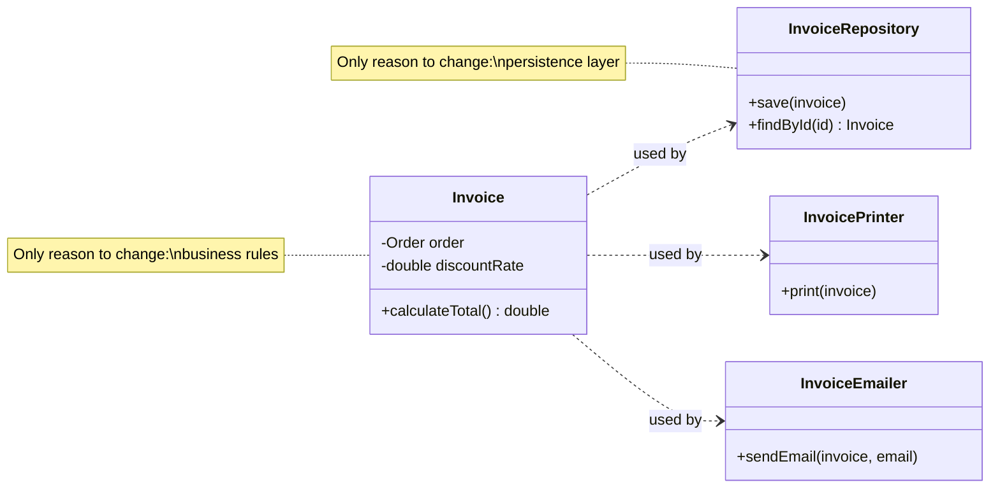
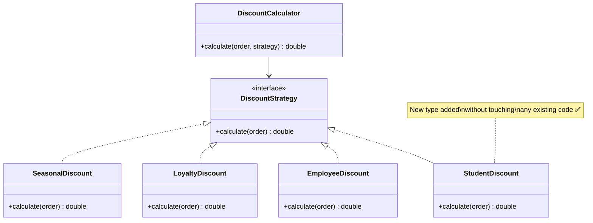
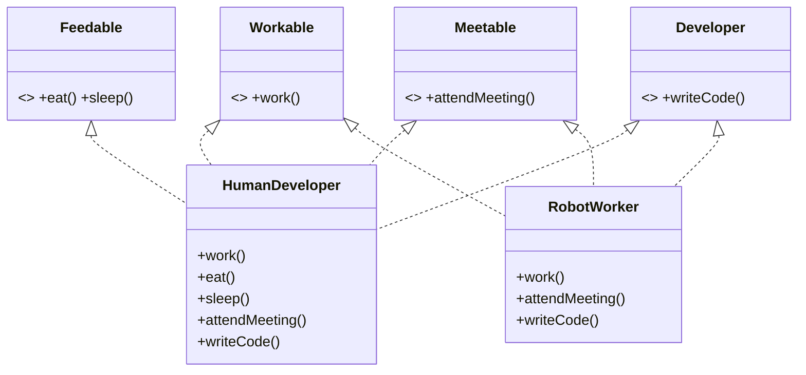
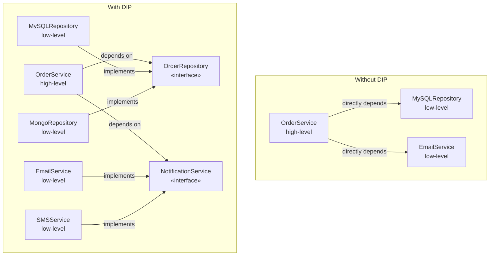
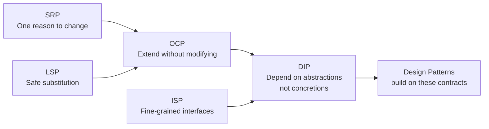

# Module 02 — SOLID Principles

> **Prerequisites**: [Module 01 → OOP Foundations](./01_OOP_Foundations.md)  
> **Next**: [Module 03 → UML & Class Diagrams](./03_UML_Class_Diagrams.md)

---

## Why Does This Module Exist?

OOP gives you tools. SOLID gives you **rules for using those tools correctly**.

You can write perfectly valid OOP code that's still a nightmare to maintain — classes that do 10 things, code you can't extend without touching existing files, inheritance chains that break when you add a new type.

SOLID is a set of 5 principles (by Robert C. Martin, "Uncle Bob") that, when followed, produce code that is:
- **Easy to change** (requirements always change)
- **Easy to extend** (new features without touching old code)
- **Easy to test** (isolated, single-purpose units)

> **Interview framing**: SOLID principles are the *why* behind every design pattern. Patterns are concrete solutions; SOLID is the reasoning.

---

## Table of Contents

1. [S — Single Responsibility Principle (SRP)](#1-s--single-responsibility-principle)
2. [O — Open/Closed Principle (OCP)](#2-o--openclosed-principle)
3. [L — Liskov Substitution Principle (LSP)](#3-l--liskov-substitution-principle)
4. [I — Interface Segregation Principle (ISP)](#4-i--interface-segregation-principle)
5. [D — Dependency Inversion Principle (DIP)](#5-d--dependency-inversion-principle)
6. [How SOLID Principles Connect](#6-how-solid-principles-connect)
7. [Interview Cheatsheet](#7-interview-cheatsheet)

---

## 1. S — Single Responsibility Principle

### The Principle

> **A class should have only one reason to change.**

"One reason to change" means **one job** — or more precisely, one *stakeholder* whose requirements can drive that class to change.

### The Problem (Without SRP)

```java
// ❌ BAD: This class has 3 reasons to change:
// 1. Business logic changes (how invoice is calculated)
// 2. Persistence changes (DB schema, ORM, etc.)
// 3. Reporting changes (email format, PDF template)
class Invoice {
    private Order order;
    private double discountRate;

    public double calculateTotal() {
        return order.getTotal() * (1 - discountRate);  // business logic
    }

    public void saveToDatabase() {
        // SQL queries, DB connections — persistence logic
        System.out.println("Saving invoice to DB...");
    }

    public void printInvoice() {
        // HTML/PDF generation — presentation logic
        System.out.println("Printing invoice...");
    }

    public void sendEmail(String email) {
        // Email SMTP logic — communication logic
        System.out.println("Sending to: " + email);
    }
}
```

**Why this is dangerous**: If the DB team changes the schema, you touch `Invoice`. If marketing changes the email template, you touch `Invoice`. One class becomes a dumping ground — a "God Class" — and every team's changes risk breaking other things.

### The Fix (With SRP)

```java
// ✅ GOOD: Each class has exactly one reason to change

// Reason to change: business rules for invoice calculation
class Invoice {
    private Order order;
    private double discountRate;

    public Invoice(Order order, double discountRate) {
        this.order = order;
        this.discountRate = discountRate;
    }

    public double calculateTotal() {
        return order.getTotal() * (1 - discountRate);
    }
}

// Reason to change: persistence layer changes
class InvoiceRepository {
    public void save(Invoice invoice) {
        System.out.println("Persisting invoice to DB...");
    }

    public Invoice findById(String id) {
        // DB fetch logic
        return null;
    }
}

// Reason to change: report format changes
class InvoicePrinter {
    public void print(Invoice invoice) {
        System.out.println("Invoice total: " + invoice.calculateTotal());
    }
}

// Reason to change: notification strategy changes
class InvoiceEmailer {
    public void sendEmail(Invoice invoice, String recipientEmail) {
        System.out.println("Emailing invoice to: " + recipientEmail);
    }
}
```

### Diagram



### Key Insight

> SRP is about **cohesion**. A class should represent one concept. Ask: *"Who would ask me to change this class?"* If the answer is "multiple different teams/stakeholders", split it.

---

## 2. O — Open/Closed Principle

### The Principle

> **Software entities should be open for extension but closed for modification.**

In plain English: **add new behaviour by adding new code, not by changing existing code.**

### The Problem (Without OCP)

```java
// ❌ BAD: Every time a new discount type is added,
// we must modify this existing class — risky and error-prone
class DiscountCalculator {
    public double calculate(Order order, String discountType) {
        if (discountType.equals("SEASONAL")) {
            return order.getTotal() * 0.10;
        } else if (discountType.equals("LOYALTY")) {
            return order.getTotal() * 0.15;
        } else if (discountType.equals("EMPLOYEE")) {   // newly added — modified existing code
            return order.getTotal() * 0.30;
        }
        // Next week: add STUDENT discount → touch this file again
        return 0;
    }
}
```

Every new discount type = modifying `DiscountCalculator` = risk of breaking existing discounts = regression testing everything.

### The Fix (With OCP)

```java
// ✅ GOOD: New discount types = new classes, zero changes to existing code

// The abstraction — stable, never changes
interface DiscountStrategy {
    double calculate(Order order);
}

// Each discount is a separate, isolated class
class SeasonalDiscount implements DiscountStrategy {
    @Override
    public double calculate(Order order) {
        return order.getTotal() * 0.10;
    }
}

class LoyaltyDiscount implements DiscountStrategy {
    @Override
    public double calculate(Order order) {
        return order.getTotal() * 0.15;
    }
}

class EmployeeDiscount implements DiscountStrategy {
    @Override
    public double calculate(Order order) {
        return order.getTotal() * 0.30;
    }
}

// Next week: add StudentDiscount — just create a new class, touch NOTHING else
class StudentDiscount implements DiscountStrategy {
    @Override
    public double calculate(Order order) {
        return order.getTotal() * 0.20;
    }
}

// The calculator is now closed for modification
class DiscountCalculator {
    public double calculate(Order order, DiscountStrategy strategy) {
        return strategy.calculate(order);
    }
}
```

### Diagram



### Key Insight

> OCP is achieved through **polymorphism and abstraction**. The pattern you just saw is the **Strategy Pattern** (Module 06). OCP explains *why* Strategy Pattern exists.

---

## 3. L — Liskov Substitution Principle

### The Principle

> **Objects of a subclass should be substitutable for objects of the parent class without breaking the program.**

Named after Barbara Liskov. If `S` is a subtype of `T`, then objects of type `T` may be replaced with objects of type `S` — and everything should still work correctly.

### The Problem (Without LSP)

```java
// ❌ BAD: The classic Rectangle/Square problem
class Rectangle {
    protected int width;
    protected int height;

    public void setWidth(int width) { this.width = width; }
    public void setHeight(int height) { this.height = height; }
    public int getArea() { return width * height; }
}

class Square extends Rectangle {
    // A square must always have equal sides
    @Override
    public void setWidth(int width) {
        this.width = width;
        this.height = width;  // forces height = width
    }

    @Override
    public void setHeight(int height) {
        this.width = height;  // forces width = height
        this.height = height;
    }
}

// The caller — written to work with Rectangle
class AreaValidator {
    public void testArea(Rectangle r) {
        r.setWidth(5);
        r.setHeight(4);
        // Expected: 5 * 4 = 20
        assert r.getArea() == 20 : "Area should be 20!";
        // If r is a Square: setHeight(4) → width=4, height=4 → area=16
        // ASSERTION FAILS! Square breaks the Rectangle contract.
    }
}
```

A `Square` *is-a* `Rectangle` geometrically, but **not behaviourally**. The `testArea` method expects that setting width and height independently is valid — but `Square` breaks that expectation.

### The Fix (With LSP)

The fix is to **not force the inheritance** when the behavioural contract can't be maintained:

```java
// ✅ GOOD: Separate the concepts; use a common abstraction

interface Shape {
    int getArea();
}

class Rectangle implements Shape {
    private int width, height;

    public Rectangle(int width, int height) {
        this.width = width;
        this.height = height;
    }

    public void setWidth(int width) { this.width = width; }
    public void setHeight(int height) { this.height = height; }

    @Override
    public int getArea() { return width * height; }
}

class Square implements Shape {
    private int side;

    public Square(int side) { this.side = side; }

    public void setSide(int side) { this.side = side; }

    @Override
    public int getArea() { return side * side; }
}

// Caller depends on Shape — both Rectangle and Square are valid substitutes
class AreaCalculator {
    public int calculateArea(Shape shape) {
        return shape.getArea();  // works correctly for both
    }
}
```

### The LSP Contract Rules

A subtype must honour all the parent's "contracts":

| Contract Type | Rule |
|---|---|
| **Preconditions** | Subtype can only weaken or keep preconditions (can't be stricter) |
| **Postconditions** | Subtype can only strengthen or keep postconditions (must deliver at least as much) |
| **Invariants** | Subtype must maintain all invariants of the parent |

### Key Insight

> LSP is the **correctness check** for inheritance. Before extending a class, ask: *"Can my subclass be used everywhere the parent is used, without the caller needing to know the difference?"* If no, don't use inheritance — use composition or a shared interface.

---

## 4. I — Interface Segregation Principle

### The Principle

> **Clients should not be forced to depend on interfaces they don't use.**

Don't create fat, one-size-fits-all interfaces. Split them into smaller, more specific ones.

### The Problem (Without ISP)

```java
// ❌ BAD: One monolithic interface forces all implementors
// to implement methods they don't need
interface Worker {
    void work();
    void eat();
    void sleep();
    void attendMeeting();
    void writeCode();
    void designUI();
}

// A robot worker can work, but it doesn't eat or sleep!
class RobotWorker implements Worker {
    public void work() { System.out.println("Robot working"); }
    public void eat() { throw new UnsupportedOperationException("Robots don't eat!"); }
    public void sleep() { throw new UnsupportedOperationException("Robots don't sleep!"); }
    public void attendMeeting() { System.out.println("Robot in meeting"); }
    public void writeCode() { System.out.println("Robot coding"); }
    public void designUI() { throw new UnsupportedOperationException("Not my job"); }
}
```

`RobotWorker` is forced to implement `eat()` and `sleep()` — methods that don't apply to it. Callers can call `robot.eat()` and get a runtime exception, which is dangerous.

### The Fix (With ISP)

```java
// ✅ GOOD: Fine-grained interfaces — implement only what applies

interface Workable {
    void work();
}

interface Feedable {
    void eat();
    void sleep();
}

interface Meetable {
    void attendMeeting();
}

interface Developer {
    void writeCode();
}

interface UIDesigner {
    void designUI();
}

// Human developer: implements everything applicable
class HumanDeveloper implements Workable, Feedable, Meetable, Developer {
    public void work() { System.out.println("Human working"); }
    public void eat() { System.out.println("Human eating"); }
    public void sleep() { System.out.println("Human sleeping"); }
    public void attendMeeting() { System.out.println("In Zoom call..."); }
    public void writeCode() { System.out.println("Writing Java"); }
}

// Robot: only what applies, no fake implementations
class RobotWorker implements Workable, Developer, Meetable {
    public void work() { System.out.println("Robot working at 1000x speed"); }
    public void attendMeeting() { System.out.println("Robot joining meeting"); }
    public void writeCode() { System.out.println("Robot auto-generating code"); }
    // No eat(), sleep(), designUI() — because it doesn't need them
}
```

### Diagram



### Key Insight

> ISP is closely related to SRP but at the *interface* level. Fat interfaces create **unnecessary coupling** — a class that only needs `work()` still takes a compile-time dependency on `eat()` and `sleep()`. Split interfaces by the *role* they represent.

---

## 5. D — Dependency Inversion Principle

### The Principle

> **A. High-level modules should not depend on low-level modules. Both should depend on abstractions.**  
> **B. Abstractions should not depend on details. Details should depend on abstractions.**

This is the most architecturally impactful of all SOLID principles.

### The Problem (Without DIP)

```java
// ❌ BAD: High-level module (OrderService) directly depends on
// a low-level module (MySQLOrderRepository)

class MySQLOrderRepository {
    public void save(Order order) {
        System.out.println("Saving to MySQL: " + order.getId());
    }
}

class EmailNotificationService {
    public void notify(String email, String message) {
        System.out.println("Sending email via SMTP to: " + email);
    }
}

// High-level business logic — tightly coupled to MySQL and SMTP
class OrderService {
    private MySQLOrderRepository repository = new MySQLOrderRepository();  // ← hardcoded!
    private EmailNotificationService notifier = new EmailNotificationService();  // ← hardcoded!

    public void placeOrder(Order order) {
        // Business logic
        repository.save(order);       // breaks if we switch to PostgreSQL
        notifier.notify(order.getUserEmail(), "Order placed!");  // breaks if we switch to SMS
    }
}
```

To switch from MySQL to PostgreSQL, you must **change `OrderService`** — a high-level business class — just because a low-level infrastructure detail changed. That's backwards.

### The Fix (With DIP)

```java
// ✅ GOOD: Both layers depend on abstractions, not each other

// Abstractions (stable contracts)
interface OrderRepository {
    void save(Order order);
    Order findById(String id);
}

interface NotificationService {
    void notify(String recipient, String message);
}

// Low-level details implement the abstractions
class MySQLOrderRepository implements OrderRepository {
    @Override
    public void save(Order order) {
        System.out.println("MySQL: Saving order " + order.getId());
    }

    @Override
    public Order findById(String id) { /* MySQL query */ return null; }
}

class MongoOrderRepository implements OrderRepository {
    @Override
    public void save(Order order) {
        System.out.println("MongoDB: Saving order " + order.getId());
    }

    @Override
    public Order findById(String id) { return null; }
}

class EmailNotificationService implements NotificationService {
    @Override
    public void notify(String recipient, String message) {
        System.out.println("Email → " + recipient + ": " + message);
    }
}

class SMSNotificationService implements NotificationService {
    @Override
    public void notify(String recipient, String message) {
        System.out.println("SMS → " + recipient + ": " + message);
    }
}

// High-level module — depends only on abstractions, injected from outside
class OrderService {
    private final OrderRepository repository;
    private final NotificationService notifier;

    // Dependencies injected — not created internally
    public OrderService(OrderRepository repository, NotificationService notifier) {
        this.repository = repository;
        this.notifier = notifier;
    }

    public void placeOrder(Order order) {
        repository.save(order);
        notifier.notify(order.getUserEmail(), "Order placed!");
    }
}

// Wiring happens in one place (the "composition root")
class Application {
    public static void main(String[] args) {
        OrderRepository repo = new MySQLOrderRepository();
        NotificationService notifier = new EmailNotificationService();
        OrderService service = new OrderService(repo, notifier);

        // To switch to Mongo + SMS, only this file changes:
        // OrderRepository repo = new MongoOrderRepository();
        // NotificationService notifier = new SMSNotificationService();
    }
}
```

### Diagram



### Key Insight

> DIP is the foundation of **Dependency Injection (DI)** and DI frameworks (Spring, Guice). It's also the reason the **Factory Pattern** and **Abstract Factory Pattern** exist — they handle the "wiring" of dependencies.
>
> The "inversion" in the name refers to inverting the traditional dependency direction: normally high-level code creates low-level objects. DIP says low-level objects should be *provided to* high-level code.

---

## 6. How SOLID Principles Connect



| Principle | Design Patterns it enables |
|-----------|---------------------------|
| **SRP** | Repository Pattern, Service Layer |
| **OCP** | Strategy, Decorator, Template Method |
| **LSP** | All patterns using polymorphism correctly |
| **ISP** | Command, Observer (fine-grained listeners) |
| **DIP** | Factory, Abstract Factory, DI containers |

---

## 7. Interview Cheatsheet

| Principle | One-sentence definition | Violation signal |
|-----------|------------------------|-----------------|
| **SRP** | One class = one reason to change | "This class handles X and also Y and also Z..." |
| **OCP** | New behaviour = new code, not changed code | "Every time we add a type, we edit this if-else/switch..." |
| **LSP** | Subtypes are valid substitutes for parent | "This method throws `UnsupportedOperationException`..." |
| **ISP** | Clients only depend on methods they use | "We have to implement these 10 methods but only use 3..." |
| **DIP** | High-level modules depend on abstractions | "`new MySQLRepo()` inside a business service class..." |

### Classic Interview Question

**"How do SOLID principles relate to design patterns?"**

> *SOLID principles define what makes good OOP design. Design patterns are reusable solutions to recurring problems — and each pattern can be traced back to one or more SOLID principles it enforces. For example, the Strategy Pattern is a direct application of OCP and DIP. The Decorator Pattern enforces OCP and SRP."*

---

> ✅ **Module 02 Complete**  
> **Next**: [Module 03 → UML & Class Diagrams](./03_UML_Class_Diagrams.md)
