# Module 03 — UML & Class Diagrams

> **Prerequisites**: [Module 02 → SOLID Principles](./02_SOLID_Principles.md)  
> **Next**: [Module 04 → Creational Patterns](./04_Creational_Patterns.md)

---

## Why Does This Module Exist?

In an LLD interview, you'll spend the first 10–15 minutes drawing a **class diagram on a whiteboard**. The interviewer evaluates your design before you write a single line of code.

If you can't read and draw class diagrams fluently:
- You can't communicate your design quickly
- You can't read design pattern books (they all use UML)
- You'll waste interview time explaining structure verbally

This module makes class diagrams second nature.

---

## Table of Contents

1. [What is UML?](#1-what-is-uml)
2. [Anatomy of a Class Box](#2-anatomy-of-a-class-box)
3. [The 6 Relationships](#3-the-6-relationships)
4. [Relationship Strength Scale](#4-relationship-strength-scale)
5. [Reading a Real Diagram](#5-reading-a-real-diagram)
6. [Drawing Diagrams in Interviews](#6-drawing-diagrams-in-interviews)
7. [Mermaid Syntax Reference](#7-mermaid-syntax-reference)

---

## 1. What is UML?

**UML (Unified Modelling Language)** is a standardized visual language for describing software systems. It has many diagram types, but in LLD interviews, you almost exclusively use **Class Diagrams**.

A class diagram shows:
- What **classes** exist
- What **fields and methods** they have
- What **relationships** exist between them

> You don't need to know all of UML. For LLD interviews, mastering class diagrams is sufficient.

---

## 2. Anatomy of a Class Box

A class is drawn as a box with three sections:

```
┌───────────────────────────┐
│       ClassName           │  ← Section 1: Name (+ «stereotype» if applicable)
├───────────────────────────┤
│  - privateField: Type     │  ← Section 2: Fields (attributes)
│  # protectedField: Type   │
│  + publicField: Type      │
├───────────────────────────┤
│  + publicMethod(): Type   │  ← Section 3: Methods (operations)
│  - privateMethod()        │
│  # protectedMethod()      │
└───────────────────────────┘
```

### Visibility Modifiers

| Symbol | Meaning | Java equivalent |
|--------|---------|----------------|
| `+` | Public | `public` |
| `-` | Private | `private` |
| `#` | Protected | `protected` |
| `~` | Package | (default, no modifier) |

### Special Class Types

| Stereotype | Meaning | Java equivalent |
|------------|---------|----------------|
| `«interface»` | Interface | `interface` |
| `«abstract»` | Abstract class | `abstract class` |
| `«enum»` | Enumeration | `enum` |

### Mermaid Example

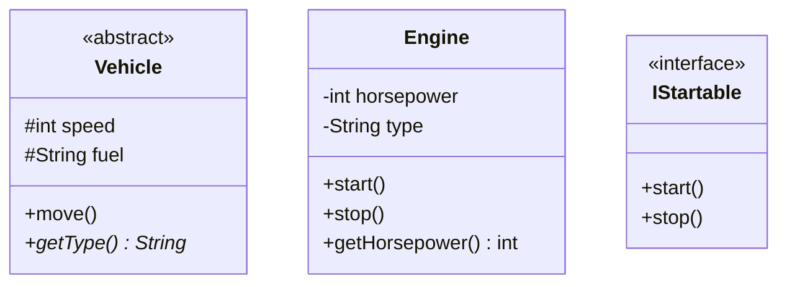

---

## 3. The 6 Relationships

This is the core of class diagrams. There are exactly 6 relationship types, and each has a specific arrow notation.

### 3.1 Inheritance (Generalization)

**"is-a"** relationship. A child class inherits from a parent class.

- **Arrow**: Solid line with **hollow triangle** arrowhead pointing to parent
- **Java**: `extends`

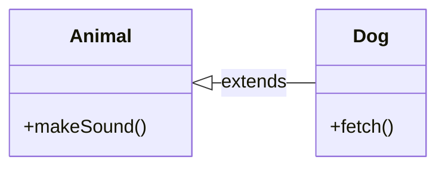

```java
class Dog extends Animal { ... }
```

---

### 3.2 Realization (Implementation)

**"can-do"** relationship. A class implements an interface.

- **Arrow**: **Dashed line** with hollow triangle arrowhead pointing to interface
- **Java**: `implements`

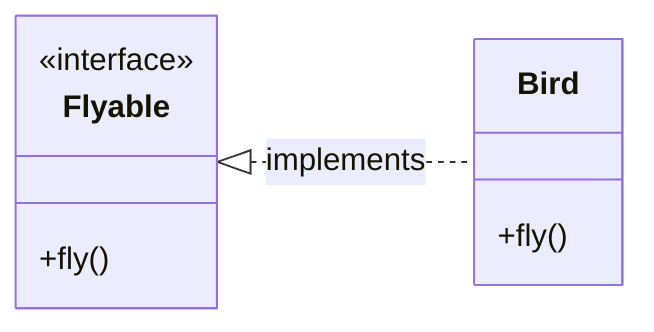

```java
class Bird implements Flyable { ... }
```

---

### 3.3 Composition

**"owns-a"** (strong has-a) relationship. The child **cannot exist without** the parent. If the parent is destroyed, the child is too.

- **Arrow**: Solid line with **filled diamond** at the owner side
- **Lifecycle**: Parent owns the child's lifecycle

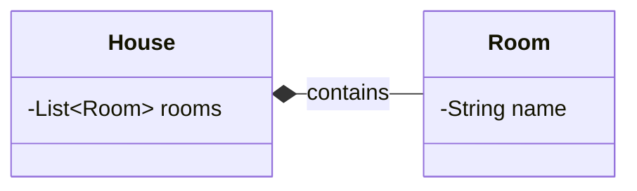

**Real-world analogy**: A `House` has `Rooms`. If you demolish the house, the rooms cease to exist.

```java
class House {
    private List<Room> rooms = new ArrayList<>();  // House creates and owns Rooms
    public void addRoom(String name) {
        rooms.add(new Room(name));  // Room is created by House
    }
}
```

---

### 3.4 Aggregation

**"has-a"** (weak has-a) relationship. The child **can exist independently** of the parent.

- **Arrow**: Solid line with **hollow diamond** at the owner side
- **Lifecycle**: Parent does NOT own child's lifecycle

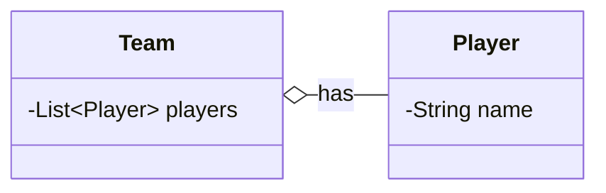

**Real-world analogy**: A `Team` has `Players`. If the team is disbanded, the players still exist (they join another team).

```java
class Team {
    private List<Player> players;

    public Team(List<Player> players) {
        this.players = players;  // Players are passed in — not created by Team
    }
}
```

---

### 3.5 Association

**"uses"** relationship. One class uses another, but neither owns the other. It's the most general relationship.

- **Arrow**: Solid line, optionally with open arrowhead showing direction
- **Variants**: Can be unidirectional or bidirectional

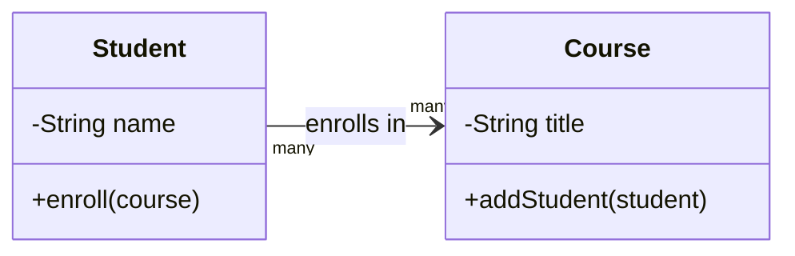

```java
class Student {
    private List<Course> courses;  // knows about courses, but doesn't own them

    public void enroll(Course course) {
        courses.add(course);
    }
}
```

---

### 3.6 Dependency

**"depends on"** (uses temporarily) relationship. The weakest relationship. One class uses another only temporarily (e.g., as a method parameter or local variable).

- **Arrow**: **Dashed line** with open arrowhead
- **Key distinction from Association**: No field — just a temporary usage

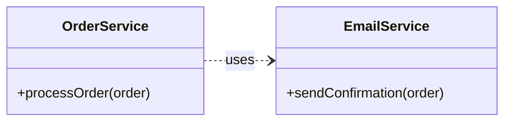

```java
class OrderService {
    public void processOrder(Order order) {
        EmailService emailService = new EmailService();  // created locally, temporary
        emailService.sendConfirmation(order);
    }
}
```

---

## 4. Relationship Strength Scale

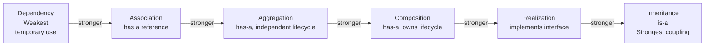

> **Interview tip**: Prefer weaker relationships. Dependency < Association < Aggregation < Composition. Strong coupling (especially inheritance) should be justified.

### Quick Decision Guide

| Ask yourself | Answer → Relationship |
|---|---|
| Does child A *exist only* within B? | Composition (`*--`) |
| Does A *have* B but B can live without A? | Aggregation (`o--`) |
| Does A *use* B as a persistent reference? | Association (`-->`) |
| Does A *use* B temporarily (param/local)? | Dependency (`..>`) |
| Does A *implement* B's interface? | Realization (`<|..`) |
| Does A *extend* B? | Inheritance (`<|--`) |

---

## 5. Reading a Real Diagram

Let's read a realistic diagram — an e-commerce order system:

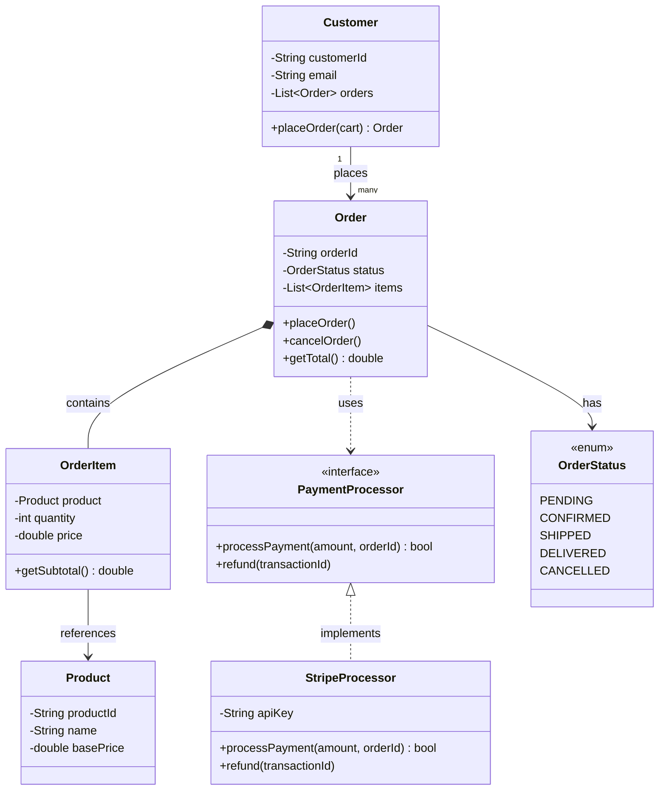

**How to read this**:
- `Customer` places many `Order`s → Association (customer and orders exist independently)
- `Order` contains `OrderItem`s → Composition (items don't exist without the order)
- `OrderItem` references a `Product` → Association (products exist independently)
- `Order` uses `PaymentProcessor` → Dependency (temporary use during checkout)
- `StripeProcessor` implements `PaymentProcessor` → Realization

---

## 6. Drawing Diagrams in Interviews

### The 5-Step Approach

1. **Identify nouns** — these become your classes (Order, Customer, Product, Rider...)
2. **Identify roles** — some nouns become interfaces (PaymentProcessor, NotificationSender...)
3. **Identify verbs** — these become methods (placeOrder, cancelRide, sendNotification...)
4. **Draw relationships** — use the decision guide from Section 4
5. **Add multiplicity** — one-to-one, one-to-many, many-to-many

### Multiplicity Notation

```
1        exactly one
0..1     zero or one (optional)
*        zero or many
1..*     one or more
2..5     between 2 and 5
```

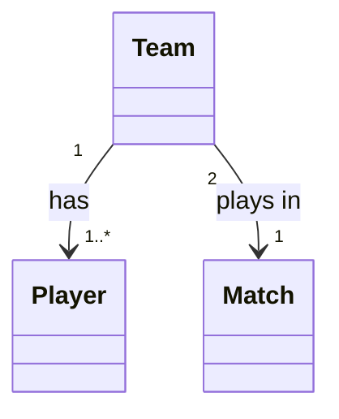

### What Interviewers Look For

| What they check | Why it matters |
|---|---|
| Correct use of interfaces | Shows understanding of abstraction |
| Composition vs Aggregation | Shows lifecycle thinking |
| No God Classes | SRP awareness |
| Multiplicities are explicit | Attention to detail |
| Enum for finite states | Pragmatic design thinking |

### Common Mistakes

| Mistake | Fix |
|---------|-----|
| Making everything `public` | Use `-` for fields, expose via methods |
| Using inheritance where composition fits | Ask the LSP test |
| Forgetting enums for states | `OrderStatus`, `PaymentStatus` should be enums |
| Not showing interfaces | Interviewers expect `«interface»` for key abstractions |

---

## 7. Mermaid Syntax Reference

Use this as a quick copy-paste guide when writing notes:

```
classDiagram
    %% Class with stereotype
    class MyInterface {
        <<interface>>
        +method() ReturnType
    }

    class AbstractBase {
        <<abstract>>
        #protectedField: Type
        +abstractMethod()* ReturnType
        +concreteMethod()
    }

    class ConcreteClass {
        -privateField: Type
        +publicMethod(param: Type) ReturnType
    }

    class MyEnum {
        <<enum>>
        VALUE_ONE
        VALUE_TWO
    }

    %% Relationships
    AbstractBase <|-- ConcreteClass        : extends (inheritance)
    MyInterface <|.. ConcreteClass         : implements (realization)
    ConcreteClass *-- OwnedClass           : composition
    ConcreteClass o-- IndependentClass     : aggregation
    ConcreteClass --> AnotherClass         : association
    ConcreteClass ..> TemporaryClass       : dependency

    %% Multiplicity
    ClassA "1" --> "many" ClassB
    ClassC "0..1" --> "1..*" ClassD
```

---

## Summary

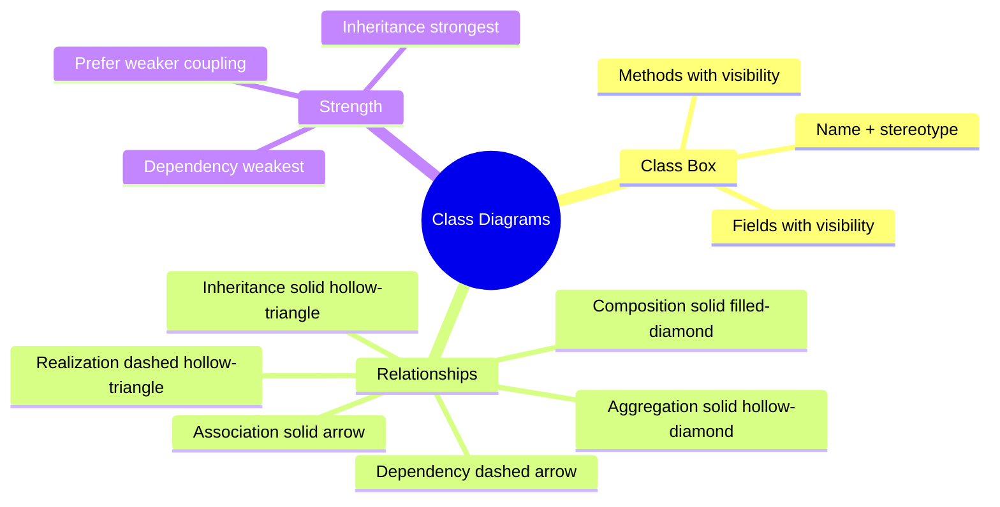

---

> ✅ **Module 03 Complete**  
> **Next**: [Module 04 → Creational Patterns](./04_Creational_Patterns.md) — now that you can read and draw class diagrams, every pattern you learn will have a diagram you can fully understand.
