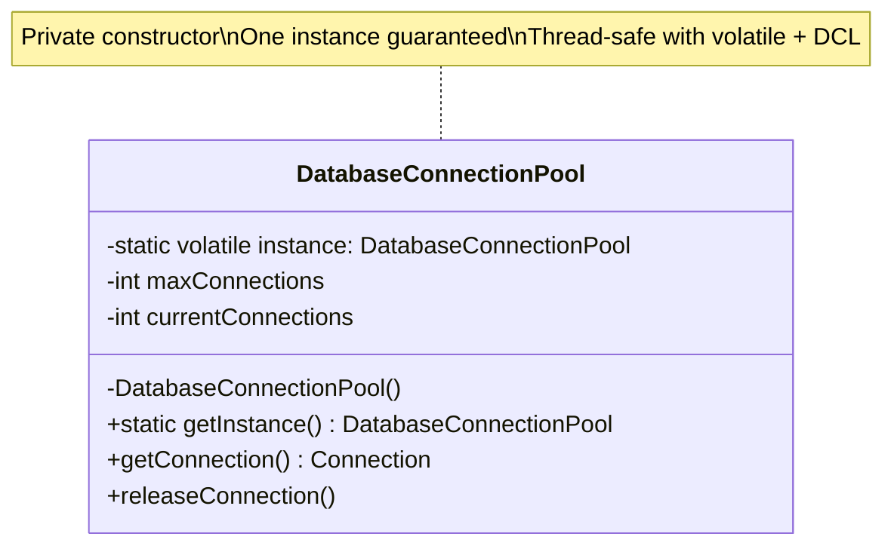
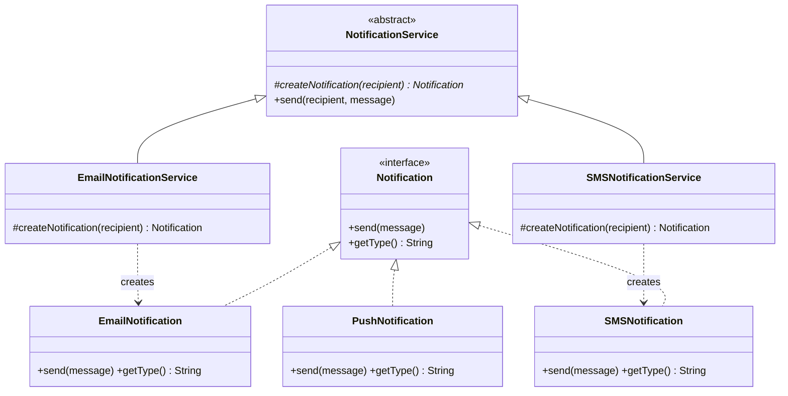
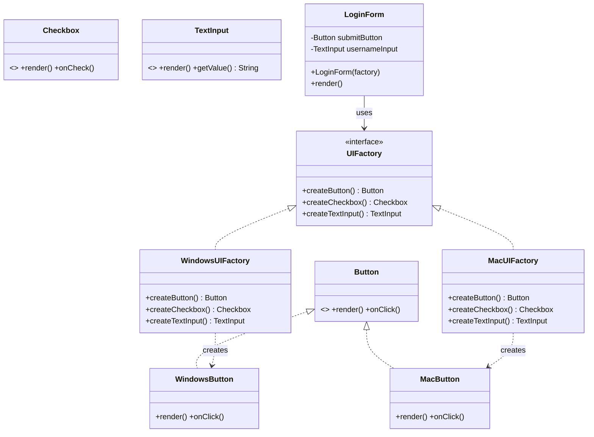
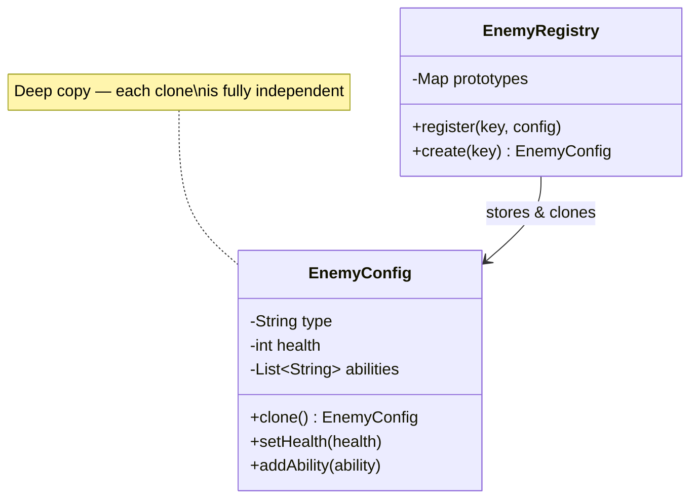
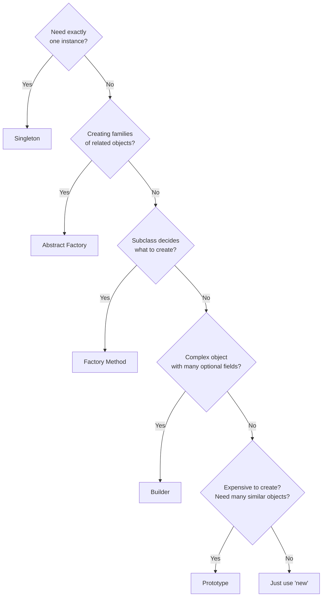

# Module 04 — Creational Design Patterns

> **Prerequisites**: [Module 03 → UML & Class Diagrams](./03_UML_Class_Diagrams.md)  
> **Next**: [Module 05 → Structural Patterns](./05_Structural_Patterns.md)

---

## Why Does This Module Exist?

Every object in your system has to be *created* somewhere. The naive way is `new SomeClass()` sprinkled everywhere. That creates two problems:

1. **Tight coupling** — callers know exactly which concrete class they're creating
2. **No control** — can't enforce constraints like "only one instance" or "always create in a valid state"

Creational patterns give you **controlled, flexible, and decoupled object creation**.

There are 5 creational patterns:

| Pattern | One-liner |
|---------|-----------|
| **Singleton** | Guarantee exactly one instance exists globally |
| **Factory Method** | Let subclasses decide which class to instantiate |
| **Abstract Factory** | Create families of related objects without knowing their classes |
| **Builder** | Construct complex objects step by step |
| **Prototype** | Create new objects by cloning an existing one |

---

## Table of Contents

1. [Singleton](#1-singleton)
2. [Factory Method](#2-factory-method)
3. [Abstract Factory](#3-abstract-factory)
4. [Builder](#4-builder)
5. [Prototype](#5-prototype)
6. [When to Use Which](#6-when-to-use-which)
7. [Interview Cheatsheet](#7-interview-cheatsheet)

---

## 1. Singleton

### The Problem It Solves

Some objects should exist exactly once in your system — a configuration manager, a logger, a connection pool, a thread pool. If you create multiple instances, you get inconsistent state (two loggers writing to different files, two config managers with different values).

`new Logger()` every time = multiple logger instances = chaos.

### The Solution

Ensure a class has **at most one instance** and provide a **global access point** to it.

```java
public class DatabaseConnectionPool {
    // The single instance — volatile for thread safety in Java
    private static volatile DatabaseConnectionPool instance;

    private int maxConnections;
    private int currentConnections;

    // Private constructor — prevents external instantiation
    private DatabaseConnectionPool() {
        this.maxConnections = 10;
        this.currentConnections = 0;
    }

    // Thread-safe double-checked locking
    public static DatabaseConnectionPool getInstance() {
        if (instance == null) {
            synchronized (DatabaseConnectionPool.class) {
                if (instance == null) {
                    instance = new DatabaseConnectionPool();
                }
            }
        }
        return instance;
    }

    public synchronized Connection getConnection() {
        if (currentConnections >= maxConnections) {
            throw new RuntimeException("Connection pool exhausted");
        }
        currentConnections++;
        return new Connection();  // simplified
    }

    public synchronized void releaseConnection() {
        if (currentConnections > 0) currentConnections--;
    }
}

// Usage
DatabaseConnectionPool pool1 = DatabaseConnectionPool.getInstance();
DatabaseConnectionPool pool2 = DatabaseConnectionPool.getInstance();
System.out.println(pool1 == pool2);  // true — same object
```

### Why Double-Checked Locking?

Without `volatile` + double-check:
```java
// ❌ Not thread-safe: two threads could both see instance == null simultaneously
public static DatabaseConnectionPool getInstance() {
    if (instance == null) {                           // Thread A and B both pass here
        instance = new DatabaseConnectionPool();      // Both create an instance!
    }
    return instance;
}
```

The `volatile` keyword ensures the `instance` write is visible to all threads immediately, and `synchronized` prevents concurrent instantiation.

### Better Alternative in Java: Initialization-on-Demand

```java
// ✅ Cleaner, thread-safe without explicit synchronization
public class Logger {
    private Logger() {}

    // Inner class is only loaded when getInstance() is first called
    private static class Holder {
        private static final Logger INSTANCE = new Logger();
    }

    public static Logger getInstance() {
        return Holder.INSTANCE;
    }

    public void log(String message) {
        System.out.println("[LOG] " + message);
    }
}
```

### Diagram



### When to Use / Avoid

| Use when | Avoid when |
|----------|-----------|
| Truly global state (config, logger, pool) | It makes testing hard (hard to mock/reset state) |
| Expensive resource that must be shared | You're tempted to use it for convenience (it becomes a global variable) |
| Coordination across the system required | Subclassing is needed (Singleton makes inheritance tricky) |

---

## 2. Factory Method

### The Problem It Solves

You have a class that creates objects, but you want **subclasses to decide what type of object to create** — without changing the parent class.

```java
// ❌ Without Factory Method: hardcoded notification type
class NotificationService {
    public void sendNotification(String type, String message) {
        if (type.equals("EMAIL")) {
            EmailNotification n = new EmailNotification();  // tightly coupled
            n.send(message);
        } else if (type.equals("SMS")) {
            SMSNotification n = new SMSNotification();
            n.send(message);
        }
        // Add WhatsApp? Push notification? Touch this file every time.
    }
}
```

### The Solution

Define a method (the **factory method**) in a base class that returns an object. Subclasses override this method to return different types.

```java

interface Notification {
    void send();
}

class EmailNotification implements Notification {
    public void send() {
        System.out.println("Sending Email");
    }
}

class SMSNotification implements Notification {
    public void send() {
        System.out.println("Sending SMS");
    }
}

class NotificationFactory {

    public static Notification createNotification(String type) {

        if (type.equalsIgnoreCase("EMAIL")) {
            return new EmailNotification();
        }

        if (type.equalsIgnoreCase("SMS")) {
            return new SMSNotification();
        }

        throw new IllegalArgumentException("Invalid notification type");
    }
}

public class Main {

    public static void main(String[] args) {

        Notification notification =
                NotificationFactory.createNotification("EMAIL");

        notification.send();
    }
}
```

### Diagram



### Key Insight

> Factory Method delegates the **"what to create"** decision to subclasses. It's OCP in action — add a new notification type by adding a new `NotificationService` subclass, touching nothing else.

---

## 3. Abstract Factory

### The Problem It Solves

You need to create **families of related objects** that must be used together, and you want to ensure consistency within a family.

Example: A UI toolkit needs `Button`, `Checkbox`, and `TextInput`. For Windows, all three should be Windows-styled. For Mac, all three should be Mac-styled. You must never mix a `WindowsButton` with a `MacCheckbox`.

### The Solution

Provide an interface for creating **families of related objects** without specifying their concrete classes.

```java
// Product interfaces (the family members)
interface Button {
    void render();
    void onClick();
}

interface Checkbox {
    void render();
    void onCheck();
}

interface TextInput {
    void render();
    String getValue();
}

// Windows family
class WindowsButton implements Button {
    public void render() { System.out.println("[Windows] Rendering square button"); }
    public void onClick() { System.out.println("[Windows] Button clicked"); }
}

class WindowsCheckbox implements Checkbox {
    public void render() { System.out.println("[Windows] Rendering square checkbox"); }
    public void onCheck() { System.out.println("[Windows] Checkbox toggled"); }
}

class WindowsTextInput implements TextInput {
    public void render() { System.out.println("[Windows] Rendering flat text input"); }
    public String getValue() { return "Windows input value"; }
}

// Mac family
class MacButton implements Button {
    public void render() { System.out.println("[Mac] Rendering rounded button"); }
    public void onClick() { System.out.println("[Mac] Button clicked"); }
}

class MacCheckbox implements Checkbox {
    public void render() { System.out.println("[Mac] Rendering rounded checkbox"); }
    public void onCheck() { System.out.println("[Mac] Checkbox toggled"); }
}

class MacTextInput implements TextInput {
    public void render() { System.out.println("[Mac] Rendering blurred text input"); }
    public String getValue() { return "Mac input value"; }
}

// Abstract Factory — creates a whole family
interface UIFactory {
    Button createButton();
    Checkbox createCheckbox();
    TextInput createTextInput();
}

// Concrete factories — each creates a consistent family
class WindowsUIFactory implements UIFactory {
    public Button createButton() { return new WindowsButton(); }
    public Checkbox createCheckbox() { return new WindowsCheckbox(); }
    public TextInput createTextInput() { return new WindowsTextInput(); }
}

class MacUIFactory implements UIFactory {
    public Button createButton() { return new MacButton(); }
    public Checkbox createCheckbox() { return new MacCheckbox(); }
    public TextInput createTextInput() { return new MacTextInput(); }
}

// Client — only depends on the factory interface, never on concrete classes
class LoginForm {
    private final Button submitButton;
    private final TextInput usernameInput;
    private final TextInput passwordInput;

    public LoginForm(UIFactory factory) {
        this.submitButton = factory.createButton();
        this.usernameInput = factory.createTextInput();
        this.passwordInput = factory.createTextInput();
    }

    public void render() {
        usernameInput.render();
        passwordInput.render();
        submitButton.render();
    }
}

// Wiring — decide the family at startup
class Application {
    public static void main(String[] args) {
        String os = System.getProperty("os.name");
        UIFactory factory = os.contains("Windows") ? new WindowsUIFactory() : new MacUIFactory();

        LoginForm form = new LoginForm(factory);
        form.render();  // Entire form is consistently Windows or Mac styled
    }
}
```

### Diagram



### Factory Method vs Abstract Factory

| | Factory Method | Abstract Factory |
|---|---|---|
| **Creates** | One product | Family of related products |
| **Mechanism** | Subclassing (override factory method) | Object composition (inject a factory) |
| **Use when** | One varying product type | Multiple related products that must be consistent |

---

## 4. Builder

### The Problem It Solves

Some objects are complex to construct — many fields, some mandatory, some optional, and some combinations are invalid.

```java
// ❌ Telescoping constructor anti-pattern
class Pizza {
    public Pizza(String size) { ... }
    public Pizza(String size, boolean cheese) { ... }
    public Pizza(String size, boolean cheese, boolean pepperoni) { ... }
    public Pizza(String size, boolean cheese, boolean pepperoni, boolean mushrooms) { ... }
    // What does Pizza("Large", true, false, true, false, true) mean??
}
```

Or the alternative: setting lots of fields after construction, which allows creating partially invalid objects.

### The Solution

Separate the **construction process** from the **representation**. Use a `Builder` object that accumulates configuration and produces the final object in one step.

```java
class Pizza {
    // All fields final — immutable once built
    private final String size;
    private final String crustType;
    private final boolean cheese;
    private final boolean pepperoni;
    private final boolean mushrooms;
    private final boolean extraSauce;
    private final String specialInstructions;

    // Private constructor — only Builder can call this
    private Pizza(Builder builder) {
        this.size = builder.size;
        this.crustType = builder.crustType;
        this.cheese = builder.cheese;
        this.pepperoni = builder.pepperoni;
        this.mushrooms = builder.mushrooms;
        this.extraSauce = builder.extraSauce;
        this.specialInstructions = builder.specialInstructions;
    }

    @Override
    public String toString() {
        return String.format("Pizza[size=%s, crust=%s, cheese=%b, pepperoni=%b, mushrooms=%b]",
                size, crustType, cheese, pepperoni, mushrooms);
    }

    // Static nested Builder class
    public static class Builder {
        // Required parameters
        private final String size;

        // Optional parameters — defaults defined here
        private String crustType = "THIN";
        private boolean cheese = true;
        private boolean pepperoni = false;
        private boolean mushrooms = false;
        private boolean extraSauce = false;
        private String specialInstructions = "";

        // Builder requires mandatory fields
        public Builder(String size) {
            if (size == null || size.isEmpty()) throw new IllegalArgumentException("Size is required");
            this.size = size;
        }

        // Fluent setters — each returns Builder for chaining
        public Builder crustType(String crust) { this.crustType = crust; return this; }
        public Builder cheese(boolean cheese) { this.cheese = cheese; return this; }
        public Builder pepperoni(boolean pepperoni) { this.pepperoni = pepperoni; return this; }
        public Builder mushrooms(boolean mushrooms) { this.mushrooms = mushrooms; return this; }
        public Builder extraSauce(boolean extraSauce) { this.extraSauce = extraSauce; return this; }
        public Builder specialInstructions(String instructions) {
            this.specialInstructions = instructions;
            return this;
        }

        // Terminal operation — validates and creates the final object
        public Pizza build() {
            // Can add cross-field validation here
            return new Pizza(this);
        }
    }
}

// Usage — reads like English, no ambiguity
Pizza margherita = new Pizza.Builder("MEDIUM")
        .crustType("THIN")
        .cheese(true)
        .build();

Pizza loadedPizza = new Pizza.Builder("LARGE")
        .crustType("STUFFED")
        .cheese(true)
        .pepperoni(true)
        .mushrooms(true)
        .extraSauce(true)
        .specialInstructions("Extra crispy please")
        .build();
```

### Director (Optional Extension)

When the same construction sequence is reused, you can encapsulate it in a `Director`:

```java
class PizzaDirector {
    private Pizza.Builder builder;

    public PizzaDirector(Pizza.Builder builder) {
        this.builder = builder;
    }

    // Pre-defined recipes
    public Pizza makeMargherita() {
        return builder
                .crustType("THIN")
                .cheese(true)
                .build();
    }

    public Pizza makePepperoniSpecial() {
        return builder
                .crustType("THICK")
                .cheese(true)
                .pepperoni(true)
                .extraSauce(true)
                .build();
    }
}
```

### Diagram

```mermaid
classDiagram
    class Pizza {
        -String size
        -String crustType
        -boolean cheese
        -boolean pepperoni
        -Pizza(builder)
    }
    class Builder {
        -String size
        -String crustType
        -boolean cheese
        +Builder(size)
        +crustType(crust) Builder
        +cheese(bool) Builder
        +pepperoni(bool) Builder
        +build() Pizza
    }
    class PizzaDirector {
        -Builder builder
        +makeMargherita() Pizza
        +makePepperoniSpecial() Pizza
    }

    Pizza +-- Builder : nested class
    PizzaDirector --> Builder : uses
    Builder ..> Pizza : creates
```

### Key Insight

> Builder is ideal when an object has **4+ fields**, especially with optional ones. The fluent API makes the construction readable and self-documenting. It also makes the product **immutable** — all fields are set once in `build()`, and the product's constructor is private.

---

## 5. Prototype

### The Problem It Solves

Object creation is sometimes **expensive** (DB queries, heavy computation, API calls). If you need many similar objects, re-creating each from scratch is wasteful. You want to **copy an existing object** instead.

Or: you need to create objects at runtime without knowing their exact class (e.g., in a game engine with many enemy types pre-configured).

### The Solution

Clone an existing object (the prototype) instead of building from scratch.

```java
// The prototype interface
interface Cloneable<T> {
    T clone();
}

// A complex object that's expensive to create
class EnemyConfig implements Cloneable<EnemyConfig> {
    private String type;
    private int health;
    private int attackPower;
    private int speed;
    private List<String> abilities;  // complex nested state

    public EnemyConfig(String type, int health, int attackPower, int speed) {
        this.type = type;
        this.health = health;
        this.attackPower = attackPower;
        this.speed = speed;
        this.abilities = new ArrayList<>();
        // Imagine this also loads textures, animations, etc. — expensive!
    }

    public void addAbility(String ability) { abilities.add(ability); }

    // Deep copy — creates a new object with all the same state
    @Override
    public EnemyConfig clone() {
        EnemyConfig copy = new EnemyConfig(this.type, this.health, this.attackPower, this.speed);
        copy.abilities = new ArrayList<>(this.abilities);  // deep copy of list
        return copy;
    }

    public void setHealth(int health) { this.health = health; }
    public void setType(String type) { this.type = type; }

    @Override
    public String toString() {
        return String.format("Enemy[%s, hp=%d, atk=%d, abilities=%s]",
                type, health, attackPower, abilities);
    }
}

// Prototype Registry — stores pre-configured prototypes
class EnemyRegistry {
    private Map<String, EnemyConfig> prototypes = new HashMap<>();

    public void register(String key, EnemyConfig config) {
        prototypes.put(key, config);
    }

    public EnemyConfig create(String key) {
        EnemyConfig prototype = prototypes.get(key);
        if (prototype == null) throw new IllegalArgumentException("Unknown enemy: " + key);
        return prototype.clone();  // return a clone, not the prototype itself!
    }
}

// Usage
class GameEngine {
    public static void main(String[] args) {
        // Configure prototypes once (expensive, but done only once)
        EnemyConfig goblinProto = new EnemyConfig("Goblin", 50, 10, 5);
        goblinProto.addAbility("Stealth");
        goblinProto.addAbility("PoisonArrow");

        EnemyConfig dragonProto = new EnemyConfig("Dragon", 500, 100, 3);
        dragonProto.addAbility("FireBreath");
        dragonProto.addAbility("FlyAttack");

        EnemyRegistry registry = new EnemyRegistry();
        registry.register("goblin", goblinProto);
        registry.register("dragon", dragonProto);

        // Spawn enemies cheaply — just clone!
        EnemyConfig goblin1 = registry.create("goblin");
        EnemyConfig goblin2 = registry.create("goblin");  // independent copy
        goblin2.setHealth(30);  // weakened variant — doesn't affect goblin1

        System.out.println(goblin1);  // hp=50
        System.out.println(goblin2);  // hp=30
    }
}
```

### Diagram



### Shallow vs Deep Copy — Critical!

```java
// ❌ Shallow copy — list is shared between original and clone
EnemyConfig shallowCopy = new EnemyConfig(...);
shallowCopy.abilities = this.abilities;  // SAME list reference!
// Modifying shallowCopy.abilities also modifies the original!

// ✅ Deep copy — list is independent
EnemyConfig deepCopy = new EnemyConfig(...);
deepCopy.abilities = new ArrayList<>(this.abilities);  // new list, same elements
```

---

## 6. When to Use Which



---

## 7. Interview Cheatsheet

| Pattern | Problem | Key mechanism | SOLID connection |
|---------|---------|---------------|-----------------|
| **Singleton** | Need one shared instance | Private constructor + static instance | SRP (one resource, one access point) |
| **Factory Method** | Let subclass decide what to create | Override `createX()` in subclass | OCP, DIP |
| **Abstract Factory** | Create consistent families of objects | Interface with multiple `createX()` methods | OCP, DIP |
| **Builder** | Complex object with many optional fields | Fluent builder + terminal `build()` | SRP (construction vs representation) |
| **Prototype** | Expensive creation, need many similar objects | `clone()` method, registry | Performance + DIP |

### Common Interview Questions

**"Singleton vs Static class — what's the difference?"**
> *Singleton can implement interfaces, be passed as a parameter, support lazy initialization, and can be subclassed (carefully). A static class is just a namespace for methods and can't do any of these.*

**"When would you avoid Singleton?"**
> *When testing — Singletons hold global state that persists between tests. Use dependency injection instead, where the 'singleton-like' object is created once and injected. Or use a DI container (Spring).*

**"Builder vs Constructor overloading?"**
> *Constructor overloading (telescoping constructor) gets unreadable beyond 3-4 params. Builder is self-documenting, allows optional fields without null passing, and ensures the object is constructed in a valid state only once.*

**"What's the difference between Abstract Factory and Factory Method?"**
> *Factory Method uses inheritance — subclass overrides one method to create one product. Abstract Factory uses composition — you inject a factory object that creates a whole family of products.*

---

> ✅ **Module 04 Complete**  
> **Next**: [Module 05 → Structural Patterns](./05_Structural_Patterns.md) — how to compose objects and classes into larger, flexible structures.  
> Say **"proceed"** or **"next 3 modules"** to continue.
