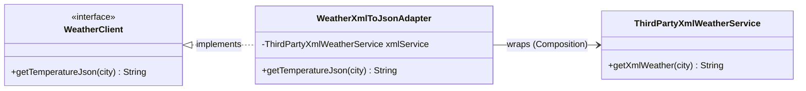
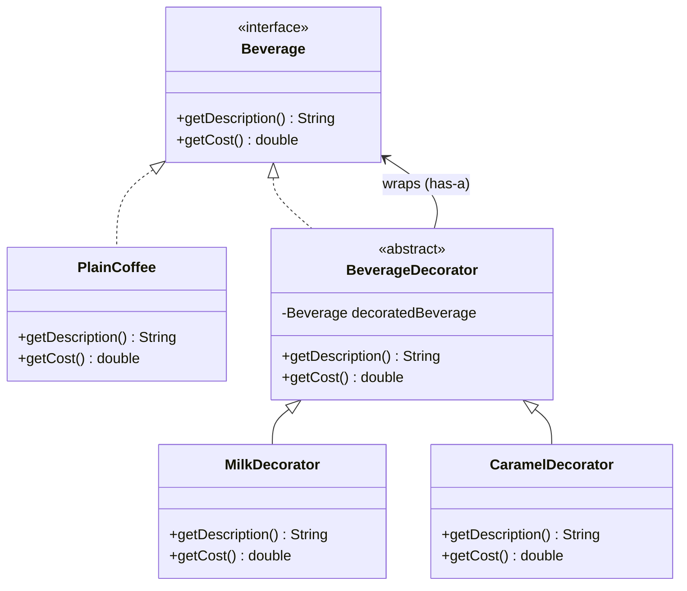
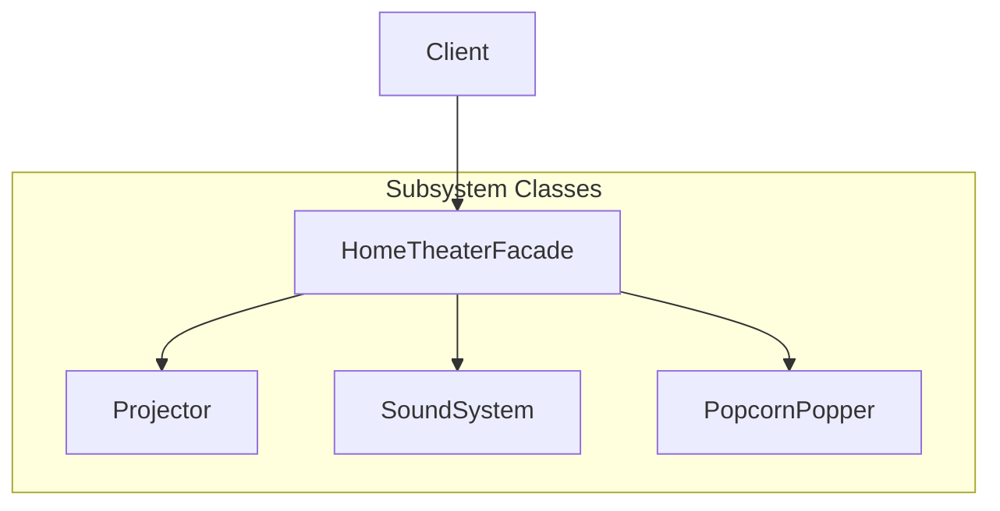
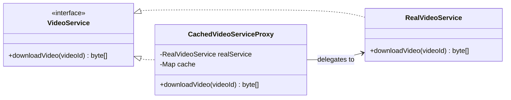
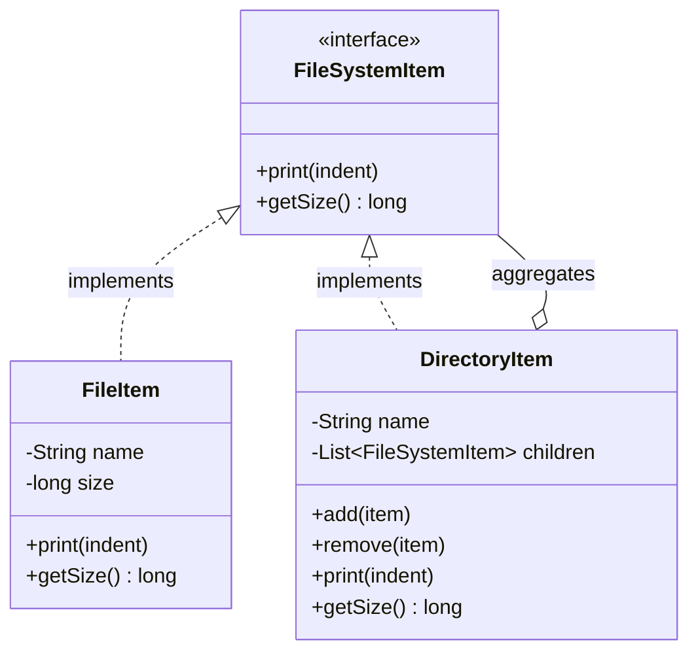
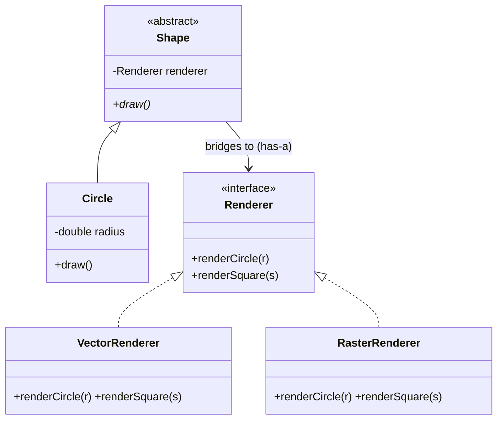
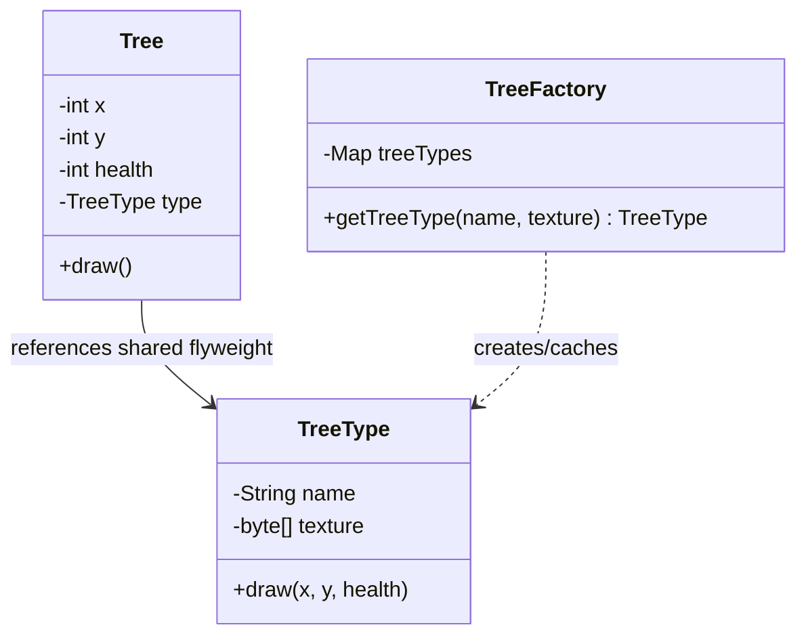
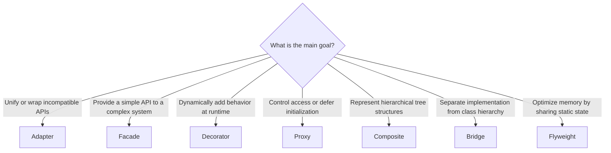

# Module 05 — Structural Design Patterns

> **Prerequisites**: [Module 03 → UML & Class Diagrams](./03_UML_Class_Diagrams.md)  
> **Next**: [Module 06 → Behavioral Patterns Pt.1](./06_Behavioral_Patterns_1.md)

---

## Why Does This Module Exist?

Once you have created objects (using Creational Patterns), you need to compose them into larger structures. The naive way is to make objects reference each other directly, which leads to rigid, tightly-coupled code. 

**Structural patterns** explain how to assemble objects and classes into larger structures while keeping these structures flexible and efficient. They focus on **decoupling interface from implementation** and **simplifying relationships** between entities.

We will cover the 7 structural patterns:

| Pattern | One-liner |
|---------|-----------|
| **Adapter** | Translate one interface into another that the client expects |
| **Decorator** | Dynamically add new behaviors to an object without subclassing |
| **Facade** | Provide a simplified entry point to a complex subsystem |
| **Proxy** | Control access to an object (for security, caching, lazy loading, etc.) |
| **Composite** | Treat individual objects and compositions of objects uniformly (tree structures) |
| **Bridge** | Separate an abstraction from its implementation so they can vary independently |
| **Flyweight** | Share state to support large numbers of fine-grained objects efficiently |

---

## Table of Contents

1. [Adapter](#1-adapter)
2. [Decorator](#2-decorator)
3. [Facade](#3-facade)
4. [Proxy](#4-proxy)
5. [Composite](#5-composite)
6. [Bridge](#6-bridge)
7. [Flyweight](#7-flyweight)
8. [When to Use Which](#8-when-to-use-which)
9. [Interview Cheatsheet](#9-interview-cheatsheet)

---

## 1. Adapter

### The Problem It Solves

Imagine you are building a dashboard that displays weather forecasts. Your dashboard expects weather data in JSON format through a `WeatherData` interface. However, you want to integrate a third-party weather service that only returns data in XML format.

You cannot modify the third-party service, and modifying your dashboard to support XML directly would violate OCP and clutter clean business logic with parsing logic.

### The Solution

Create an **Adapter** class that implements your expected interface (`JSON`) and wraps the incompatible class (`XML`). It translates the requests between them.

```java
// 1. Client Interface (what our system expects)
interface WeatherClient {
    String getTemperatureJson(String city);
}

// 2. Adaptee (the third-party service with incompatible format)
class ThirdPartyXmlWeatherService {
    public String getXmlWeather(String city) {
        return "<weather><city>" + city + "</city><temp>24.5</temp></weather>";
    }
}

// 3. Adapter (bridges the gap)
class WeatherXmlToJsonAdapter implements WeatherClient {
    private final ThirdPartyXmlWeatherService xmlService;

    public WeatherXmlToJsonAdapter(ThirdPartyXmlWeatherService xmlService) {
        this.xmlService = xmlService;
    }

    @Override
    public String getTemperatureJson(String city) {
        // Fetch XML from the service
        String xml = xmlService.getXmlWeather(city);
        
        // Parse XML and convert to JSON (simplified representation for readability)
        double temp = extractTempFromXml(xml); 
        return String.format("{\"city\": \"%s\", \"temp\": %.1f}", city, temp);
    }

    private double extractTempFromXml(String xml) {
        // Pretend this parses XML and extracts the value
        return 24.5;
    }
}
```

### Diagram



### Key Insight

> The Adapter pattern is a wrapper that **changes the interface** of an existing object. It makes two incompatible interfaces work together without changing their source code.

---

## 2. Decorator

### The Problem It Solves

You are designing a Coffee Shop application. You have a base `Coffee` class. Customers can add many toppings: Milk, Sugar, Whip, Caramel, etc. 

If you use inheritance, you get class explosion: `CoffeeWithMilk`, `CoffeeWithSugar`, `CoffeeWithMilkAndSugar`, `CoffeeWithMilkSugarAndCaramel`, etc. Adding a new ingredient means adding dozens of new subclasses.

### The Solution

Instead of subclassing to add behavior, you **wrap** the object inside a decorator. The decorator implements the same interface as the wrapped object, and adds its own behavior before or after forwarding requests.

```java
// 1. Component Interface
interface Beverage {
    String getDescription();
    double getCost();
}

// 2. Concrete Component
class PlainCoffee implements Beverage {
    @Override
    public String getDescription() { return "Plain Coffee"; }
    @Override
    public double getCost() { return 2.00; }
}

// 3. Abstract Decorator (implements interface AND aggregates instance of same interface)
abstract class BeverageDecorator implements Beverage {
    protected final Beverage decoratedBeverage;

    public BeverageDecorator(Beverage beverage) {
        this.decoratedBeverage = beverage;
    }

    @Override
    public String getDescription() { return decoratedBeverage.getDescription(); }
    @Override
    public double getCost() { return decoratedBeverage.getCost(); }
}

// 4. Concrete Decorators
class MilkDecorator extends BeverageDecorator {
    public MilkDecorator(Beverage beverage) { super(beverage); }

    @Override
    public String getDescription() {
        return decoratedBeverage.getDescription() + ", Milk";
    }

    @Override
    public double getCost() {
        return decoratedBeverage.getCost() + 0.50; // Add price of milk
    }
}

class CaramelDecorator extends BeverageDecorator {
    public CaramelDecorator(Beverage beverage) { super(beverage); }

    @Override
    public String getDescription() {
        return decoratedBeverage.getDescription() + ", Caramel";
    }

    @Override
    public double getCost() {
        return decoratedBeverage.getCost() + 0.80; // Add price of caramel
    }
}

// Usage
Beverage myCoffee = new PlainCoffee();
myCoffee = new MilkDecorator(myCoffee);      // Wrap with Milk
myCoffee = new CaramelDecorator(myCoffee);   // Wrap with Caramel

System.out.println(myCoffee.getDescription()); // "Plain Coffee, Milk, Caramel"
System.out.println(myCoffee.getCost());         // 3.30 (2.00 + 0.50 + 0.80)
```

### Diagram



### Key Insight

> Decorator adds behavior **dynamically** at runtime by layering wrappers. It obeys OCP because you write new decorators without modifying any existing classes. Java's `java.io` stream classes (e.g. `BufferedReader(new FileReader(file))`) are classic Decorators.

---

## 3. Facade

### The Problem It Solves

Your client code wants to play a movie on a home theater system. The theater consists of a DVD Player, Projector, SoundSystem, TheaterLights, Screen, and PopcornPopper. 

Without a Facade, the client has to call `popper.on()`, `popper.pop()`, `lights.dim(10)`, `screen.down()`, `projector.on()`, `soundSystem.setVolume(5)`, etc. The client is tightly coupled to 6 different classes, making the code hard to read and reuse.

### The Solution

Introduce a **Facade** that provides a unified, simplified high-level interface to the complex subsystem. The client interacts *only* with the Facade.

```java
// Subsystem classes (complex internals)
class Projector { void on() {} void off() {} }
class SoundSystem { void on() {} void setVolume(int v) {} void off() {} }
class PopcornPopper { void on() {} void pop() {} void off() {} }

// Facade
class HomeTheaterFacade {
    private final Projector projector;
    private final SoundSystem soundSystem;
    private final PopcornPopper popper;

    public HomeTheaterFacade(Projector proj, SoundSystem sound, PopcornPopper popper) {
        this.projector = proj;
        this.soundSystem = sound;
        this.popper = popper;
    }

    // High-level macro method
    public void watchMovie() {
        System.out.println("Get ready to watch a movie...");
        popper.on();
        popper.pop();
        projector.on();
        soundSystem.on();
        soundSystem.setVolume(7);
    }

    public void endMovie() {
        System.out.println("Shutting down theater...");
        projector.off();
        soundSystem.off();
        popper.off();
    }
}
```

### Diagram



### Key Insight

> A Facade **simplifies an interface** to a complex subsystem. It does not hide the subsystem entirely — clients that need advanced configuration can still access the underlying classes directly.

---

## 4. Proxy

### The Problem It Solves

You have a `VideoDownloader` class that fetches heavy video objects from YouTube. 
1. If multiple parts of your application request the same video, you download it repeatedly (wastes bandwidth).
2. You want to restrict access to certain videos based on user roles (security check).
3. You want to delay fetching the video from the network until it is actually needed (lazy initialization).

Putting caching, authentication, and lazy-loading directly in `VideoDownloader` violates SRP.

### The Solution

A **Proxy** acts as a placeholder or surrogate. It implements the same interface as the real service, intercepting calls to perform operations like logging, caching, authorization, or lazy loading *before* delegating to the real object.

```java
// 1. Shared Interface
interface VideoService {
    byte[] downloadVideo(String videoId);
}

// 2. Real Subject
class RealVideoService implements VideoService {
    @Override
    public byte[] downloadVideo(String videoId) {
        System.out.println("Downloading video " + videoId + " from YouTube (Heavy Network Call)...");
        return new byte[1000]; // Mock heavy data
    }
}

// 3. Proxy Class
class CachedVideoServiceProxy implements VideoService {
    private final RealVideoService realService;
    private final Map<String, byte[]> cache = new HashMap<>();

    public CachedVideoServiceProxy() {
        // Lazy initialization: don't create real service until needed
        this.realService = new RealVideoService();
    }

    @Override
    public byte[] downloadVideo(String videoId) {
        if (cache.containsKey(videoId)) {
            System.out.println("Serving video " + videoId + " from local cache.");
            return cache.get(videoId);
        }
        
        // Forward request to real service if not cached
        byte[] videoData = realService.downloadVideo(videoId);
        cache.put(videoId, videoData);
        return videoData;
    }
}

btw this doesnt technically have lazy initialisation we are initialising it verytime we initialise the cachedvideoservice so for this we use the singleton design pattern now we can achieve this easily using something like this 

if(realvideoservice==null){
    realvideoservice=new .....
}

but this is not thread safe what if two different threads enter the same code block and then there would be two initialisation.

so there are two ways to deal with this one with the double check locking (High performace way)

import java.util.Map;
import java.util.concurrent.ConcurrentHashMap;

class CachedVideoServiceProxy implements VideoService {
    // volatile ensures changes made by one thread are immediately visible to others
    private volatile RealVideoService realService = null; 
    // ConcurrentHashMap handles thread-safe atomic operations on the cache
    private final Map<String, byte[]> cache = new ConcurrentHashMap<>();

    public CachedVideoServiceProxy() {}

    @Override
    public byte[] downloadVideo(String videoId) {
        // 1. Thread-safe cache check
        if (cache.containsKey(videoId)) {
            System.out.println("Serving video " + videoId + " from local cache.");
            return cache.get(videoId);
        }
        
        // 2. Double-checked locking for Lazy Initialization
        if (realService == null) { // First check (no locking friction)
            synchronized (this) {
                if (realService == null) { // Second check (inside lock)
                    System.out.println("Thread-safe initialization of RealVideoService...");
                    realService = new RealVideoService();
                }
            }
        }
        
        // 3. Atomically compute and put if absent to prevent duplicate heavy downloads
        // for the same video ID across concurrent threads.
        return cache.computeIfAbsent(videoId, id -> realService.downloadVideo(id));
    }
}

and second is the initialisation on demad way (the most clean , this is the one we learnt in the singleton design pattern)

import java.util.Map;
import java.util.concurrent.ConcurrentHashMap;

class CachedVideoServiceProxy implements VideoService {
    private final Map<String, byte[]> cache = new ConcurrentHashMap<>();

    // The JVM guarantees that this inner class is not loaded into memory 
    // until 'Holder.INSTANCE' is explicitly referenced. 
    private static class Holder {
        private static final RealVideoService INSTANCE = new RealVideoService();
    }

    public CachedVideoServiceProxy() {}

    @Override
    public byte[] downloadVideo(String videoId) {
        if (cache.containsKey(videoId)) {
            return cache.get(videoId);
        }
        
        // Thread-safe, lazy instantiation completely managed by the JVM classloader
        RealVideoService service = Holder.INSTANCE; 
        
        return cache.computeIfAbsent(videoId, service::downloadVideo);
    }
}
```

### Diagram



### Types of Proxies

1. **Virtual Proxy**: Delays creation of an expensive object until it is needed (lazy instantiation).
2. **Protection Proxy**: Controls access based on user permissions.
3. **Caching Proxy**: Stores results of expensive operations to avoid re-execution.
4. **Remote Proxy**: Handles communication details when the real object is in a different address space/JVM.

---

## 5. Composite

### The Problem It Solves

You are building a file system representation. You have `File`s and `Directory`s. A `Directory` can contain both `File`s and other `Directory`s. 

If the client wants to calculate the total size of a root directory, it has to check every item: "Is this a file? Get its size. Is this a directory? Recursively calculate its size." This requires type checking and branching logic inside client code.

### The Solution

Make individual objects (`File`) and compositions (`Directory`) implement a **shared interface**. This allows clients to treat individual objects and groups of objects **identically**.

```java
// 1. Component Interface
interface FileSystemItem {
    void print(String indent);
    long getSize();
}

// 2. Leaf (individual object)
class FileItem implements FileSystemItem {
    private final String name;
    private final long size;

    public FileItem(String name, long size) {
        this.name = name;
        this.size = size;
    }

    @Override
    public void print(String indent) { System.out.println(indent + "- File: " + name + " (" + size + " bytes)"); }

    @Override
    public long getSize() { return size; }
}

// 3. Composite (contains nested Component items)
class DirectoryItem implements FileSystemItem {
    private final String name;
    private final List<FileSystemItem> children = new ArrayList<>();

    public DirectoryItem(String name) { this.name = name; }

    public void add(FileSystemItem item) { children.add(item); }
    public void remove(FileSystemItem item) { children.remove(item); }

    @Override
    public void print(String indent) {
        System.out.println(indent + "+ Directory: " + name);
        for (FileSystemItem item : children) {
            item.print(indent + "  "); // Uniform call handles files and sub-directories!
        }
    }

    @Override
    public long getSize() {
        long totalSize = 0;
        for (FileSystemItem item : children) {
            totalSize += item.getSize(); // Polymorphic recursion
        }
        return totalSize;
    }
}
```

### Diagram



### Key Insight

> Use Composite whenever your domain can be represented as a **tree structure**. It makes client code simple because you can ignore the difference between a single item and a tree of items.

---

## 6. Bridge

### The Problem It Solves

You want to design a Drawing Application that draws shapes (`Circle`, `Square`) using different renderers (`VectorRenderer`, `RasterRenderer`). 

If you inherit shapes directly with rendering types, you get a 2D matrix explosion: `VectorCircle`, `RasterCircle`, `VectorSquare`, `RasterSquare`. If you add a new shape (`Triangle`) or a new renderer (`3DRenderer`), you must create a flurry of subclasses.

### The Solution

Decouple the **Abstraction** (the Shape) from the **Implementation** (the Renderer) by introducing an interface bridge. The Abstraction maintains a reference to the Implementation interface.

```java
// 1. Implementation Interface (the "How" to draw)
interface Renderer {
    void renderCircle(double radius);
    void renderSquare(double side);
}

// Concrete implementations
class VectorRenderer implements Renderer {
    public void renderCircle(double radius) { System.out.println("Drawing vector circle. R = " + radius); }
    public void renderSquare(double side) { System.out.println("Drawing vector square. Side = " + side); }
}

class RasterRenderer implements Renderer {
    public void renderCircle(double radius) { System.out.println("Drawing pixel circle. R = " + radius); }
    public void renderSquare(double side) { System.out.println("Drawing pixel square. Side = " + side); }
}

// 2. Abstraction (the "What")
abstract class Shape {
    protected final Renderer renderer; // The Bridge

    protected Shape(Renderer renderer) { this.renderer = renderer; }
    
    abstract void draw();
}

// Refined Abstractions
class Circle extends Shape {
    private final double radius;

    public Circle(Renderer renderer, double radius) {
        super(renderer);
        this.radius = radius;
    }

    @Override
    void draw() { renderer.renderCircle(radius); }
}
```

### Diagram



### Key Insight

> Bridge replaces class inheritance with **object composition**. It lets you scale the abstractions (shapes) and implementations (renderers) independently without them multiplying.

---

## 7. Flyweight

### The Problem It Solves

You are building a game like Minecraft. You want to render a forest with 1,000,000 trees. Each tree has a position (`x, y`), current health, name, and a 50MB texture/mesh block.

Creating 1,000,000 tree objects with 50MB textures would instantly exceed memory limits (`1,000,000 * 50MB = 50TB`).

### The Solution

Split the object's state into:
1. **Intrinsic State**: Constant data that can be shared across all trees (e.g. texture, mesh, name).
2. **Extrinsic State**: Variable data unique to each instance (e.g. coordinate positions, health).

Create a shared "Flyweight" object for the Intrinsic state, and store the Extrinsic state externally.

```java
// 1. The Flyweight Class (Holds Intrinsic State)
class TreeType {
    private final String name;
    private final byte[] texture; // Heavy shared resource

    public TreeType(String name, byte[] texture) {
        this.name = name;
        this.texture = texture;
    }

    public void draw(int x, int y, int health) {
        // Render tree using coordinates (Extrinsic) and shared texture (Intrinsic)
        System.out.println("Drawing " + name + " at (" + x + "," + y + ") Health: " + health);
    }
}

// 2. The Flyweight Factory (Ensures sharing)
class TreeFactory {
    private static final Map<String, TreeType> treeTypes = new HashMap<>();

    public static TreeType getTreeType(String name, byte[] texture) {
        if (!treeTypes.containsKey(name)) {
            treeTypes.put(name, new TreeType(name, texture));
            System.out.println("Loaded new Tree Type into memory: " + name);
        }
        return treeTypes.get(name);
    }
}

// 3. Context (Holds Extrinsic State & references Flyweight)
class Tree {
    private final int x;
    private final int y;
    private final int health;
    private final TreeType type; // Shared Flyweight reference

    public Tree(int x, int y, int health, TreeType type) {
        this.x = x;
        this.y = y;
        this.health = health;
        this.type = type;
    }

    public void draw() {
        type.draw(x, y, health); // Delegate drawing to Flyweight
    }
}
```

### Diagram



### Key Insight

> Flyweight is a memory-saving optimization pattern. When you have thousands of objects with identical static state, strip that state out and cache it in a single instance.

---

## 8. When to Use Which



---

## 9. Interview Cheatsheet

| Pattern | Intention | Lifecycle Management | Key visual sign |
|---|---|---|---|
| **Adapter** | Converts interface A to interface B | Instantiated with Adaptee object | `class Adapter implements Target { Adaptee a; }` |
| **Decorator** | Adds dynamic behavior to interface A | Wraps another instance of interface A | `class Dec implements A { A wrapped; }` |
| **Facade** | Simplifies complex interfaces | Coordinates subsystem instances | Directs calls to class B, C, D |
| **Proxy** | Intercepts calls to subject | Often instantiates subject lazily | Same interface, restricts/caches calls |
| **Composite** | Treats node/leaves uniformly | Children stored in a collection | Class holds collection of its interfaces |
| **Bridge** | Separates abstraction from impl | Abstraction composed with Impl reference | `abstract class Abstraction { Impl bridge; }` |
| **Flyweight** | Shares heavy static objects | Factory coordinates cache | Static map stores shared objects |

### Typical Interview Questions

**"How does Proxy differ from Decorator?"**
> *While both wrap an object and have the same interface, their purpose differs. Decorator is about adding behavior dynamically at runtime (clients stack wrappers). Proxy is about controlling access (e.g. security checks, caching) and managing the wrapped object's lifecycle. A Proxy often manages its subject internally, while Decorator takes it as a constructor parameter.*

**"Explain the difference between Adapter and Bridge."**
> *Adapter makes code work *after* it has already been designed (retrofitting incompatible third-party libraries). Bridge is applied *before* coding (during initial design phase) to separate an abstraction hierarchy from its implementation hierarchy so they can grow independently.*

**"What is the risk of using Flyweight?"**
> *It introduces complexity by splitting class state. If thread-safety isn't handled correctly, modifying intrinsic state in one thread will corrupt all instances sharing it. Intrinsic state must remain strictly immutable (`final`).*

---

> ✅ **Module 05 Complete**  
> **Next**: [Module 06 → Behavioral Patterns Pt.1](./06_Behavioral_Patterns_1.md) — how objects communicate and coordinate tasks.  
> Say **"proceed"** to generate the next module!
