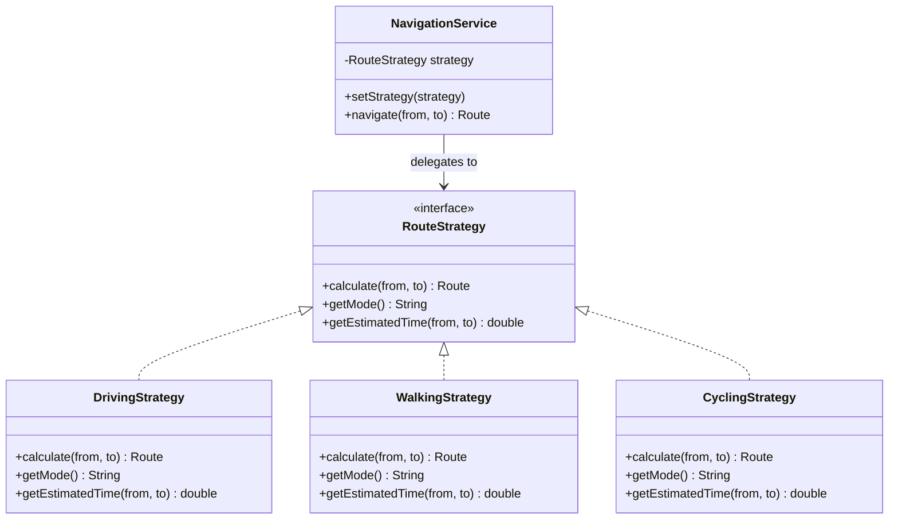
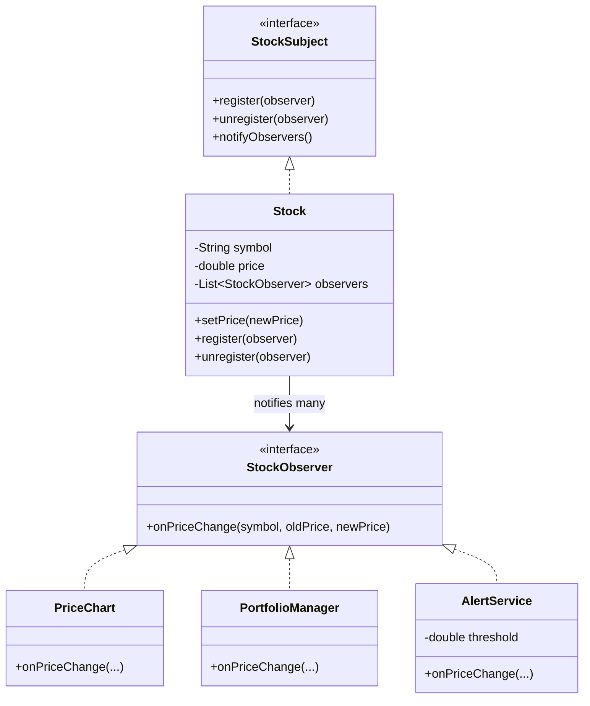
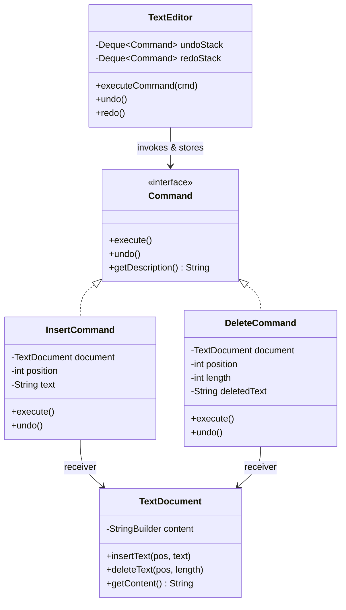
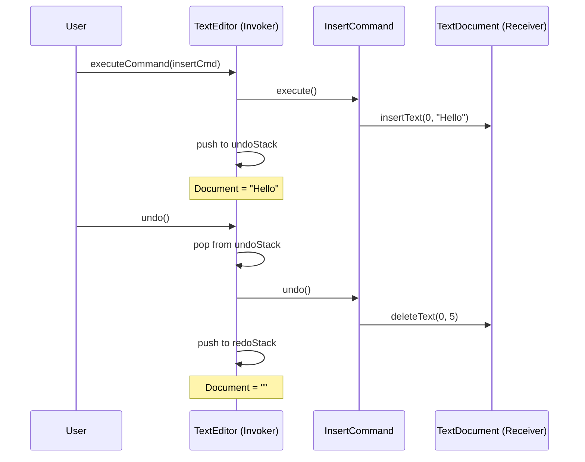
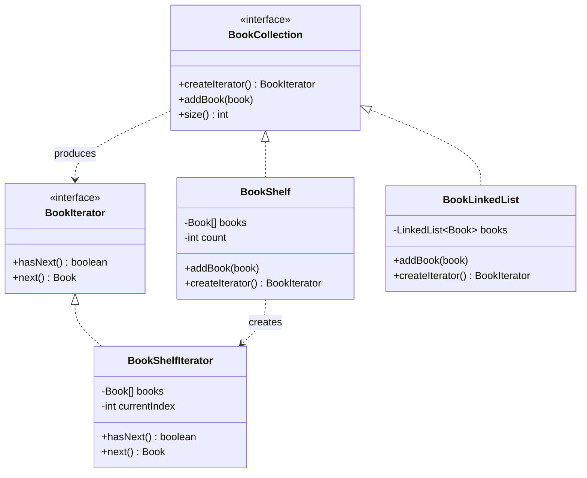
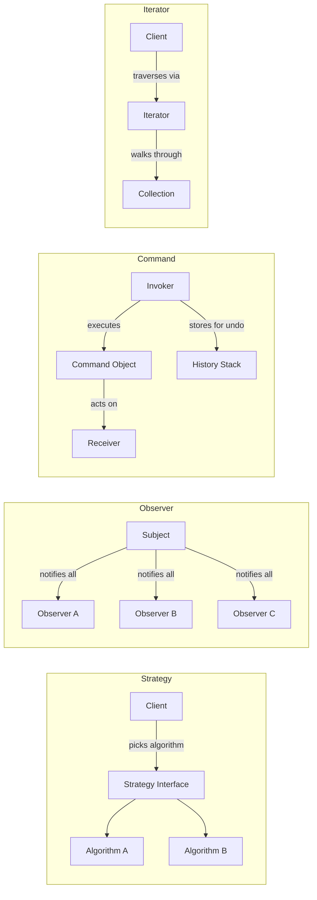

# Module 06 — Behavioral Design Patterns (Part 1)

> **Prerequisites**: [Module 05 → Structural Patterns](./05_Structural_Patterns.md)  
> **Next**: [Module 07 → Behavioral Patterns Pt.2](./07_Behavioral_Patterns_2.md)

---

## Why Does This Module Exist?

Creational patterns handle *how objects are made*. Structural patterns handle *how objects are composed*. **Behavioral patterns** handle *how objects communicate and coordinate responsibilities*.

Without behavioral patterns, you end up with:
- Massive `if-else` / `switch` chains that grow with every new behavior
- Objects that know too much about each other (tight coupling)
- Logic scattered across multiple classes instead of being encapsulated

Behavioral patterns give objects well-defined **roles** in communication — who sends, who receives, who decides, and how they coordinate.

We'll split behavioral patterns across two modules:

| Module | Patterns | Why grouped together |
|--------|----------|---------------------|
| **06 (this one)** | Strategy, Observer, Command, Iterator | The "everyday four" — you'll use these constantly |
| **07 (next)** | State, Template Method, Chain of Responsibility, Mediator, Visitor, Memento | More specialized, but critical for LLD problems |

---

## Table of Contents

1. [Strategy](#1-strategy)
2. [Observer](#2-observer)
3. [Command](#3-command)
4. [Iterator](#4-iterator)
5. [How They Differ](#5-how-they-differ)
6. [Interview Cheatsheet](#6-interview-cheatsheet)

---

## 1. Strategy

### The Problem It Solves

You're building a navigation app (think Google Maps). The user can choose between driving, walking, cycling, or public transit — and each has a completely different route-calculation algorithm.

```java
// ❌ BAD: Algorithm selection via if-else — violates OCP
class NavigationService {
    public Route calculateRoute(String from, String to, String mode) {
        if (mode.equals("DRIVING")) {
            // 200 lines of driving algorithm
        } else if (mode.equals("WALKING")) {
            // 150 lines of walking algorithm
        } else if (mode.equals("CYCLING")) {
            // 180 lines of cycling algorithm
        }
        // Add PUBLIC_TRANSIT? Modify this class. Add HELICOPTER? Modify again.
        return null;
    }
}
```

Problems:
1. **SRP violation**: One class contains 4+ algorithms
2. **OCP violation**: Every new mode = modify existing code
3. **Untestable**: Can't test one algorithm in isolation

### The Solution

Extract each algorithm into its own class behind a common interface. The context class delegates to whichever strategy it holds — swappable at runtime.

```java
// Strategy Interface
interface RouteStrategy {
    Route calculate(String from, String to);
    String getMode();
    double getEstimatedTime(String from, String to);  // in minutes
}

// Concrete Strategies
class DrivingStrategy implements RouteStrategy {
    @Override
    public Route calculate(String from, String to) {
        System.out.println("Calculating fastest driving route...");
        // Consider: highways, traffic, tolls, fuel cost
        return new Route(from, to, "DRIVING");
    }

    @Override
    public String getMode() { return "DRIVING"; }

    @Override
    public double getEstimatedTime(String from, String to) {
        return 25.0;  // simplified
    }
}

class WalkingStrategy implements RouteStrategy {
    @Override
    public Route calculate(String from, String to) {
        System.out.println("Calculating walking route...");
        // Consider: pedestrian paths, park shortcuts, stairs
        return new Route(from, to, "WALKING");
    }

    @Override
    public String getMode() { return "WALKING"; }

    @Override
    public double getEstimatedTime(String from, String to) {
        return 90.0;
    }
}

class CyclingStrategy implements RouteStrategy {
    @Override
    public Route calculate(String from, String to) {
        System.out.println("Calculating cycling route...");
        // Consider: bike lanes, elevation, bike-sharing stations
        return new Route(from, to, "CYCLING");
    }

    @Override
    public String getMode() { return "CYCLING"; }

    @Override
    public double getEstimatedTime(String from, String to) {
        return 40.0;
    }
}

// Context — delegates to whatever strategy it holds
class NavigationService {
    private RouteStrategy strategy;

    public NavigationService(RouteStrategy strategy) {
        this.strategy = strategy;
    }

    // Can swap at runtime!
    public void setStrategy(RouteStrategy strategy) {
        this.strategy = strategy;
    }

    public Route navigate(String from, String to) {
        System.out.println("Mode: " + strategy.getMode());
        System.out.println("ETA: " + strategy.getEstimatedTime(from, to) + " min");
        return strategy.calculate(from, to);
    }
}

// Usage
NavigationService nav = new NavigationService(new DrivingStrategy());
nav.navigate("Home", "Office");  // Uses driving algorithm

nav.setStrategy(new CyclingStrategy());  // Swap at runtime
nav.navigate("Home", "Office");  // Now uses cycling algorithm
```

### Diagram



### Key Insight

> Strategy = **OCP + DIP in action**. The context depends on an abstraction (interface). New algorithms = new classes, zero changes to existing code. Ask yourself: *"Am I selecting between multiple algorithms?"* If yes, Strategy.

### Strategy vs Inheritance

| Approach | Problem |
|---|---|
| Inheritance (`DrivingNavigator extends Navigator`) | Algorithm is baked in at compile time; can't swap |
| Strategy (inject `RouteStrategy`) | Algorithm is pluggable at runtime; fully testable in isolation |

---

## 2. Observer

### The Problem It Solves

You're building a stock market dashboard. When a stock price changes, multiple components need to react: the price chart updates, the portfolio recalculates, a notification fires, and a log entry is created.

```java
// ❌ BAD: StockPrice directly calls every dependent — tight coupling
class StockPrice {
    private double price;
    private PriceChart chart;
    private Portfolio portfolio;
    private NotificationEngine notifier;
    private AuditLogger logger;

    public void setPrice(double newPrice) {
        this.price = newPrice;
        chart.update(price);        // StockPrice knows about chart
        portfolio.recalculate();     // StockPrice knows about portfolio
        notifier.alert(price);       // StockPrice knows about notifier
        logger.log(price);           // StockPrice knows about logger
        // Add a new component? Modify StockPrice. Again.
    }
}
```

`StockPrice` is now coupled to 4 classes. Every new listener = modifying the publisher. This is the exact opposite of OCP.

### The Solution

The **Observer pattern** (also called Publish-Subscribe) defines a one-to-many dependency: when the **subject** (publisher) changes state, all its **observers** (subscribers) are notified automatically — without the subject knowing who they are.

```java
// 1. Observer Interface — what subscribers implement
interface StockObserver {
    void onPriceChange(String stockSymbol, double oldPrice, double newPrice);
}

// 2. Subject Interface — what publishers implement
interface StockSubject {
    void register(StockObserver observer);
    void unregister(StockObserver observer);
    void notifyObservers();
}

// 3. Concrete Subject — the publisher
class Stock implements StockSubject {
    private final String symbol;
    private double price;
    private final List<StockObserver> observers = new ArrayList<>();

    public Stock(String symbol, double initialPrice) {
        this.symbol = symbol;
        this.price = initialPrice;
    }

    @Override
    public void register(StockObserver observer) { observers.add(observer); }

    @Override
    public void unregister(StockObserver observer) { observers.remove(observer); }

    @Override
    public void notifyObservers() {
        for (StockObserver observer : observers) {
            observer.onPriceChange(symbol, price, price);  // simplified
        }
    }

    // When state changes, notify all observers
    public void setPrice(double newPrice) {
        double oldPrice = this.price;
        this.price = newPrice;
        System.out.println(symbol + " price changed: " + oldPrice + " → " + newPrice);
        notifyAllObservers(oldPrice, newPrice);
    }

    private void notifyAllObservers(double oldPrice, double newPrice) {
        for (StockObserver observer : observers) {
            observer.onPriceChange(symbol, oldPrice, newPrice);
        }
    }

    public double getPrice() { return price; }
}

// 4. Concrete Observers — each reacts differently
class PriceChart implements StockObserver {
    @Override
    public void onPriceChange(String symbol, double oldPrice, double newPrice) {
        System.out.println("[Chart] Updating " + symbol + " chart: " + newPrice);
    }
}

class PortfolioManager implements StockObserver {
    @Override
    public void onPriceChange(String symbol, double oldPrice, double newPrice) {
        double changePercent = ((newPrice - oldPrice) / oldPrice) * 100;
        System.out.printf("[Portfolio] %s moved %.2f%%\n", symbol, changePercent);
    }
}

class AlertService implements StockObserver {
    private final double threshold;

    public AlertService(double threshold) { this.threshold = threshold; }

    @Override
    public void onPriceChange(String symbol, double oldPrice, double newPrice) {
        double changePercent = Math.abs((newPrice - oldPrice) / oldPrice) * 100;
        if (changePercent > threshold) {
            System.out.printf("[ALERT] %s moved %.2f%% — exceeds %.1f%% threshold!\n",
                    symbol, changePercent, threshold);
        }
    }
}

// Usage
Stock reliance = new Stock("RELIANCE", 2500.0);

reliance.register(new PriceChart());
reliance.register(new PortfolioManager());
reliance.register(new AlertService(5.0));  // alert if > 5% move

reliance.setPrice(2650.0);
// Output:
// RELIANCE price changed: 2500.0 → 2650.0
// [Chart] Updating RELIANCE chart: 2650.0
// [Portfolio] RELIANCE moved 6.00%
// [ALERT] RELIANCE moved 6.00% — exceeds 5.0% threshold!
```

### Diagram



### Push vs Pull Models

| Model | How it works | When to use |
|---|---|---|
| **Push** | Subject sends data in the notification (`onPriceChange(symbol, old, new)`) | Observers always need the same data |
| **Pull** | Subject sends itself; observer queries what it needs (`onPriceChange(stock)` → `stock.getPrice()`) | Observers need different subsets of data |

### Key Insight

> Observer decouples the **event source** from the **event handlers**. The subject knows it has observers; it doesn't know what they are. This is the backbone of event-driven systems, UI frameworks (listeners), and pub-sub messaging.

---

## 3. Command

### The Problem It Solves

You're building a text editor. The user can: type text, delete text, bold text, undo the last action, redo the last undo. 

Without Command pattern:
- The `Toolbar` button directly calls `document.bold()` — tightly coupled
- How do you implement Undo? You'd need to know what the last action was and how to reverse it
- How do you implement Redo? Now you need a history stack of actions
- How do you implement macros (replay a sequence of actions)? No clean way

### The Solution

Encapsulate each action as an **object** — with all the information needed to execute it and (crucially) **undo** it. Store these command objects in a history stack for undo/redo.

```java
// 1. Command Interface
interface Command {
    void execute();
    void undo();
    String getDescription();
}

// 2. Receiver — the object that actually does the work
class TextDocument {
    private StringBuilder content = new StringBuilder();

    public void insertText(int position, String text) {
        content.insert(position, text);
    }

    public void deleteText(int position, int length) {
        content.delete(position, position + length);
    }

    public String getContent() { return content.toString(); }

    @Override
    public String toString() { return content.toString(); }
}

// 3. Concrete Commands — each knows how to execute AND undo
class InsertCommand implements Command {
    private final TextDocument document;
    private final int position;
    private final String text;

    public InsertCommand(TextDocument document, int position, String text) {
        this.document = document;
        this.position = position;
        this.text = text;
    }

    @Override
    public void execute() {
        document.insertText(position, text);
    }

    @Override
    public void undo() {
        document.deleteText(position, text.length());  // reverse of insert = delete
    }

    @Override
    public String getDescription() { return "Insert '" + text + "' at " + position; }
}

class DeleteCommand implements Command {
    private final TextDocument document;
    private final int position;
    private final int length;
    private String deletedText;  // saved for undo!

    public DeleteCommand(TextDocument document, int position, int length) {
        this.document = document;
        this.position = position;
        this.length = length;
    }

    @Override
    public void execute() {
        // Save what we're about to delete (for undo)
        deletedText = document.getContent().substring(position, position + length);
        document.deleteText(position, length);
    }

    @Override
    public void undo() {
        document.insertText(position, deletedText);  // reverse of delete = re-insert
    }

    @Override
    public String getDescription() { return "Delete " + length + " chars at " + position; }
}

// 4. Invoker — manages execution and history
class TextEditor {
    private final TextDocument document = new TextDocument();
    private final Deque<Command> undoStack = new ArrayDeque<>();
    private final Deque<Command> redoStack = new ArrayDeque<>();

    public void executeCommand(Command command) {
        command.execute();
        undoStack.push(command);
        redoStack.clear();  // new action invalidates redo history
        System.out.println("Executed: " + command.getDescription());
        System.out.println("Document: \"" + document + "\"");
    }

    public void undo() {
        if (undoStack.isEmpty()) {
            System.out.println("Nothing to undo.");
            return;
        }
        Command command = undoStack.pop();
        command.undo();
        redoStack.push(command);
        System.out.println("Undone: " + command.getDescription());
        System.out.println("Document: \"" + document + "\"");
    }

    public void redo() {
        if (redoStack.isEmpty()) {
            System.out.println("Nothing to redo.");
            return;
        }
        Command command = redoStack.pop();
        command.execute();
        undoStack.push(command);
        System.out.println("Redone: " + command.getDescription());
        System.out.println("Document: \"" + document + "\"");
    }

    public TextDocument getDocument() { return document; }
}

// Usage
TextEditor editor = new TextEditor();
TextDocument doc = editor.getDocument();

editor.executeCommand(new InsertCommand(doc, 0, "Hello "));
// Document: "Hello "

editor.executeCommand(new InsertCommand(doc, 6, "World"));
// Document: "Hello World"

editor.executeCommand(new DeleteCommand(doc, 5, 6));
// Document: "Hello"

editor.undo();
// Undone: Delete 6 chars at 5
// Document: "Hello World"

editor.undo();
// Undone: Insert 'World' at 6
// Document: "Hello "

editor.redo();
// Redone: Insert 'World' at 6
// Document: "Hello World"
```

### Diagram



### The Flow



### Key Insight

> Command turns a **request into an object**. This lets you:
> - **Parameterize** methods with different requests
> - **Queue** or **log** requests
> - **Undo/Redo** operations
> - Build **macros** (a command that executes a list of commands)
>
> Any time you need undo, transaction logs, or deferred execution — think Command.

---

## 4. Iterator

### The Problem It Solves

You've built a custom data structure — say, a `BookShelf` that stores books in an array internally. Now client code wants to loop through all books.

```java
// ❌ BAD: Client must know the internal structure
class BookShelf {
    private Book[] books;
    private int count;

    public Book[] getBooks() { return books; }   // exposes internal array
    public int getCount() { return count; }
}

// Client is coupled to array implementation
for (int i = 0; i < shelf.getCount(); i++) {
    Book b = shelf.getBooks()[i];  // what if we switch to a LinkedList?
}
```

If `BookShelf` switches from an array to a `LinkedList`, `TreeSet`, or a database cursor — every caller breaks.

### The Solution

Provide a way to traverse elements of a collection without exposing its underlying structure. The `Iterator` encapsulates the traversal logic.

```java
// 1. Iterator Interface
interface BookIterator {
    boolean hasNext();
    Book next();
}

// 2. Aggregate Interface
interface BookCollection {
    BookIterator createIterator();
    void addBook(Book book);
    int size();
}

// 3. Concrete Iterator
class BookShelfIterator implements BookIterator {
    private final Book[] books;
    private final int count;
    private int currentIndex = 0;

    public BookShelfIterator(Book[] books, int count) {
        this.books = books;
        this.count = count;
    }

    @Override
    public boolean hasNext() {
        return currentIndex < count;
    }

    @Override
    public Book next() {
        if (!hasNext()) throw new NoSuchElementException("No more books");
        return books[currentIndex++];
    }
}

// 4. Concrete Aggregate
class BookShelf implements BookCollection {
    private Book[] books;
    private int count = 0;

    public BookShelf(int capacity) {
        this.books = new Book[capacity];
    }

    @Override
    public void addBook(Book book) {
        if (count >= books.length) throw new RuntimeException("Shelf is full");
        books[count++] = book;
    }

    @Override
    public int size() { return count; }

    @Override
    public BookIterator createIterator() {
        return new BookShelfIterator(books, count);
    }
}

// 5. Alternative: LinkedList-based collection — same interface!
class BookLinkedList implements BookCollection {
    private final LinkedList<Book> books = new LinkedList<>();

    @Override
    public void addBook(Book book) { books.add(book); }

    @Override
    public int size() { return books.size(); }

    @Override
    public BookIterator createIterator() {
        return new BookIterator() {
            private final java.util.Iterator<Book> internal = books.iterator();
            @Override public boolean hasNext() { return internal.hasNext(); }
            @Override public Book next() { return internal.next(); }
        };
    }
}

// Client code — works with ANY BookCollection, regardless of internal structure
class LibraryPrinter {
    public void printAll(BookCollection collection) {
        BookIterator iterator = collection.createIterator();
        while (iterator.hasNext()) {
            Book book = iterator.next();
            System.out.println("Title: " + book.getTitle());
        }
        // Doesn't know if it's an array, linked list, or database result set
    }
}
```

### Diagram



### Java's Built-in Iterators

In practice, Java provides this pattern natively via `java.util.Iterator` and the `Iterable` interface:

```java
// Making BookShelf work with Java's enhanced for-loop
class BookShelf implements Iterable<Book> {
    private Book[] books;
    private int count;

    @Override
    public Iterator<Book> iterator() {
        return new Iterator<>() {
            private int index = 0;
            @Override public boolean hasNext() { return index < count; }
            @Override public Book next() { return books[index++]; }
        };
    }
}

// Now works with for-each!
for (Book book : bookShelf) {
    System.out.println(book.getTitle());
}
```

### Key Insight

> Iterator **decouples traversal from data structure**. The collection can change its internal representation freely; the client code never notices. Java's entire Collections Framework is built on this pattern (`Iterable<T>` / `Iterator<T>`).

---

## 5. How They Differ

These four patterns can feel similar because they all decouple "who does what." Here's how to distinguish them:



| Pattern | Core question it answers | Direction |
|---------|--------------------------|-----------|
| **Strategy** | *Which algorithm should I use?* | Client → one strategy |
| **Observer** | *Who should I notify when I change?* | Subject → many observers |
| **Command** | *How do I encapsulate a request as an object?* | Invoker → command → receiver |
| **Iterator** | *How do I traverse a collection without exposing its internals?* | Client → iterator → collection |

---

## 6. Interview Cheatsheet

| Pattern | Problem signal | Real-world examples | SOLID connection |
|---------|---------------|---------------------|-----------------|
| **Strategy** | Multiple interchangeable algorithms; `if/switch` on algorithm type | Sorting algorithms, payment methods, compression algorithms, route calculation | OCP, DIP |
| **Observer** | One change must notify many; pub-sub | Event listeners, stock tickers, MVC (model notifies views), notification systems | OCP, SRP |
| **Command** | Need undo/redo, queuing, logging of operations | Text editors, database transactions, task schedulers, remote control buttons | SRP (action encapsulated) |
| **Iterator** | Traverse a collection without knowing its internals | Java `Iterator`, database cursors, file system walkers | DIP, ISP |

### Typical Interview Questions

**"When would you use Strategy vs if-else?"**
> *When the number of algorithms can grow, and each algorithm has meaningful logic worth encapsulating. If it's just 2-3 trivial conditions that won't change, if-else is fine. Strategy shines when algorithms are complex, testable in isolation, or swappable at runtime.*

**"Explain Observer vs direct method calls."**
> *Direct calls create tight coupling — the publisher must know every subscriber. Observer inverts this: the publisher knows only the Observer interface. New subscribers are added without touching the publisher. Trade-off: harder to debug (notifications are implicit, not explicit call chains).*

**"What's the relationship between Command and Memento?"**
> *Command stores how to execute and undo an action. Memento stores a snapshot of an object's state. For undo, Command reverses its own action; Memento restores a saved snapshot. They can be used together — Command triggers the action, Memento saves the state before the action for rollback.*

**"How does Java's `Iterable`/`Iterator` relate to the Iterator pattern?"**
> *It IS the Iterator pattern. `Iterable<T>` is the Aggregate interface (`createIterator()` = `iterator()`). `Iterator<T>` is the Iterator interface. Any class implementing `Iterable` can be used in enhanced for-loops — the language syntax directly supports the pattern.*

---

> ✅ **Module 06 Complete**  
> **Next**: [Module 07 → Behavioral Patterns Pt.2](./07_Behavioral_Patterns_2.md) — State, Template Method, Chain of Responsibility, Mediator, Visitor, and Memento.  
> Say **"proceed"** or **"next 3 modules"** to continue.
