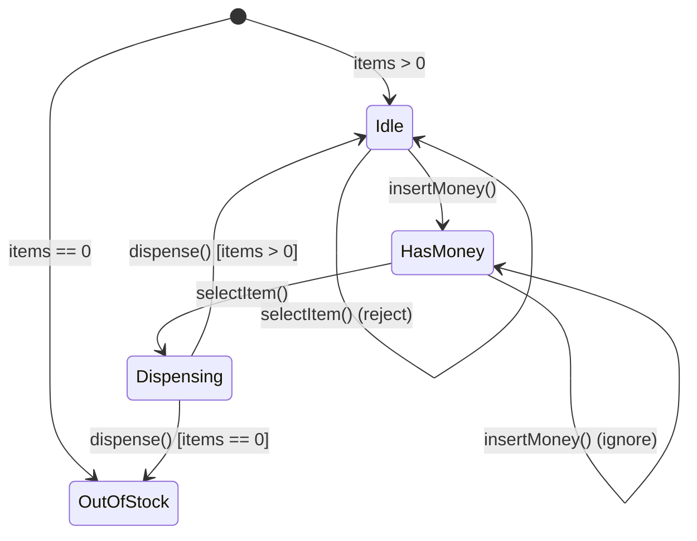
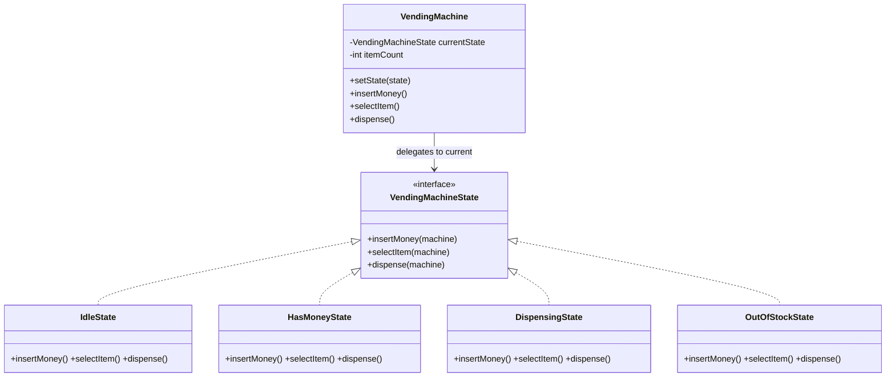
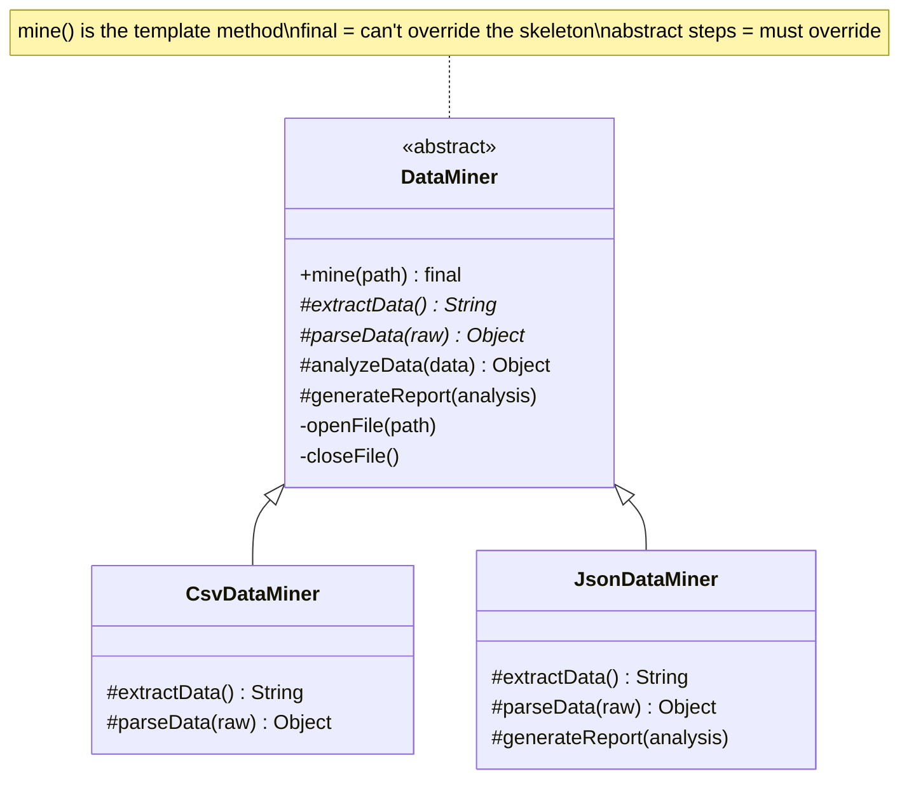
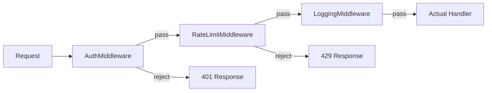
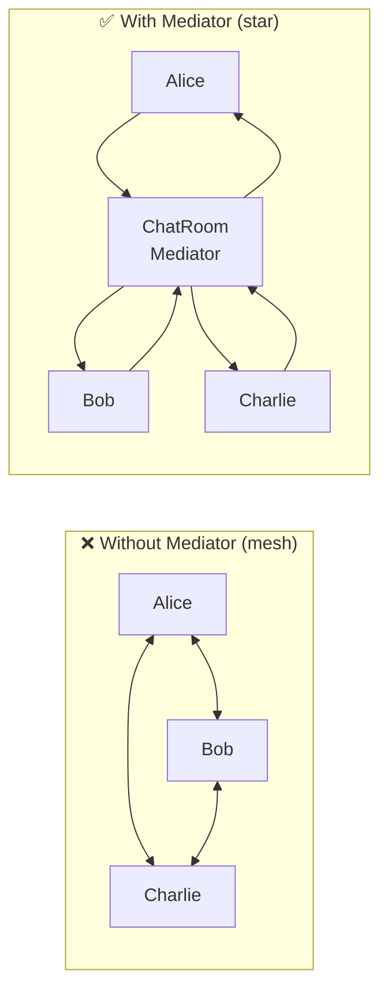
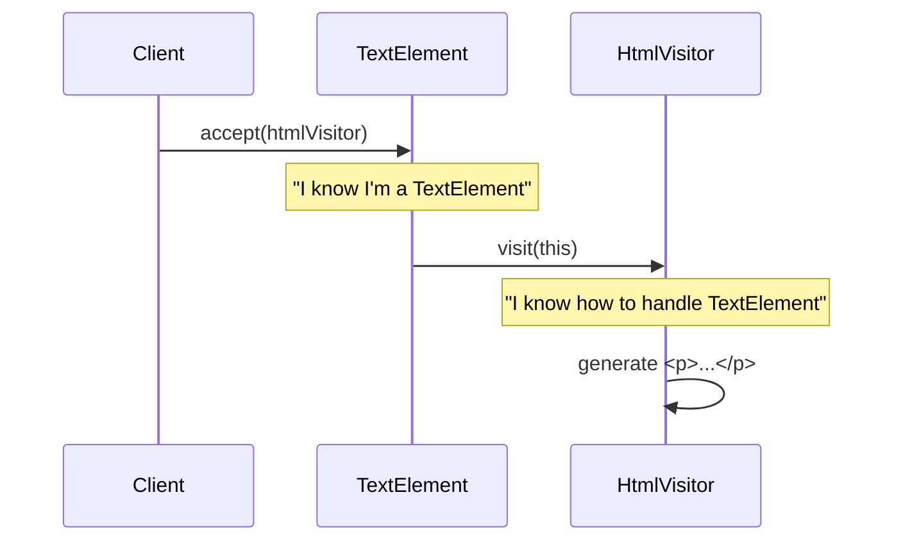
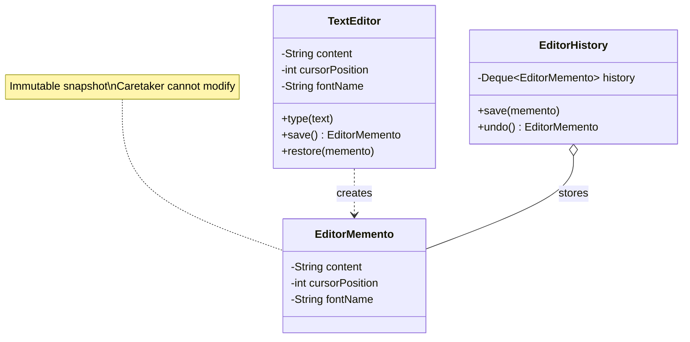
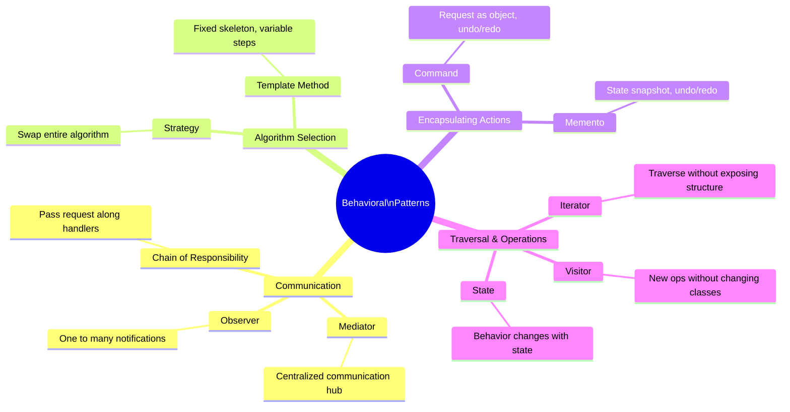

# Module 07 — Behavioral Design Patterns (Part 2)

> **Prerequisites**: [Module 06 → Behavioral Patterns Pt.1](./06_Behavioral_Patterns_1.md)  
> **Next**: [Module 08 → LLD Problem: Parking Lot](./08_LLD_Parking_Lot.md)

---

## Why Does This Module Exist?

Module 06 covered the "everyday four" behavioral patterns. This module covers six more specialized patterns that you'll encounter in specific LLD scenarios — particularly State (elevator, vending machine), Template Method (frameworks), and Chain of Responsibility (middleware, approval workflows).

| Pattern | One-liner |
|---------|-----------|
| **State** | Let an object alter its behavior when its internal state changes — it appears to change class |
| **Template Method** | Define the skeleton of an algorithm in a base class; let subclasses override specific steps |
| **Chain of Responsibility** | Pass a request along a chain of handlers; each decides to handle it or pass it along |
| **Mediator** | Centralize complex communication between objects through a single mediator |
| **Visitor** | Add new operations to a class hierarchy without modifying the classes |
| **Memento** | Capture and restore an object's internal state without violating encapsulation |

---

## Table of Contents

1. [State](#1-state)
2. [Template Method](#2-template-method)
3. [Chain of Responsibility](#3-chain-of-responsibility)
4. [Mediator](#4-mediator)
5. [Visitor](#5-visitor)
6. [Memento](#6-memento)
7. [All Behavioral Patterns at a Glance](#7-all-behavioral-patterns-at-a-glance)

---

## 1. State

### The Problem It Solves

You're designing a Vending Machine. It has states: `IDLE`, `HAS_MONEY`, `DISPENSING`, `OUT_OF_STOCK`. The same button ("select item") does completely different things depending on the current state.

```java
// ❌ BAD: State-dependent behavior via if-else
class VendingMachine {
    private String state = "IDLE";

    public void insertMoney() {
        if (state.equals("IDLE")) {
            state = "HAS_MONEY";
            System.out.println("Money accepted");
        } else if (state.equals("HAS_MONEY")) {
            System.out.println("Money already inserted");
        } else if (state.equals("DISPENSING")) {
            System.out.println("Please wait...");
        } else if (state.equals("OUT_OF_STOCK")) {
            System.out.println("Machine is empty, returning money");
        }
    }

    public void selectItem() { /* another 4-branch if-else */ }
    public void dispense() { /* another 4-branch if-else */ }
    // Every method has the same 4-branch structure.
    // Add a new state (e.g. MAINTENANCE)? Touch EVERY method.
}
```

Every method has the same branching structure. Adding a new state means modifying every single method.

### The Solution

Extract each state into its own class. The context (VendingMachine) delegates behavior to its current state object.

```java
// 1. State Interface
interface VendingMachineState {
    void insertMoney(VendingMachine machine);
    void selectItem(VendingMachine machine);
    void dispense(VendingMachine machine);
}

// 2. Context
class VendingMachine {
    private VendingMachineState currentState;
    private int itemCount;

    // Pre-created state objects (avoids creating new objects on every transition)
    final VendingMachineState idleState = new IdleState();
    final VendingMachineState hasMoneyState = new HasMoneyState();
    final VendingMachineState dispensingState = new DispensingState();
    final VendingMachineState outOfStockState = new OutOfStockState();

    public VendingMachine(int itemCount) {
        this.itemCount = itemCount;
        this.currentState = itemCount > 0 ? idleState : outOfStockState;
    }

    public void setState(VendingMachineState state) { this.currentState = state; }
    public int getItemCount() { return itemCount; }
    public void decrementItemCount() { itemCount--; }

    // Delegate to current state
    public void insertMoney() { currentState.insertMoney(this); }
    public void selectItem() { currentState.selectItem(this); }
    public void dispense() { currentState.dispense(this); }
}

// 3. Concrete States
class IdleState implements VendingMachineState {
    @Override
    public void insertMoney(VendingMachine machine) {
        System.out.println("Money accepted.");
        machine.setState(machine.hasMoneyState);
    }

    @Override
    public void selectItem(VendingMachine machine) {
        System.out.println("Please insert money first.");
    }

    @Override
    public void dispense(VendingMachine machine) {
        System.out.println("Please insert money and select an item.");
    }
}

class HasMoneyState implements VendingMachineState {
    @Override
    public void insertMoney(VendingMachine machine) {
        System.out.println("Money already inserted.");
    }

    @Override
    public void selectItem(VendingMachine machine) {
        System.out.println("Item selected. Dispensing...");
        machine.setState(machine.dispensingState);
        machine.dispense();  // trigger next state's action
    }

    @Override
    public void dispense(VendingMachine machine) {
        System.out.println("Please select an item first.");
    }
}

class DispensingState implements VendingMachineState {
    @Override
    public void insertMoney(VendingMachine machine) {
        System.out.println("Please wait, dispensing in progress.");
    }

    @Override
    public void selectItem(VendingMachine machine) {
        System.out.println("Please wait, dispensing in progress.");
    }

    @Override
    public void dispense(VendingMachine machine) {
        machine.decrementItemCount();
        System.out.println("Item dispensed!");
        if (machine.getItemCount() > 0) {
            machine.setState(machine.idleState);
        } else {
            System.out.println("Out of stock.");
            machine.setState(machine.outOfStockState);
        }
    }
}

class OutOfStockState implements VendingMachineState {
    @Override
    public void insertMoney(VendingMachine machine) {
        System.out.println("Machine is out of stock. Returning money.");
    }

    @Override
    public void selectItem(VendingMachine machine) {
        System.out.println("Machine is out of stock.");
    }

    @Override
    public void dispense(VendingMachine machine) {
        System.out.println("No items to dispense.");
    }
}
```

### State Transition Diagram



### Class Diagram



### Key Insight

> State pattern = **Strategy pattern** where the strategy changes automatically based on internal conditions. Use State when behavior depends on state and transitions are well-defined (finite state machines). LLD classics: Vending Machine, Elevator, Traffic Light, ATM.

---

## 2. Template Method

### The Problem It Solves

You're building a data mining framework. It processes different data formats (CSV, JSON, XML) through the same pipeline: open file → extract data → parse data → analyze data → generate report → close file.

The **pipeline steps are fixed**, but **individual steps vary** by format. You don't want each format implementation to duplicate the pipeline orchestration logic.

### The Solution

Define the algorithm's skeleton in a base class method (the **template method**). Individual steps are `abstract` or `protected` methods that subclasses override.

```java
// Abstract class with the template method
abstract class DataMiner {

    // The TEMPLATE METHOD — defines the algorithm skeleton
    // Declared 'final' so subclasses cannot change the algorithm structure
    public final void mine(String path) {
        openFile(path);
        String rawData = extractData();
        Object parsedData = parseData(rawData);
        Object analysis = analyzeData(parsedData);
        generateReport(analysis);
        closeFile();
    }

    // Steps that VARY — subclasses must implement
    protected abstract String extractData();
    protected abstract Object parseData(String rawData);

    // Steps with DEFAULT behavior — can be overridden if needed (hooks)
    protected Object analyzeData(Object data) {
        System.out.println("Running standard analysis...");
        return data;
    }

    // Steps that are FIXED — common to all
    private void openFile(String path) {
        System.out.println("Opening file: " + path);
    }

    private void closeFile() {
        System.out.println("Closing file.");
    }

    protected void generateReport(Object analysis) {
        System.out.println("Generating standard report...");
    }
}

// Concrete class — only overrides what varies
class CsvDataMiner extends DataMiner {
    @Override
    protected String extractData() {
        System.out.println("Extracting data from CSV rows...");
        return "csv-raw-data";
    }

    @Override
    protected Object parseData(String rawData) {
        System.out.println("Parsing comma-separated values...");
        return new Object();  // parsed result
    }
}

class JsonDataMiner extends DataMiner {
    @Override
    protected String extractData() {
        System.out.println("Extracting data from JSON document...");
        return "json-raw-data";
    }

    @Override
    protected Object parseData(String rawData) {
        System.out.println("Parsing JSON keys and values...");
        return new Object();
    }

    @Override
    protected void generateReport(Object analysis) {
        System.out.println("Generating JSON-formatted report...");  // custom report
    }
}

// Usage
DataMiner miner = new CsvDataMiner();
miner.mine("data/sales.csv");
// Opening file: data/sales.csv
// Extracting data from CSV rows...
// Parsing comma-separated values...
// Running standard analysis...
// Generating standard report...
// Closing file.
```

### Diagram



### Template Method vs Strategy

| | Template Method | Strategy |
|---|---|---|
| **Mechanism** | Inheritance (override steps) | Composition (inject algorithms) |
| **What varies** | Individual steps of a fixed algorithm | The entire algorithm |
| **Coupling** | Tight (child coupled to parent skeleton) | Loose (strategy is injected) |
| **Use when** | Algorithm structure is fixed; steps vary | Algorithm is entirely swappable |

---

## 3. Chain of Responsibility

### The Problem It Solves

You're building an HTTP middleware pipeline. Incoming requests must pass through: authentication → authorization → rate limiting → logging → actual handler. Each step should either handle the request and stop, or pass it to the next step.

Without CoR, you'd have one massive function with nested if-else blocks doing all checks.

### The Solution

Chain handlers into a linked list. Each handler either processes the request or passes it to the **next handler** in the chain.

```java
// 1. Abstract Handler
abstract class RequestHandler {
    private RequestHandler next;

    public RequestHandler setNext(RequestHandler next) {
        this.next = next;
        return next;  // enables chaining: a.setNext(b).setNext(c)
    }

    public void handle(HttpRequest request) {
        if (canHandle(request)) {
            doHandle(request);
        } else if (next != null) {
            next.handle(request);
        } else {
            System.out.println("Request unhandled: " + request.getPath());
        }
    }

    protected abstract boolean canHandle(HttpRequest request);
    protected abstract void doHandle(HttpRequest request);
}

// 2. Concrete Handlers

class AuthenticationHandler extends RequestHandler {
    @Override
    protected boolean canHandle(HttpRequest request) {
        return true;  // always runs — it's a filter, not a terminal handler
    }

    @Override
    protected void doHandle(HttpRequest request) {
        if (request.getAuthToken() == null) {
            System.out.println("[AUTH] ❌ No token — 401 Unauthorized");
            return;  // stop the chain
        }
        System.out.println("[AUTH] ✅ Token validated");
        // Pass to next — call parent's handle to continue chain
        if (getNext() != null) getNext().handle(request);
    }

    private RequestHandler getNext() {
        // Simplified — in real impl, access `next` from parent
        return null;
    }
}

// Simplified version using a pipeline approach (more practical):
abstract class Middleware {
    private Middleware next;

    public Middleware linkWith(Middleware next) {
        this.next = next;
        return next;
    }

    public boolean check(HttpRequest request) {
        if (next == null) return true;
        return next.check(request);
    }
}

class AuthMiddleware extends Middleware {
    @Override
    public boolean check(HttpRequest request) {
        if (request.getAuthToken() == null || request.getAuthToken().isEmpty()) {
            System.out.println("[Auth] ❌ Rejected — missing token");
            return false;
        }
        System.out.println("[Auth] ✅ Passed");
        return super.check(request);  // pass to next in chain
    }
}

class RateLimitMiddleware extends Middleware {
    private final Map<String, Integer> requestCounts = new HashMap<>();
    private final int maxRequests;

    public RateLimitMiddleware(int maxRequests) { this.maxRequests = maxRequests; }

    @Override
    public boolean check(HttpRequest request) {
        String ip = request.getIp();
        int count = requestCounts.getOrDefault(ip, 0) + 1;
        requestCounts.put(ip, count);

        if (count > maxRequests) {
            System.out.println("[RateLimit] ❌ Rejected — too many requests from " + ip);
            return false;
        }
        System.out.println("[RateLimit] ✅ Passed (" + count + "/" + maxRequests + ")");
        return super.check(request);
    }
}

class LoggingMiddleware extends Middleware {
    @Override
    public boolean check(HttpRequest request) {
        System.out.println("[Log] " + request.getMethod() + " " + request.getPath());
        return super.check(request);
    }
}

// Usage
Middleware chain = new AuthMiddleware();
chain.linkWith(new RateLimitMiddleware(100))
     .linkWith(new LoggingMiddleware());

HttpRequest req = new HttpRequest("GET", "/api/data", "valid-token", "192.168.1.1");
boolean allowed = chain.check(req);
// [Auth] ✅ Passed
// [RateLimit] ✅ Passed (1/100)
// [Log] GET /api/data
```

### Diagram



### Key Insight

> CoR decouples the **sender** of a request from its **receivers**. Each handler is independent, reusable, and testable. The chain order is configurable. Real-world uses: servlet filters, Spring interceptors, middleware pipelines, approval workflows (manager → director → VP).

---

## 4. Mediator

### The Problem It Solves

You're building a chat room. If every user communicates directly with every other user, you get an N×N mesh of connections. Adding a new user means connecting them to all existing users. Removing one means cleaning up all their connections.

### The Solution

Introduce a **Mediator** that sits between all communicating objects. Objects don't talk to each other — they talk to the mediator, which routes the messages.

```java
// 1. Mediator Interface
interface ChatMediator {
    void sendMessage(String message, User sender);
    void addUser(User user);
}

// 2. Colleague (the communicating object)
abstract class User {
    protected final ChatMediator mediator;
    protected final String name;

    public User(ChatMediator mediator, String name) {
        this.mediator = mediator;
        this.name = name;
    }

    public abstract void send(String message);
    public abstract void receive(String message, String senderName);

    public String getName() { return name; }
}

// 3. Concrete Mediator
class ChatRoom implements ChatMediator {
    private final List<User> users = new ArrayList<>();

    @Override
    public void addUser(User user) {
        users.add(user);
        System.out.println("[ChatRoom] " + user.getName() + " joined.");
    }

    @Override
    public void sendMessage(String message, User sender) {
        for (User user : users) {
            if (user != sender) {  // don't send to self
                user.receive(message, sender.getName());
            }
        }
    }
}

// 4. Concrete Colleague
class ChatUser extends User {
    public ChatUser(ChatMediator mediator, String name) {
        super(mediator, name);
    }

    @Override
    public void send(String message) {
        System.out.println(name + " sends: " + message);
        mediator.sendMessage(message, this);
    }

    @Override
    public void receive(String message, String senderName) {
        System.out.println(name + " received from " + senderName + ": " + message);
    }
}

// Usage
ChatMediator room = new ChatRoom();
User alice = new ChatUser(room, "Alice");
User bob = new ChatUser(room, "Bob");
User charlie = new ChatUser(room, "Charlie");

room.addUser(alice);
room.addUser(bob);
room.addUser(charlie);

alice.send("Hello everyone!");
// Alice sends: Hello everyone!
// Bob received from Alice: Hello everyone!
// Charlie received from Alice: Hello everyone!
```

### Without vs With Mediator



### Key Insight

> Mediator converts **N×N** communication to **N×1**. Trade-off: the Mediator itself can become a God Object if not carefully scoped. Real-world uses: air traffic control (planes don't talk to each other), chat rooms, event buses, GUI form dialogs (button clicks affect other controls).

---

## 5. Visitor

### The Problem It Solves

You have a document structure: `TextElement`, `ImageElement`, `TableElement`. Now you need to add operations: `export to HTML`, `export to PDF`, `count words`. 

If you add these methods to each element class, every new operation = modifying every element class. That's OCP violation for *operations* (not types).

### The Solution

**Visitor** lets you define a new operation without changing the classes of the elements it operates on. The element "accepts" a visitor and calls the visitor's method for its own type.

```java
// 1. Visitor Interface — one method per element type
interface DocumentVisitor {
    void visit(TextElement text);
    void visit(ImageElement image);
    void visit(TableElement table);
}

// 2. Element Interface
interface DocumentElement {
    void accept(DocumentVisitor visitor);
}

// 3. Concrete Elements — accept() does the "double dispatch"
class TextElement implements DocumentElement {
    private final String content;
    public TextElement(String content) { this.content = content; }
    public String getContent() { return content; }

    @Override
    public void accept(DocumentVisitor visitor) {
        visitor.visit(this);  // calls visit(TextElement)
    }
}

class ImageElement implements DocumentElement {
    private final String src;
    private final int width, height;
    public ImageElement(String src, int w, int h) { this.src = src; this.width = w; this.height = h; }
    public String getSrc() { return src; }
    public int getWidth() { return width; }
    public int getHeight() { return height; }

    @Override
    public void accept(DocumentVisitor visitor) {
        visitor.visit(this);  // calls visit(ImageElement)
    }
}

class TableElement implements DocumentElement {
    private final int rows, cols;
    public TableElement(int rows, int cols) { this.rows = rows; this.cols = cols; }
    public int getRows() { return rows; }
    public int getCols() { return cols; }

    @Override
    public void accept(DocumentVisitor visitor) {
        visitor.visit(this);  // calls visit(TableElement)
    }
}

// 4. Concrete Visitors — new operations WITHOUT touching element classes
class HtmlExportVisitor implements DocumentVisitor {
    @Override
    public void visit(TextElement text) {
        System.out.println("<p>" + text.getContent() + "</p>");
    }

    @Override
    public void visit(ImageElement image) {
        System.out.printf("\n",
                image.getSrc(), image.getWidth(), image.getHeight());
    }

    @Override
    public void visit(TableElement table) {
        System.out.printf("<table rows=\"%d\" cols=\"%d\">...</table>\n",
                table.getRows(), table.getCols());
    }
}

class WordCountVisitor implements DocumentVisitor {
    private int totalWords = 0;

    @Override
    public void visit(TextElement text) {
        totalWords += text.getContent().split("\\s+").length;
    }

    @Override
    public void visit(ImageElement image) { /* images have no words */ }
    @Override
    public void visit(TableElement table) { /* simplified */ }

    public int getTotalWords() { return totalWords; }
}

// Usage
List<DocumentElement> document = List.of(
    new TextElement("Hello world from the document"),
    new ImageElement("photo.jpg", 800, 600),
    new TableElement(5, 3)
);

HtmlExportVisitor htmlVisitor = new HtmlExportVisitor();
for (DocumentElement el : document) el.accept(htmlVisitor);

WordCountVisitor counter = new WordCountVisitor();
for (DocumentElement el : document) el.accept(counter);
System.out.println("Total words: " + counter.getTotalWords());  // 5
```

### The Double Dispatch Trick



### Key Insight

> Visitor obeys OCP for *operations* at the cost of violating OCP for *types*. Adding a new operation = new Visitor class (easy). Adding a new element type = modify all Visitors (hard). Use when the **element hierarchy is stable** but **operations change often**.

---

## 6. Memento

### The Problem It Solves

You need to implement an **undo** feature. You could expose all internal fields of the object so someone external can save/restore them — but that breaks encapsulation.

### The Solution

The object itself creates a **memento** (snapshot of its state). An external **caretaker** stores mementos. To undo, the caretaker gives a memento back, and the object restores itself.

```java
// 1. Memento — stores the snapshot (immutable)
class EditorMemento {
    private final String content;
    private final int cursorPosition;
    private final String fontName;

    public EditorMemento(String content, int cursorPosition, String fontName) {
        this.content = content;
        this.cursorPosition = cursorPosition;
        this.fontName = fontName;
    }

    // Only the originator should access these
    String getContent() { return content; }
    int getCursorPosition() { return cursorPosition; }
    String getFontName() { return fontName; }
}

// 2. Originator — creates and restores from mementos
class TextEditor {
    private String content;
    private int cursorPosition;
    private String fontName;

    public TextEditor() {
        this.content = "";
        this.cursorPosition = 0;
        this.fontName = "Arial";
    }

    public void type(String text) {
        content = content.substring(0, cursorPosition) + text + content.substring(cursorPosition);
        cursorPosition += text.length();
    }

    public void setFont(String font) { this.fontName = font; }

    // Create a snapshot
    public EditorMemento save() {
        return new EditorMemento(content, cursorPosition, fontName);
    }

    // Restore from a snapshot
    public void restore(EditorMemento memento) {
        this.content = memento.getContent();
        this.cursorPosition = memento.getCursorPosition();
        this.fontName = memento.getFontName();
    }

    @Override
    public String toString() {
        return String.format("Editor[content='%s', cursor=%d, font=%s]",
                content, cursorPosition, fontName);
    }
}

// 3. Caretaker — manages the history of mementos
class EditorHistory {
    private final Deque<EditorMemento> history = new ArrayDeque<>();

    public void save(EditorMemento memento) {
        history.push(memento);
    }

    public EditorMemento undo() {
        if (history.isEmpty()) throw new RuntimeException("No history to undo");
        return history.pop();
    }

    public boolean canUndo() { return !history.isEmpty(); }
}

// Usage
TextEditor editor = new TextEditor();
EditorHistory history = new EditorHistory();

history.save(editor.save());  // save initial state
editor.type("Hello ");
System.out.println(editor);  // content='Hello ', cursor=6

history.save(editor.save());  // save state before next change
editor.type("World");
System.out.println(editor);  // content='Hello World', cursor=11

history.save(editor.save());
editor.setFont("Courier");

// Undo!
editor.restore(history.undo());
System.out.println(editor);  // content='Hello World', cursor=11, font=Arial

editor.restore(history.undo());
System.out.println(editor);  // content='Hello ', cursor=6
```

### Diagram



### Command vs Memento for Undo

| | Command | Memento |
|---|---|---|
| **Stores** | How to execute AND reverse an action | A full snapshot of state |
| **Undo logic** | Each command knows its own reverse | Restore a previous snapshot |
| **Memory** | Lightweight (just the delta/action) | Heavy (full state per snapshot) |
| **Best for** | Known reversible operations | Complex state where computing reverse is hard |

---

## 7. All Behavioral Patterns at a Glance



| Pattern | When to reach for it |
|---------|---------------------|
| **Strategy** | Multiple interchangeable algorithms |
| **Observer** | Event-driven notifications (one → many) |
| **Command** | Undo/redo, queuing, macro recording |
| **Iterator** | Custom collection traversal |
| **State** | Finite state machine (vending machine, elevator, order status) |
| **Template Method** | Fixed algorithm structure, varying steps (frameworks) |
| **Chain of Responsibility** | Pipeline / middleware / approval chain |
| **Mediator** | N-to-N communication → star topology |
| **Visitor** | Add operations to a stable class hierarchy |
| **Memento** | Full state snapshots for undo |

---

> ✅ **Module 07 Complete**  
> **Next**: [Module 08 → LLD Problem: Parking Lot](./08_LLD_Parking_Lot.md) — your first end-to-end LLD design problem.
