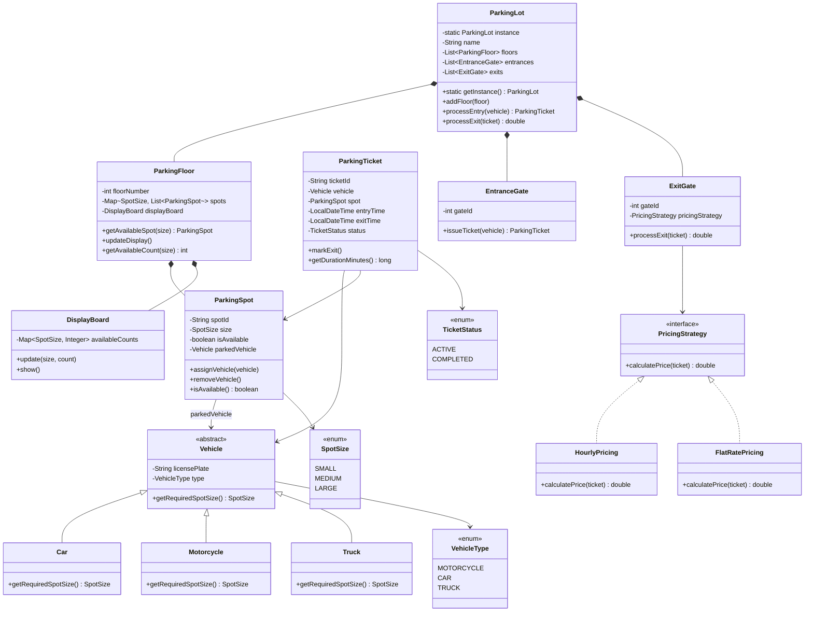
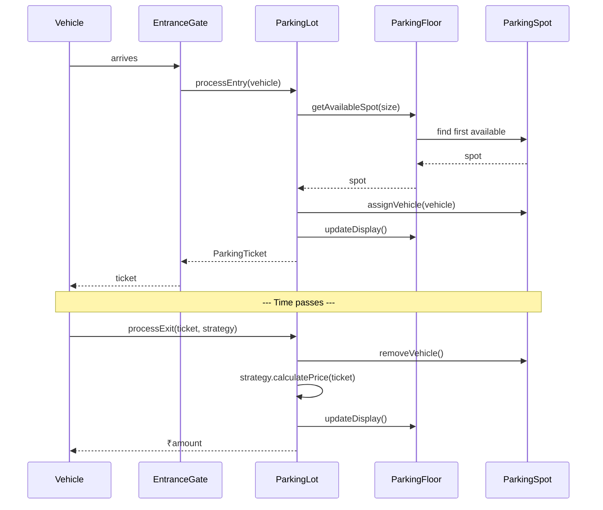

# Module 08 — LLD Problem: Parking Lot

> **Prerequisites**: Modules [01–07](./00_README.md) (OOP, SOLID, UML, all Design Patterns)  
> **Next**: [Module 09 → LLD Problem: Library Management](./09_LLD_Library_Management.md)

---

## Why This Problem?

The Parking Lot is the **#1 most asked LLD interview question**. It's popular because:
- It's easy to understand (everyone has seen a parking lot)
- It tests your ability to identify classes, relationships, and enums
- It's rich enough to apply Strategy, Factory, Observer, and State patterns
- It naturally leads to discussions on concurrency, extensibility, and pricing

This module walks through the problem **exactly as you would in an interview** — from requirements gathering to final class diagram to code.

---

## Table of Contents

1. [Step 1: Requirements Gathering](#step-1-requirements-gathering)
2. [Step 2: Identify Core Objects](#step-2-identify-core-objects)
3. [Step 3: Class Diagram](#step-3-class-diagram)
4. [Step 4: Code Implementation](#step-4-code-implementation)
5. [Step 5: Patterns Applied](#step-5-patterns-applied)
6. [Step 6: Extensions & Interview Follow-ups](#step-6-extensions--interview-follow-ups)

---

## Step 1: Requirements Gathering

> **In an interview**: Always start by asking clarifying questions. Never jump to design.

### Functional Requirements

1. The parking lot has multiple **floors**
2. Each floor has multiple **parking spots** of different sizes: SMALL, MEDIUM, LARGE
3. The lot supports different **vehicle types**: Motorcycle, Car, Truck
4. Vehicle size determines which spot it can park in:
   - Motorcycle → SMALL spot
   - Car → MEDIUM spot
   - Truck → LARGE spot
5. A vehicle should be assigned the **nearest available spot** that fits its size
6. When a vehicle exits, the spot becomes available again
7. The system should track **entry and exit times** for billing
8. Support multiple **pricing strategies** (flat rate, hourly rate, weekend rate)
9. Display available spots per floor/type on **display boards**

### Non-Functional Requirements

- Thread-safe (multiple entry/exit gates used concurrently)
- Extensible (new vehicle types, new pricing strategies)

---

## Step 2: Identify Core Objects

> Extract nouns from requirements → candidate classes

| Noun | Class? | Notes |
|------|--------|-------|
| Parking Lot | ✅ `ParkingLot` | The system — Singleton |
| Floor | ✅ `ParkingFloor` | Contains spots |
| Parking Spot | ✅ `ParkingSpot` | Has size, status |
| Vehicle | ✅ `Vehicle` (abstract) | Motorcycle, Car, Truck |
| Ticket | ✅ `ParkingTicket` | Tracks entry time, spot, vehicle |
| Entry/Exit Gate | ✅ `EntranceGate`, `ExitGate` | Where vehicles enter/leave |
| Pricing Strategy | ✅ `PricingStrategy` (interface) | Strategy Pattern |
| Display Board | ✅ `DisplayBoard` | Shows available spots |
| Spot Size | ✅ `SpotSize` (enum) | SMALL, MEDIUM, LARGE |
| Vehicle Type | ✅ `VehicleType` (enum) | MOTORCYCLE, CAR, TRUCK |

---

## Step 3: Class Diagram



---

## Step 4: Code Implementation

### Enums

```java
public enum SpotSize { SMALL, MEDIUM, LARGE }
public enum VehicleType { MOTORCYCLE, CAR, TRUCK }
public enum TicketStatus { ACTIVE, COMPLETED }
```

### Vehicle Hierarchy

```java
public abstract class Vehicle {
    private final String licensePlate;
    private final VehicleType type;

    protected Vehicle(String licensePlate, VehicleType type) {
        this.licensePlate = licensePlate;
        this.type = type;
    }

    public abstract SpotSize getRequiredSpotSize();

    public String getLicensePlate() { return licensePlate; }
    public VehicleType getType() { return type; }
}

public class Motorcycle extends Vehicle {
    public Motorcycle(String plate) { super(plate, VehicleType.MOTORCYCLE); }
    @Override public SpotSize getRequiredSpotSize() { return SpotSize.SMALL; }
}

public class Car extends Vehicle {
    public Car(String plate) { super(plate, VehicleType.CAR); }
    @Override public SpotSize getRequiredSpotSize() { return SpotSize.MEDIUM; }
}

public class Truck extends Vehicle {
    public Truck(String plate) { super(plate, VehicleType.TRUCK); }
    @Override public SpotSize getRequiredSpotSize() { return SpotSize.LARGE; }
}
```

### ParkingSpot

```java
public class ParkingSpot {
    private final String spotId;
    private final SpotSize size;
    private boolean isAvailable;
    private Vehicle parkedVehicle;

    public ParkingSpot(String spotId, SpotSize size) {
        this.spotId = spotId;
        this.size = size;
        this.isAvailable = true;
    }

    public synchronized boolean assignVehicle(Vehicle vehicle) {
        if (!isAvailable) return false;
        this.parkedVehicle = vehicle;
        this.isAvailable = false;
        return true;
    }

    public synchronized void removeVehicle() {
        this.parkedVehicle = null;
        this.isAvailable = true;
    }

    public boolean isAvailable() { return isAvailable; }
    public SpotSize getSize() { return size; }
    public String getSpotId() { return spotId; }
    public Vehicle getParkedVehicle() { return parkedVehicle; }
}
```

### ParkingTicket

```java
public class ParkingTicket {
    private final String ticketId;
    private final Vehicle vehicle;
    private final ParkingSpot spot;
    private final LocalDateTime entryTime;
    private LocalDateTime exitTime;
    private TicketStatus status;

    public ParkingTicket(Vehicle vehicle, ParkingSpot spot) {
        this.ticketId = UUID.randomUUID().toString().substring(0, 8).toUpperCase();
        this.vehicle = vehicle;
        this.spot = spot;
        this.entryTime = LocalDateTime.now();
        this.status = TicketStatus.ACTIVE;
    }

    public void markExit() {
        this.exitTime = LocalDateTime.now();
        this.status = TicketStatus.COMPLETED;
    }

    public long getDurationMinutes() {
        LocalDateTime end = (exitTime != null) ? exitTime : LocalDateTime.now();
        return java.time.Duration.between(entryTime, end).toMinutes();
    }

    // Getters
    public String getTicketId() { return ticketId; }
    public Vehicle getVehicle() { return vehicle; }
    public ParkingSpot getSpot() { return spot; }
    public TicketStatus getStatus() { return status; }
}
```

### PricingStrategy (Strategy Pattern)

```java
public interface PricingStrategy {
    double calculatePrice(ParkingTicket ticket);
}

public class HourlyPricing implements PricingStrategy {
    private final Map<VehicleType, Double> hourlyRates;

    public HourlyPricing() {
        hourlyRates = new EnumMap<>(VehicleType.class);
        hourlyRates.put(VehicleType.MOTORCYCLE, 10.0);
        hourlyRates.put(VehicleType.CAR, 20.0);
        hourlyRates.put(VehicleType.TRUCK, 30.0);
    }

    @Override
    public double calculatePrice(ParkingTicket ticket) {
        long minutes = ticket.getDurationMinutes();
        long hours = (long) Math.ceil(minutes / 60.0);
        hours = Math.max(hours, 1);  // minimum 1 hour charge
        double rate = hourlyRates.get(ticket.getVehicle().getType());
        return hours * rate;
    }
}

public class FlatRatePricing implements PricingStrategy {
    private final double flatRate;

    public FlatRatePricing(double flatRate) { this.flatRate = flatRate; }

    @Override
    public double calculatePrice(ParkingTicket ticket) {
        return flatRate;
    }
}
```

### DisplayBoard

```java
public class DisplayBoard {
    private final Map<SpotSize, Integer> availableCounts = new EnumMap<>(SpotSize.class);

    public void update(SpotSize size, int count) {
        availableCounts.put(size, count);
    }

    public void show() {
        System.out.println("--- Display Board ---");
        availableCounts.forEach((size, count) ->
            System.out.printf("  %s: %d spots available\n", size, count));
    }
}
```

### ParkingFloor

```java
public class ParkingFloor {
    private final int floorNumber;
    private final Map<SpotSize, List<ParkingSpot>> spotsBySize;
    private final DisplayBoard displayBoard;

    public ParkingFloor(int floorNumber) {
        this.floorNumber = floorNumber;
        this.spotsBySize = new EnumMap<>(SpotSize.class);
        this.displayBoard = new DisplayBoard();
        for (SpotSize size : SpotSize.values()) {
            spotsBySize.put(size, new ArrayList<>());
        }
    }

    public void addSpot(ParkingSpot spot) {
        spotsBySize.get(spot.getSize()).add(spot);
        updateDisplay();
    }

    public synchronized ParkingSpot getAvailableSpot(SpotSize size) {
        List<ParkingSpot> spots = spotsBySize.get(size);
        for (ParkingSpot spot : spots) {
            if (spot.isAvailable()) {
                return spot;
            }
        }
        return null;  // no available spot on this floor
    }

    public int getAvailableCount(SpotSize size) {
        return (int) spotsBySize.get(size).stream()
                .filter(ParkingSpot::isAvailable)
                .count();
    }

    public void updateDisplay() {
        for (SpotSize size : SpotSize.values()) {
            displayBoard.update(size, getAvailableCount(size));
        }
    }

    public int getFloorNumber() { return floorNumber; }
    public DisplayBoard getDisplayBoard() { return displayBoard; }
}
```

### ParkingLot (Singleton + Orchestrator)

```java
public class ParkingLot {
    private static volatile ParkingLot instance;

    private final String name;
    private final List<ParkingFloor> floors;
    private final Map<String, ParkingTicket> activeTickets;  // ticketId → ticket

    private ParkingLot(String name) {
        this.name = name;
        this.floors = new ArrayList<>();
        this.activeTickets = new ConcurrentHashMap<>();
    }

    public static ParkingLot getInstance(String name) {
        if (instance == null) {
            synchronized (ParkingLot.class) {
                if (instance == null) {
                    instance = new ParkingLot(name);
                }
            }
        }
        return instance;
    }

    public void addFloor(ParkingFloor floor) {
        floors.add(floor);
    }

    // Entry flow: find spot → assign → create ticket
    public ParkingTicket processEntry(Vehicle vehicle) {
        SpotSize requiredSize = vehicle.getRequiredSpotSize();

        // Search all floors for an available spot
        for (ParkingFloor floor : floors) {
            ParkingSpot spot = floor.getAvailableSpot(requiredSize);
            if (spot != null && spot.assignVehicle(vehicle)) {
                ParkingTicket ticket = new ParkingTicket(vehicle, spot);
                activeTickets.put(ticket.getTicketId(), ticket);
                floor.updateDisplay();
                System.out.printf("Vehicle %s parked at %s (Floor %d)\n",
                        vehicle.getLicensePlate(), spot.getSpotId(), floor.getFloorNumber());
                return ticket;
            }
        }
        System.out.println("No available spot for " + vehicle.getType());
        return null;  // parking lot full for this vehicle type
    }

    // Exit flow: free spot → calculate price → close ticket
    public double processExit(ParkingTicket ticket, PricingStrategy strategy) {
        if (ticket.getStatus() != TicketStatus.ACTIVE) {
            throw new IllegalStateException("Ticket already used");
        }

        ticket.markExit();
        ticket.getSpot().removeVehicle();
        activeTickets.remove(ticket.getTicketId());

        double amount = strategy.calculatePrice(ticket);

        // Update display on the floor
        for (ParkingFloor floor : floors) {
            floor.updateDisplay();
        }

        System.out.printf("Vehicle %s exited. Duration: %d min. Amount: ₹%.2f\n",
                ticket.getVehicle().getLicensePlate(),
                ticket.getDurationMinutes(), amount);
        return amount;
    }

    public void showDisplayBoards() {
        for (ParkingFloor floor : floors) {
            System.out.println("Floor " + floor.getFloorNumber());
            floor.getDisplayBoard().show();
        }
    }
}
```

### Putting It Together

```java
public class Main {
    public static void main(String[] args) {
        ParkingLot lot = ParkingLot.getInstance("City Center Parking");

        // Setup: 2 floors
        ParkingFloor floor1 = new ParkingFloor(1);
        floor1.addSpot(new ParkingSpot("1-S1", SpotSize.SMALL));
        floor1.addSpot(new ParkingSpot("1-S2", SpotSize.SMALL));
        floor1.addSpot(new ParkingSpot("1-M1", SpotSize.MEDIUM));
        floor1.addSpot(new ParkingSpot("1-M2", SpotSize.MEDIUM));
        floor1.addSpot(new ParkingSpot("1-L1", SpotSize.LARGE));

        ParkingFloor floor2 = new ParkingFloor(2);
        floor2.addSpot(new ParkingSpot("2-M1", SpotSize.MEDIUM));
        floor2.addSpot(new ParkingSpot("2-L1", SpotSize.LARGE));

        lot.addFloor(floor1);
        lot.addFloor(floor2);

        // Entry
        Vehicle car1 = new Car("KA-01-1234");
        Vehicle bike1 = new Motorcycle("KA-02-5678");
        Vehicle truck1 = new Truck("KA-03-9999");

        ParkingTicket t1 = lot.processEntry(car1);
        ParkingTicket t2 = lot.processEntry(bike1);
        ParkingTicket t3 = lot.processEntry(truck1);

        lot.showDisplayBoards();

        // Exit
        PricingStrategy pricing = new HourlyPricing();
        lot.processExit(t1, pricing);
        lot.processExit(t2, pricing);

        lot.showDisplayBoards();
    }
}
```

---

## Step 5: Patterns Applied

| Pattern | Where used | Why |
|---------|-----------|-----|
| **Singleton** | `ParkingLot` | Only one parking lot instance in the system |
| **Strategy** | `PricingStrategy` | Swap pricing logic (hourly, flat, weekend) without changing exit flow |
| **Factory Method** | Could wrap vehicle creation via `VehicleFactory.create(type, plate)` | Decouple vehicle instantiation |
| **Observer** | `DisplayBoard` updates | Floors notify display boards when spot availability changes |
| **Abstract class** | `Vehicle` | Shared fields (`licensePlate`, `type`) with abstract `getRequiredSpotSize()` |

### Flow Diagram



---

## Step 6: Extensions & Interview Follow-ups

### "How would you handle multiple vehicle sizes per spot?"

Allow a LARGE spot to accept Cars and Motorcycles too (spot can fit smaller vehicles):

```java
public boolean canFit(Vehicle vehicle) {
    return size.ordinal() >= vehicle.getRequiredSpotSize().ordinal();
}
```

### "How would you handle concurrency?"

- `ParkingSpot.assignVehicle()` is `synchronized` — prevents two vehicles from getting the same spot
- `activeTickets` uses `ConcurrentHashMap` — thread-safe ticket storage
- For higher throughput: use `ReentrantLock` per spot instead of synchronizing the entire method

### "How would you add EV charging spots?"

Add a new enum value or a boolean flag:

```java
public class ParkingSpot {
    private boolean hasEVCharger;  // new field

    public boolean isEVChargingSpot() { return hasEVCharger; }
}
```

Or create a `EVParkingSpot extends ParkingSpot` — depends on how different the behavior is.

### "How would you handle payment?"

Payment is a separate concern — introduce `PaymentProcessor` interface with `CashPayment`, `CardPayment`, `UPIPayment` (another Strategy Pattern application).

---

> ✅ **Module 08 Complete**  
> **Next**: [Module 09 → LLD Problem: Library Management](./09_LLD_Library_Management.md)
