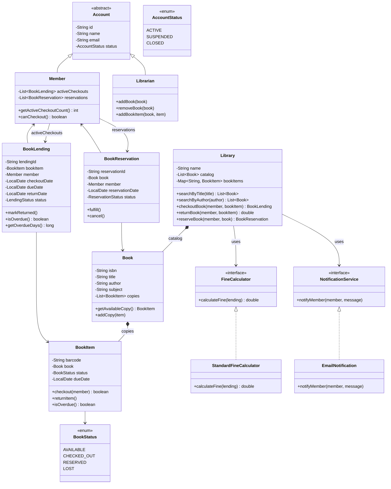
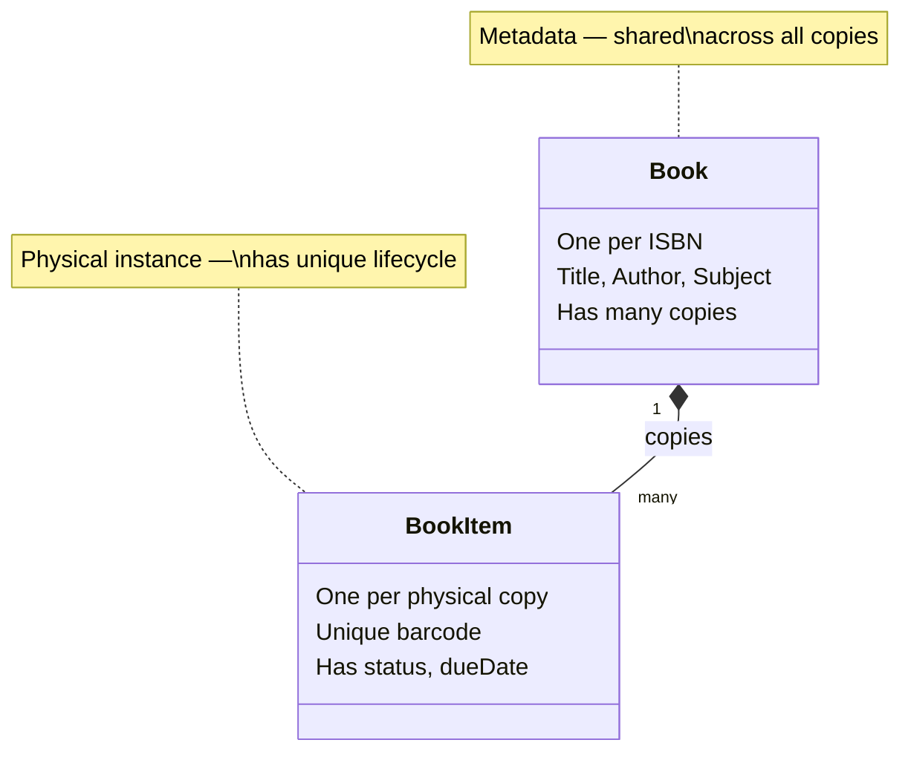

# Module 09 — LLD Problem: Library Management System

> **Prerequisites**: Modules [01–07](./00_README.md) (all patterns)  
> **Next**: [Module 10 → LLD Problem: Elevator System](./10_LLD_Elevator_System.md)

---

## Why This Problem?

The Library Management System is a classic LLD problem that tests your ability to model:
- **Entities with lifecycle** (a book's journey: available → reserved → issued → returned → lost)
- **State pattern** usage (book status transitions)
- **Observer pattern** (notify users when a reserved book becomes available)
- **Search and filtering** (by title, author, subject — Strategy for search)
- **Fine calculation** (late returns — Strategy for pricing, like Parking Lot)

---

## Table of Contents

1. [Step 1: Requirements Gathering](#step-1-requirements-gathering)
2. [Step 2: Identify Core Objects](#step-2-identify-core-objects)
3. [Step 3: Class Diagram](#step-3-class-diagram)
4. [Step 4: Code Implementation](#step-4-code-implementation)
5. [Step 5: Patterns Applied](#step-5-patterns-applied)
6. [Step 6: Extensions & Interview Follow-ups](#step-6-extensions--interview-follow-ups)

---

## Step 1: Requirements Gathering

### Functional Requirements

1. The library has **books**. Each book can have **multiple copies** (BookItem)
2. **Members** can search for books by title, author, or subject
3. Members can **checkout** (issue) a book copy — max 5 books at a time
4. Members can **return** a book
5. Members can **reserve** a book that is currently checked out by someone else
6. When a reserved book is returned, the **member who reserved it gets notified**
7. **Librarians** can add, remove, and update book records
8. The system calculates **late return fines** (₹10/day for books, ₹5/day for magazines)
9. Each checkout has a **due date** (14 days for books, 7 days for magazines)
10. Members can have at most **one active reservation** per book

### Non-Functional Requirements

- Extensible for new item types (DVDs, journals)
- Multiple members can search concurrently

---

## Step 2: Identify Core Objects

| Noun | Class? | Notes |
|------|--------|-------|
| Library | ✅ `Library` | Singleton — the system entry point |
| Book | ✅ `Book` | Metadata (title, author, ISBN) |
| Book Copy | ✅ `BookItem` | Physical copy with barcode, status |
| Member | ✅ `Member` | Registered user who borrows books |
| Librarian | ✅ `Librarian` | Admin user who manages catalog |
| Account | ✅ `Account` (abstract) | Base for Member and Librarian |
| Lending | ✅ `BookLending` | Tracks checkout: who, which copy, when, due date |
| Reservation | ✅ `BookReservation` | Tracks who reserved which book |
| Fine | ✅ `FineCalculator` (interface) | Strategy for calculating fines |
| Search | ✅ `SearchStrategy` (interface) | Strategy for different search approaches |
| Notification | ✅ `NotificationService` (interface) | Observer — notify on book availability |
| Book Status | ✅ `BookStatus` (enum) | AVAILABLE, CHECKED_OUT, RESERVED, LOST |
| Account Status | ✅ `AccountStatus` (enum) | ACTIVE, SUSPENDED, CLOSED |

---

## Step 3: Class Diagram



---

## Step 4: Code Implementation

### Enums

```java
public enum BookStatus { AVAILABLE, CHECKED_OUT, RESERVED, LOST }
public enum AccountStatus { ACTIVE, SUSPENDED, CLOSED }
public enum LendingStatus { ACTIVE, RETURNED }
public enum ReservationStatus { WAITING, FULFILLED, CANCELLED }
```

### Book & BookItem

```java
public class Book {
    private final String isbn;
    private final String title;
    private final String author;
    private final String subject;
    private final List<BookItem> copies = new ArrayList<>();

    public Book(String isbn, String title, String author, String subject) {
        this.isbn = isbn;
        this.title = title;
        this.author = author;
        this.subject = subject;
    }

    public void addCopy(BookItem item) { copies.add(item); }

    public BookItem getAvailableCopy() {
        return copies.stream()
                .filter(item -> item.getStatus() == BookStatus.AVAILABLE)
                .findFirst()
                .orElse(null);
    }

    public List<BookItem> getCopies() { return Collections.unmodifiableList(copies); }
    public String getIsbn() { return isbn; }
    public String getTitle() { return title; }
    public String getAuthor() { return author; }
    public String getSubject() { return subject; }
}

public class BookItem {
    private final String barcode;
    private final Book book;
    private BookStatus status;
    private LocalDate dueDate;

    public BookItem(String barcode, Book book) {
        this.barcode = barcode;
        this.book = book;
        this.status = BookStatus.AVAILABLE;
    }

    public synchronized boolean checkout(Member member, int loanPeriodDays) {
        if (status != BookStatus.AVAILABLE) return false;
        this.status = BookStatus.CHECKED_OUT;
        this.dueDate = LocalDate.now().plusDays(loanPeriodDays);
        return true;
    }

    public synchronized void returnItem() {
        this.status = BookStatus.AVAILABLE;
        this.dueDate = null;
    }

    public boolean isOverdue() {
        return dueDate != null && LocalDate.now().isAfter(dueDate);
    }

    public BookStatus getStatus() { return status; }
    public void setStatus(BookStatus status) { this.status = status; }
    public String getBarcode() { return barcode; }
    public Book getBook() { return book; }
    public LocalDate getDueDate() { return dueDate; }
}
```

### Account, Member, Librarian

```java
public abstract class Account {
    private final String id;
    private final String name;
    private final String email;
    private AccountStatus status;

    protected Account(String id, String name, String email) {
        this.id = id;
        this.name = name;
        this.email = email;
        this.status = AccountStatus.ACTIVE;
    }

    public String getId() { return id; }
    public String getName() { return name; }
    public String getEmail() { return email; }
    public AccountStatus getStatus() { return status; }
    public void setStatus(AccountStatus status) { this.status = status; }
}

public class Member extends Account {
    private static final int MAX_CHECKOUTS = 5;
    private final List<BookLending> activeCheckouts = new ArrayList<>();
    private final List<BookReservation> reservations = new ArrayList<>();

    public Member(String id, String name, String email) {
        super(id, name, email);
    }

    public boolean canCheckout() {
        return getStatus() == AccountStatus.ACTIVE && activeCheckouts.size() < MAX_CHECKOUTS;
    }

    public int getActiveCheckoutCount() { return activeCheckouts.size(); }
    public void addCheckout(BookLending lending) { activeCheckouts.add(lending); }
    public void removeCheckout(BookLending lending) { activeCheckouts.remove(lending); }
    public void addReservation(BookReservation reservation) { reservations.add(reservation); }
    public List<BookReservation> getReservations() { return reservations; }
}

public class Librarian extends Account {
    public Librarian(String id, String name, String email) {
        super(id, name, email);
    }

    public void addBook(Library library, Book book) {
        library.addBookToCatalog(book);
        System.out.println("Librarian added book: " + book.getTitle());
    }
}
```

### BookLending & BookReservation

```java
public class BookLending {
    private final String lendingId;
    private final BookItem bookItem;
    private final Member member;
    private final LocalDate checkoutDate;
    private final LocalDate dueDate;
    private LocalDate returnDate;
    private LendingStatus status;

    public BookLending(BookItem bookItem, Member member, int loanPeriodDays) {
        this.lendingId = UUID.randomUUID().toString().substring(0, 8);
        this.bookItem = bookItem;
        this.member = member;
        this.checkoutDate = LocalDate.now();
        this.dueDate = LocalDate.now().plusDays(loanPeriodDays);
        this.status = LendingStatus.ACTIVE;
    }

    public void markReturned() {
        this.returnDate = LocalDate.now();
        this.status = LendingStatus.RETURNED;
    }

    public boolean isOverdue() {
        LocalDate effectiveEnd = (returnDate != null) ? returnDate : LocalDate.now();
        return effectiveEnd.isAfter(dueDate);
    }

    public long getOverdueDays() {
        if (!isOverdue()) return 0;
        LocalDate effectiveEnd = (returnDate != null) ? returnDate : LocalDate.now();
        return java.time.temporal.ChronoUnit.DAYS.between(dueDate, effectiveEnd);
    }

    // Getters
    public BookItem getBookItem() { return bookItem; }
    public Member getMember() { return member; }
    public LendingStatus getStatus() { return status; }
    public LocalDate getDueDate() { return dueDate; }
}

public class BookReservation {
    private final String reservationId;
    private final Book book;
    private final Member member;
    private final LocalDate reservationDate;
    private ReservationStatus status;

    public BookReservation(Book book, Member member) {
        this.reservationId = UUID.randomUUID().toString().substring(0, 8);
        this.book = book;
        this.member = member;
        this.reservationDate = LocalDate.now();
        this.status = ReservationStatus.WAITING;
    }

    public void fulfill() { this.status = ReservationStatus.FULFILLED; }
    public void cancel() { this.status = ReservationStatus.CANCELLED; }

    public Book getBook() { return book; }
    public Member getMember() { return member; }
    public ReservationStatus getStatus() { return status; }
}
```

### FineCalculator (Strategy Pattern)

```java
public interface FineCalculator {
    double calculateFine(BookLending lending);
}

public class StandardFineCalculator implements FineCalculator {
    private static final double FINE_PER_DAY = 10.0;  // ₹10/day

    @Override
    public double calculateFine(BookLending lending) {
        long overdueDays = lending.getOverdueDays();
        if (overdueDays <= 0) return 0.0;
        double fine = overdueDays * FINE_PER_DAY;
        System.out.printf("Overdue by %d days → Fine: ₹%.2f\n", overdueDays, fine);
        return fine;
    }
}
```

### NotificationService (Observer Pattern)

```java
public interface NotificationService {
    void notifyMember(Member member, String message);
}

public class EmailNotificationService implements NotificationService {
    @Override
    public void notifyMember(Member member, String message) {
        System.out.printf("[Email → %s] %s\n", member.getEmail(), message);
    }
}
```

### Library (Orchestrator)

```java
public class Library {
    private static final int BOOK_LOAN_DAYS = 14;

    private final String name;
    private final List<Book> catalog = new ArrayList<>();
    private final Map<String, BookItem> bookItemsByBarcode = new HashMap<>();
    private final List<BookReservation> pendingReservations = new ArrayList<>();
    private final FineCalculator fineCalculator;
    private final NotificationService notificationService;

    public Library(String name, FineCalculator fineCalculator, NotificationService notificationService) {
        this.name = name;
        this.fineCalculator = fineCalculator;
        this.notificationService = notificationService;
    }

    public void addBookToCatalog(Book book) {
        catalog.add(book);
        book.getCopies().forEach(item -> bookItemsByBarcode.put(item.getBarcode(), item));
    }

    // --- Search ---
    public List<Book> searchByTitle(String title) {
        return catalog.stream()
                .filter(b -> b.getTitle().toLowerCase().contains(title.toLowerCase()))
                .collect(Collectors.toList());
    }

    public List<Book> searchByAuthor(String author) {
        return catalog.stream()
                .filter(b -> b.getAuthor().toLowerCase().contains(author.toLowerCase()))
                .collect(Collectors.toList());
    }

    // --- Checkout ---
    public BookLending checkoutBook(Member member, BookItem bookItem) {
        if (!member.canCheckout()) {
            System.out.println("Member " + member.getName() + " cannot checkout (limit or suspended).");
            return null;
        }

        if (!bookItem.checkout(member, BOOK_LOAN_DAYS)) {
            System.out.println("Book copy not available for checkout.");
            return null;
        }

        BookLending lending = new BookLending(bookItem, member, BOOK_LOAN_DAYS);
        member.addCheckout(lending);

        System.out.printf("✅ %s checked out '%s' (Barcode: %s). Due: %s\n",
                member.getName(), bookItem.getBook().getTitle(),
                bookItem.getBarcode(), lending.getDueDate());
        return lending;
    }

    // --- Return ---
    public double returnBook(Member member, BookItem bookItem, BookLending lending) {
        lending.markReturned();
        bookItem.returnItem();
        member.removeCheckout(lending);

        double fine = fineCalculator.calculateFine(lending);

        System.out.printf("✅ %s returned '%s'.\n",
                member.getName(), bookItem.getBook().getTitle());

        // Check if anyone reserved this book → notify them (Observer)
        notifyReservation(bookItem.getBook());

        return fine;
    }

    // --- Reservation ---
    public BookReservation reserveBook(Member member, Book book) {
        // Check if an available copy exists — if so, no need to reserve
        if (book.getAvailableCopy() != null) {
            System.out.println("Book has available copies. No reservation needed.");
            return null;
        }

        BookReservation reservation = new BookReservation(book, member);
        member.addReservation(reservation);
        pendingReservations.add(reservation);

        System.out.printf("📌 %s reserved '%s'. Will be notified when available.\n",
                member.getName(), book.getTitle());
        return reservation;
    }

    // Observer-like: when a book is returned, notify the first person who reserved it
    private void notifyReservation(Book book) {
        for (BookReservation res : pendingReservations) {
            if (res.getBook().getIsbn().equals(book.getIsbn())
                    && res.getStatus() == ReservationStatus.WAITING) {
                res.fulfill();
                notificationService.notifyMember(res.getMember(),
                        "The book '" + book.getTitle() + "' is now available for pickup!");
                pendingReservations.remove(res);
                break;  // only notify the first reservation in queue
            }
        }
    }
}
```

### Putting It Together

```java
public class Main {
    public static void main(String[] args) {
        // Setup
        Library library = new Library(
                "City Central Library",
                new StandardFineCalculator(),
                new EmailNotificationService()
        );

        // Add books
        Book cleanCode = new Book("978-0132350884", "Clean Code", "Robert C. Martin", "Software");
        BookItem copy1 = new BookItem("CC-001", cleanCode);
        BookItem copy2 = new BookItem("CC-002", cleanCode);
        cleanCode.addCopy(copy1);
        cleanCode.addCopy(copy2);
        library.addBookToCatalog(cleanCode);

        Book designPatterns = new Book("978-0201633610", "Design Patterns", "Gang of Four", "Software");
        BookItem dpCopy1 = new BookItem("DP-001", designPatterns);
        designPatterns.addCopy(dpCopy1);
        library.addBookToCatalog(designPatterns);

        // Members
        Member alice = new Member("M001", "Alice", "alice@email.com");
        Member bob = new Member("M002", "Bob", "bob@email.com");

        // Alice checks out "Design Patterns" (only 1 copy)
        BookLending lending1 = library.checkoutBook(alice, dpCopy1);

        // Bob tries to checkout same book — no copies available
        // Bob reserves it instead
        BookReservation bobReservation = library.reserveBook(bob, designPatterns);

        // Alice returns the book → Bob gets notified!
        library.returnBook(alice, dpCopy1, lending1);

        // Search
        List<Book> results = library.searchByAuthor("Robert");
        System.out.println("\nSearch results for author 'Robert':");
        results.forEach(b -> System.out.println("  - " + b.getTitle()));
    }
}
```

**Expected output:**
```
✅ Alice checked out 'Design Patterns' (Barcode: DP-001). Due: 2026-07-27
📌 Bob reserved 'Design Patterns'. Will be notified when available.
✅ Alice returned 'Design Patterns'.
[Email → bob@email.com] The book 'Design Patterns' is now available for pickup!

Search results for author 'Robert':
  - Clean Code
```

---

## Step 5: Patterns Applied

| Pattern | Where | Why |
|---------|-------|-----|
| **Strategy** | `FineCalculator` | Swap fine logic (standard, premium member, no fine) without changing `Library` |
| **Strategy** | `NotificationService` | Swap notification channel (email, SMS, push) |
| **Observer** | Reservation → Notification | When book becomes available, auto-notify the member who reserved it |
| **Abstract class** | `Account` → `Member` / `Librarian` | Shared identity fields; different roles |
| **Factory** | Could add `AccountFactory.createMember()` / `createLibrarian()` | Decouple creation |

### Key Design Decision: Book vs BookItem



This separation is **critical**. Without it, you can't track which specific copy is checked out, and you can't have 3 copies of the same book in different states.

---

## Step 6: Extensions & Interview Follow-ups

### "How would you handle different item types (magazines, DVDs)?"

Create an abstract `LibraryItem` parent class. `BookItem`, `MagazineItem`, `DVDItem` extend it. Each defines its own `getLoanPeriodDays()` and fine rates.

```java
abstract class LibraryItem {
    abstract int getLoanPeriodDays();
    abstract double getFinePerDay();
}
```

### "How would you handle concurrent checkouts?"

`BookItem.checkout()` is already `synchronized`. For higher scale:
- Use a `ReentrantLock` per `BookItem`
- Or use optimistic locking with a version field (check-and-swap)

### "How would you add a waitlist instead of a single reservation?"

Replace `List<BookReservation>` with a `Queue<BookReservation>` per book. When the book is returned, `poll()` the next reservation from the queue.

### "How would you handle renewals?"

Add a `renew()` method to `BookLending`:

```java
public boolean renew(int additionalDays) {
    if (isOverdue()) return false;  // can't renew if already overdue
    this.dueDate = this.dueDate.plusDays(additionalDays);
    return true;
}
```

---

> ✅ **Module 09 Complete**  
> **Next**: [Module 10 → LLD Problem: Elevator System](./10_LLD_Elevator_System.md) — applying the State Pattern to a real-world system.
