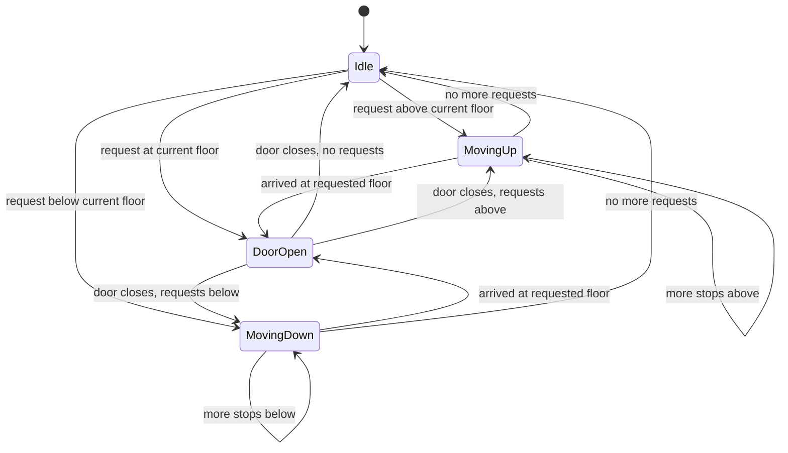
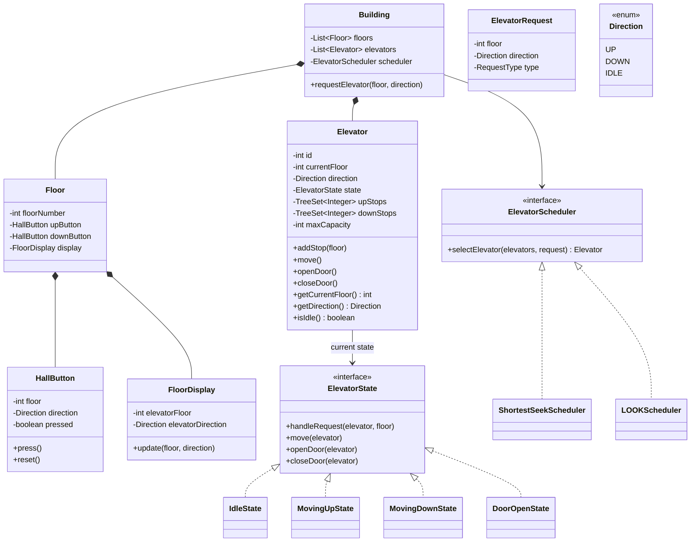
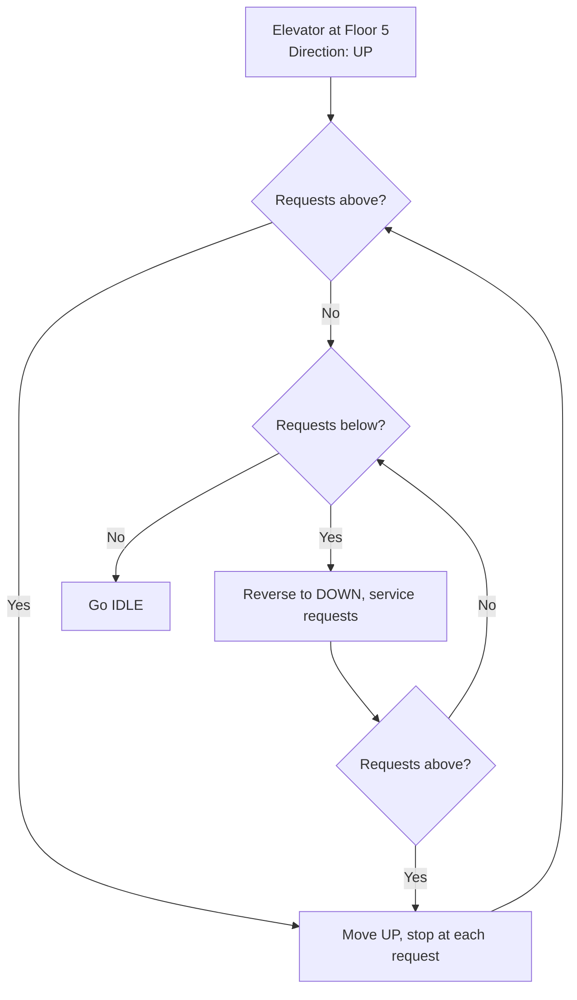

# Module 10 — LLD Problem: Elevator System

> **Prerequisites**: [Module 07 → State Pattern](./07_Behavioral_Patterns_2.md), [Module 06 → Strategy & Observer](./06_Behavioral_Patterns_1.md)  
> **Next**: [Module 11 → LLD Problem: Ride-sharing (Uber)](./11_LLD_Ride_Sharing.md)

---

## Why This Problem?

The Elevator System is a favourite LLD interview question because it naturally tests:
- **State Pattern** — elevator states (IDLE, MOVING_UP, MOVING_DOWN, DOOR_OPEN)
- **Strategy Pattern** — scheduling algorithms (shortest seek, LOOK, SCAN)
- **Observer Pattern** — floor displays and button panels react to elevator state changes
- **Concurrency** — multiple requests arrive simultaneously from different floors

It's more complex than Parking Lot because you must handle **scheduling** (which elevator services which request?) and **direction-aware logic**.

---

## Table of Contents

1. [Step 1: Requirements Gathering](#step-1-requirements-gathering)
2. [Step 2: Identify Core Objects](#step-2-identify-core-objects)
3. [Step 3: State Machine Design](#step-3-state-machine-design)
4. [Step 4: Class Diagram](#step-4-class-diagram)
5. [Step 5: Code Implementation](#step-5-code-implementation)
6. [Step 6: Scheduling Strategies](#step-6-scheduling-strategies)
7. [Step 7: Patterns Applied & Interview Follow-ups](#step-7-patterns-applied--interview-follow-ups)

---

## Step 1: Requirements Gathering

### Functional Requirements

1. A building has **N floors** and **M elevators**
2. Each floor has **Up/Down call buttons** (hall buttons)
3. Inside each elevator there is a **panel with floor buttons** and **open/close door buttons**
4. An elevator can move **up**, **down**, or be **idle**
5. When a user presses a hall button, the **best elevator** is dispatched (scheduling)
6. The elevator stops at requested floors, opens doors, waits, closes doors, and continues
7. Elevator doors have a **timeout** — auto-close after a set duration
8. Each elevator has a **maximum weight capacity**
9. **Floor displays** show current floor and direction of each elevator

### Non-Functional Requirements

- Thread-safe — multiple button presses happen concurrently
- Efficient scheduling — minimize wait time and travel distance

---

## Step 2: Identify Core Objects

| Noun | Class | Notes |
|------|-------|-------|
| Building | `Building` | Contains floors and elevators |
| Floor | `Floor` | Has hall buttons and a display |
| Elevator | `Elevator` | Has state, current floor, direction, internal panel |
| Elevator State | `ElevatorState` (interface) | State Pattern — IDLE, MOVING_UP, MOVING_DOWN, DOOR_OPEN |
| Hall Button | `HallButton` | UP or DOWN call from a floor |
| Elevator Panel | `ElevatorPanel` | Internal buttons (floor selection, open/close) |
| Request | `ElevatorRequest` | A floor + direction request or internal floor request |
| Scheduler | `ElevatorScheduler` (interface) | Strategy — picks which elevator handles a request |
| Direction | `Direction` (enum) | UP, DOWN, IDLE |
| Display | `FloorDisplay` | Shows elevator position and direction |

---

## Step 3: State Machine Design



---

## Step 4: Class Diagram



---

## Step 5: Code Implementation

### Enums & Request

```java
public enum Direction { UP, DOWN, IDLE }
public enum RequestType { EXTERNAL, INTERNAL }  // hall button vs panel button

public class ElevatorRequest {
    private final int floor;
    private final Direction direction;
    private final RequestType type;

    public ElevatorRequest(int floor, Direction direction, RequestType type) {
        this.floor = floor;
        this.direction = direction;
        this.type = type;
    }

    public int getFloor() { return floor; }
    public Direction getDirection() { return direction; }
    public RequestType getType() { return type; }
}
```

### ElevatorState (State Pattern)

```java
public interface ElevatorState {
    void handleRequest(Elevator elevator, int destinationFloor);
    void move(Elevator elevator);
    void openDoor(Elevator elevator);
    void closeDoor(Elevator elevator);
    String getName();
}

public class IdleState implements ElevatorState {
    @Override
    public void handleRequest(Elevator elevator, int destinationFloor) {
        elevator.addStop(destinationFloor);

        if (destinationFloor > elevator.getCurrentFloor()) {
            elevator.setDirection(Direction.UP);
            elevator.setState(new MovingUpState());
        } else if (destinationFloor < elevator.getCurrentFloor()) {
            elevator.setDirection(Direction.DOWN);
            elevator.setState(new MovingDownState());
        } else {
            // Already at requested floor
            elevator.setState(new DoorOpenState());
            elevator.openDoor();
        }
    }

    @Override
    public void move(Elevator elevator) {
        // Idle — do nothing
    }

    @Override
    public void openDoor(Elevator elevator) {
        elevator.setState(new DoorOpenState());
    }

    @Override
    public void closeDoor(Elevator elevator) { /* already closed in idle */ }

    @Override
    public String getName() { return "IDLE"; }
}

public class MovingUpState implements ElevatorState {
    @Override
    public void handleRequest(Elevator elevator, int destinationFloor) {
        elevator.addStop(destinationFloor);
    }

    @Override
    public void move(Elevator elevator) {
        int current = elevator.getCurrentFloor();
        Integer nextStop = elevator.getNextUpStop();

        if (nextStop == null) {
            // No more upward stops — check downward or go idle
            Integer nextDown = elevator.getNextDownStop();
            if (nextDown != null) {
                elevator.setDirection(Direction.DOWN);
                elevator.setState(new MovingDownState());
                elevator.move();
            } else {
                elevator.setDirection(Direction.IDLE);
                elevator.setState(new IdleState());
            }
            return;
        }

        // Move one floor up
        elevator.setCurrentFloor(current + 1);
        System.out.printf("  Elevator %d ▲ Floor %d\n", elevator.getId(), elevator.getCurrentFloor());

        if (elevator.getCurrentFloor() == nextStop) {
            elevator.removeStop(nextStop);
            elevator.setState(new DoorOpenState());
            elevator.openDoor();
        }
    }

    @Override
    public void openDoor(Elevator elevator) {
        elevator.setState(new DoorOpenState());
    }

    @Override
    public void closeDoor(Elevator elevator) { /* doors aren't open while moving */ }

    @Override
    public String getName() { return "MOVING_UP"; }
}

public class MovingDownState implements ElevatorState {
    @Override
    public void handleRequest(Elevator elevator, int destinationFloor) {
        elevator.addStop(destinationFloor);
    }

    @Override
    public void move(Elevator elevator) {
        int current = elevator.getCurrentFloor();
        Integer nextStop = elevator.getNextDownStop();

        if (nextStop == null) {
            Integer nextUp = elevator.getNextUpStop();
            if (nextUp != null) {
                elevator.setDirection(Direction.UP);
                elevator.setState(new MovingUpState());
                elevator.move();
            } else {
                elevator.setDirection(Direction.IDLE);
                elevator.setState(new IdleState());
            }
            return;
        }

        elevator.setCurrentFloor(current - 1);
        System.out.printf("  Elevator %d ▼ Floor %d\n", elevator.getId(), elevator.getCurrentFloor());

        if (elevator.getCurrentFloor() == nextStop) {
            elevator.removeStop(nextStop);
            elevator.setState(new DoorOpenState());
            elevator.openDoor();
        }
    }

    @Override
    public void openDoor(Elevator elevator) {
        elevator.setState(new DoorOpenState());
    }

    @Override
    public void closeDoor(Elevator elevator) { }

    @Override
    public String getName() { return "MOVING_DOWN"; }
}

public class DoorOpenState implements ElevatorState {
    @Override
    public void handleRequest(Elevator elevator, int destinationFloor) {
        elevator.addStop(destinationFloor);
    }

    @Override
    public void move(Elevator elevator) {
        // Can't move while door is open
        System.out.println("  Close door first!");
    }

    @Override
    public void openDoor(Elevator elevator) {
        System.out.printf("  Elevator %d: Door open at Floor %d\n",
                elevator.getId(), elevator.getCurrentFloor());
    }

    @Override
    public void closeDoor(Elevator elevator) {
        System.out.printf("  Elevator %d: Door closed at Floor %d\n",
                elevator.getId(), elevator.getCurrentFloor());

        // Decide next state
        Integer nextUp = elevator.getNextUpStop();
        Integer nextDown = elevator.getNextDownStop();

        if (elevator.getDirection() == Direction.UP && nextUp != null) {
            elevator.setState(new MovingUpState());
        } else if (elevator.getDirection() == Direction.DOWN && nextDown != null) {
            elevator.setState(new MovingDownState());
        } else if (nextUp != null) {
            elevator.setDirection(Direction.UP);
            elevator.setState(new MovingUpState());
        } else if (nextDown != null) {
            elevator.setDirection(Direction.DOWN);
            elevator.setState(new MovingDownState());
        } else {
            elevator.setDirection(Direction.IDLE);
            elevator.setState(new IdleState());
        }
    }

    @Override
    public String getName() { return "DOOR_OPEN"; }
}
```

### Elevator

```java
public class Elevator {
    private final int id;
    private int currentFloor;
    private Direction direction;
    private ElevatorState state;

    // Two sorted sets: one for upward stops, one for downward stops
    private final TreeSet<Integer> upStops = new TreeSet<>();
    private final TreeSet<Integer> downStops = new TreeSet<>(Collections.reverseOrder());

    public Elevator(int id) {
        this.id = id;
        this.currentFloor = 0;  // ground floor
        this.direction = Direction.IDLE;
        this.state = new IdleState();
    }

    // Delegate to current state
    public void handleRequest(int floor) { state.handleRequest(this, floor); }
    public void move() { state.move(this); }
    public void openDoor() { state.openDoor(this); }
    public void closeDoor() { state.closeDoor(this); }

    public void addStop(int floor) {
        if (floor > currentFloor) {
            upStops.add(floor);
        } else if (floor < currentFloor) {
            downStops.add(floor);
        }
        // If floor == currentFloor, open the door (handled in state)
    }

    public void removeStop(int floor) {
        upStops.remove(floor);
        downStops.remove(floor);
    }

    public Integer getNextUpStop() {
        return upStops.isEmpty() ? null : upStops.first();
    }

    public Integer getNextDownStop() {
        return downStops.isEmpty() ? null : downStops.first();
    }

    public boolean isIdle() { return direction == Direction.IDLE; }
    public int getTotalStops() { return upStops.size() + downStops.size(); }

    // Process all current stops (simulate ride)
    public void processAllStops() {
        System.out.printf("Elevator %d starting at Floor %d [%s]\n",
                id, currentFloor, state.getName());
        while (!upStops.isEmpty() || !downStops.isEmpty()) {
            move();
        }
        System.out.printf("Elevator %d now idle at Floor %d\n\n", id, currentFloor);
    }

    // Getters and setters
    public int getId() { return id; }
    public int getCurrentFloor() { return currentFloor; }
    public void setCurrentFloor(int floor) { this.currentFloor = floor; }
    public Direction getDirection() { return direction; }
    public void setDirection(Direction dir) { this.direction = dir; }
    public ElevatorState getState() { return state; }
    public void setState(ElevatorState state) { this.state = state; }
}
```

### ElevatorScheduler (Strategy Pattern)

```java
public interface ElevatorScheduler {
    Elevator selectElevator(List<Elevator> elevators, ElevatorRequest request);
}

// Shortest Seek: pick the closest idle or same-direction elevator
public class ShortestSeekScheduler implements ElevatorScheduler {
    @Override
    public Elevator selectElevator(List<Elevator> elevators, ElevatorRequest request) {
        Elevator best = null;
        int minDistance = Integer.MAX_VALUE;

        for (Elevator elevator : elevators) {
            int distance = Math.abs(elevator.getCurrentFloor() - request.getFloor());

            // Priority 1: idle elevator closest to the floor
            if (elevator.isIdle() && distance < minDistance) {
                best = elevator;
                minDistance = distance;
            }
            // Priority 2: elevator moving in the same direction and hasn't passed the floor
            else if (elevator.getDirection() == request.getDirection()) {
                boolean hasntPassed =
                    (request.getDirection() == Direction.UP && elevator.getCurrentFloor() <= request.getFloor()) ||
                    (request.getDirection() == Direction.DOWN && elevator.getCurrentFloor() >= request.getFloor());
                if (hasntPassed && distance < minDistance) {
                    best = elevator;
                    minDistance = distance;
                }
            }
        }

        // Fallback: any elevator with minimum load
        if (best == null) {
            best = elevators.stream()
                    .min(Comparator.comparingInt(Elevator::getTotalStops))
                    .orElse(elevators.get(0));
        }

        return best;
    }
}
```

### Building (Orchestrator)

```java
public class Building {
    private final int totalFloors;
    private final List<Elevator> elevators;
    private final ElevatorScheduler scheduler;

    public Building(int totalFloors, int numElevators, ElevatorScheduler scheduler) {
        this.totalFloors = totalFloors;
        this.elevators = new ArrayList<>();
        this.scheduler = scheduler;

        for (int i = 1; i <= numElevators; i++) {
            elevators.add(new Elevator(i));
        }
    }

    // External request: user on a floor presses UP or DOWN
    public void requestElevator(int fromFloor, Direction direction) {
        ElevatorRequest request = new ElevatorRequest(fromFloor, direction, RequestType.EXTERNAL);
        Elevator selected = scheduler.selectElevator(elevators, request);

        System.out.printf("Floor %d [%s] → Dispatching Elevator %d (currently at Floor %d)\n",
                fromFloor, direction, selected.getId(), selected.getCurrentFloor());

        selected.handleRequest(fromFloor);
    }

    // Internal request: user inside an elevator presses a floor button
    public void pressFloorButton(int elevatorId, int targetFloor) {
        Elevator elevator = elevators.stream()
                .filter(e -> e.getId() == elevatorId)
                .findFirst()
                .orElseThrow(() -> new IllegalArgumentException("Invalid elevator ID"));

        System.out.printf("Elevator %d: Floor %d button pressed\n", elevatorId, targetFloor);
        elevator.handleRequest(targetFloor);
    }

    public List<Elevator> getElevators() { return elevators; }
}
```

### Putting It Together

```java
public class Main {
    public static void main(String[] args) {
        Building building = new Building(10, 2, new ShortestSeekScheduler());

        // Person on floor 3 presses UP
        building.requestElevator(3, Direction.UP);

        // Person on floor 7 presses DOWN
        building.requestElevator(7, Direction.DOWN);

        // Person inside elevator 1 presses floor 8
        building.pressFloorButton(1, 8);

        // Simulate: process all stops
        for (Elevator e : building.getElevators()) {
            e.processAllStops();
        }
    }
}
```

---

## Step 6: Scheduling Strategies

### The LOOK Algorithm (Elevator Algorithm)

The most common real-world elevator algorithm. Like a disk's seek head:

1. Move in the current direction, servicing requests along the way
2. When no more requests in that direction, reverse
3. Repeat



### Scheduling Comparison

| Algorithm | How it selects | Pros | Cons |
|-----------|---------------|------|------|
| **Shortest Seek** | Closest elevator to the request | Fast response for individual | Can starve distant floors |
| **LOOK** | Continue in direction, reverse at last stop | Fair, no starvation | Slightly longer individual wait |
| **Round Robin** | Assign in circular order | Simple, balanced load | Ignores proximity |
| **Zone-based** | Assign elevator to a zone of floors | Reduces travel | Uneven load if zones differ |

---

## Step 7: Patterns Applied & Interview Follow-ups

### Patterns Applied

| Pattern | Where | Why |
|---------|-------|-----|
| **State** | `ElevatorState` | Behavior changes completely based on state (idle/moving/door open) |
| **Strategy** | `ElevatorScheduler` | Swap scheduling algorithms without changing Building |
| **Observer** | `FloorDisplay` (can be added) | Displays react when elevator position changes |
| **Singleton** | Could use for `Building` | Only one building |

### Interview Follow-ups

**"How do you handle emergencies?"**
> Add a `MAINTENANCE` state. When triggered, the elevator ignores all requests, moves to the nearest floor, opens doors, and stays idle. Override all state transitions.

**"How do you handle overweight?"**
> Elevator has a `weightSensor` field. In `DoorOpenState`, if weight exceeds `maxCapacity`, play an alarm and don't close doors until weight decreases. Don't add any stops while overloaded.

**"How would you optimize for a building with 50+ floors?"**
> Zone-based scheduling: floors 1-15 = Elevators 1-2, floors 16-30 = Elevators 3-4, etc. Express elevators skip certain floors. Some elevators are designated as "high-zone only" (don't stop at floors 1-15 except lobby).

**"How do you handle priority (VIP floor, fire rescue)?"**
> Add a `Priority` field to `ElevatorRequest`. High-priority requests are inserted at the front of the stop queue. Fire rescue mode: all elevators go to ground floor, doors open, system disables normal operation.

---

> ✅ **Module 10 Complete**  
> **Next**: [Module 11 → LLD Problem: Ride-sharing (Uber)](./11_LLD_Ride_Sharing.md)
