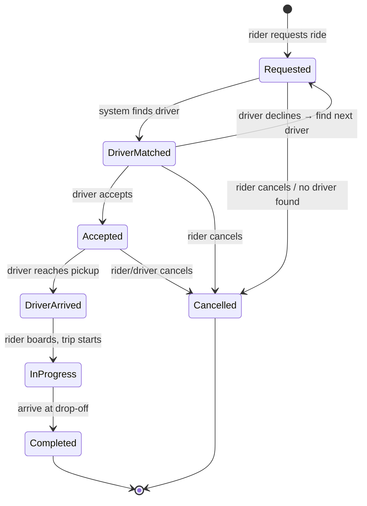
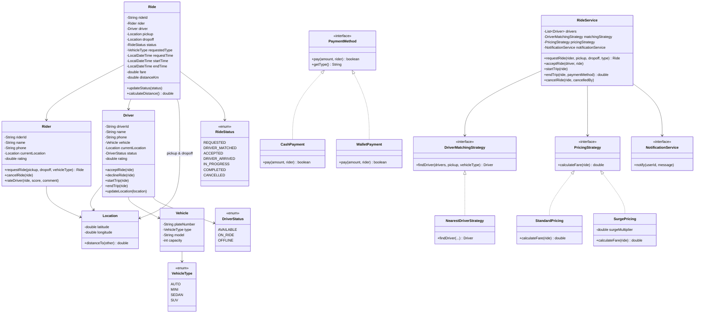
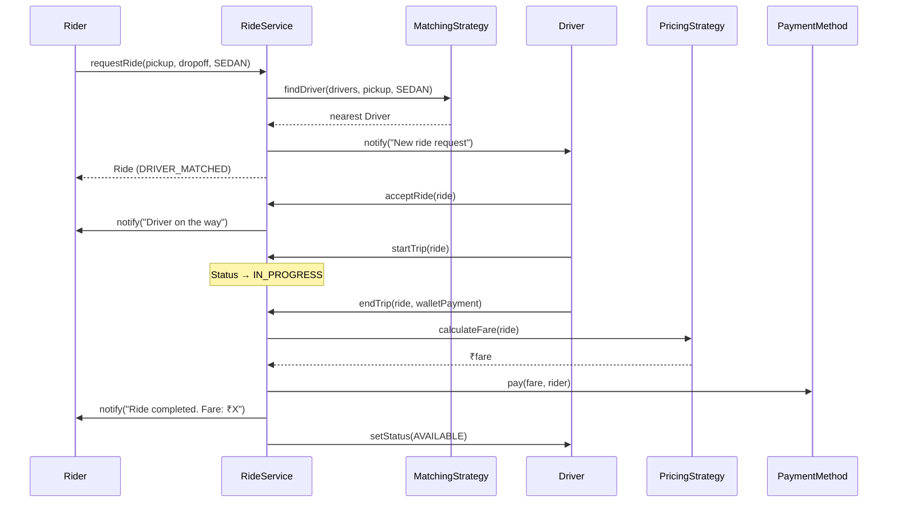

# Module 11 — LLD Problem: Ride-Sharing (Uber/Ola)

> **Prerequisites**: Modules [01–07](./00_README.md)  
> **Next**: [Module 12 → LLD Problem: Food Delivery (Swiggy)](./12_LLD_Food_Delivery.md)

---

## Why This Problem?

Ride-sharing systems test your ability to model:
- **Real-time matching** — matching riders to nearby drivers (Strategy Pattern)
- **State transitions** — a ride goes through a well-defined lifecycle (State Pattern)
- **Observer** — notify rider/driver when ride status changes
- **Pricing** — surge pricing, distance-based, time-based (Strategy Pattern)
- **Location tracking** — continuous driver location updates

This is one of the most complex LLD problems and is frequently asked at senior-level interviews at product companies.

---

## Table of Contents

1. [Step 1: Requirements Gathering](#step-1-requirements-gathering)
2. [Step 2: Identify Core Objects](#step-2-identify-core-objects)
3. [Step 3: Ride Lifecycle](#step-3-ride-lifecycle)
4. [Step 4: Class Diagram](#step-4-class-diagram)
5. [Step 5: Code Implementation](#step-5-code-implementation)
6. [Step 6: Patterns Applied & Interview Follow-ups](#step-6-patterns-applied--interview-follow-ups)

---

## Step 1: Requirements Gathering

### Functional Requirements

1. **Riders** can request a ride by specifying pickup and drop-off locations
2. **Drivers** can mark themselves as available/unavailable
3. The system **matches** the nearest available driver to the rider
4. Driver can **accept** or **decline** a ride request (if declined, goes to next nearest)
5. The system calculates **fare** based on distance, time, and vehicle type
6. Support **surge pricing** during high-demand periods
7. Both rider and driver can track the **ride status** in real-time
8. Riders can **rate** drivers and vice versa after a ride
9. Support different **vehicle types**: Auto, Mini, Sedan, SUV
10. Riders can **cancel** a ride (with possible cancellation fee)
11. **Payment**: Cash, Wallet, UPI, Card

### Non-Functional Requirements

- Low latency driver matching (geospatial search)
- Concurrent ride requests from many riders
- Real-time location updates from all active drivers

---

## Step 2: Identify Core Objects

| Noun | Class | Notes |
|------|-------|-------|
| Rider | `Rider` | Requests rides, rates drivers |
| Driver | `Driver` | Has vehicle, accepts rides, updates location |
| Ride | `Ride` | Central entity with lifecycle |
| Vehicle | `Vehicle` | Type, plate number, capacity |
| Location | `Location` | Latitude + longitude |
| Ride Status | `RideStatus` (enum) | REQUESTED → MATCHED → ACCEPTED → IN_PROGRESS → COMPLETED / CANCELLED |
| Vehicle Type | `VehicleType` (enum) | AUTO, MINI, SEDAN, SUV |
| Driver Status | `DriverStatus` (enum) | AVAILABLE, ON_RIDE, OFFLINE |
| Pricing Strategy | `PricingStrategy` (interface) | Standard, Surge |
| Driver Matching | `DriverMatchingStrategy` (interface) | Nearest, rating-based |
| Payment | `PaymentMethod` (interface) | Cash, Wallet, UPI |
| Notification | `NotificationService` (interface) | Push, SMS |
| Rating | `Rating` | Score + comment |
| Ride Service | `RideService` | Orchestrator |

---

## Step 3: Ride Lifecycle



---

## Step 4: Class Diagram



---

## Step 5: Code Implementation

### Core Value Objects & Enums

```java
public enum RideStatus { REQUESTED, DRIVER_MATCHED, ACCEPTED, DRIVER_ARRIVED, IN_PROGRESS, COMPLETED, CANCELLED }
public enum DriverStatus { AVAILABLE, ON_RIDE, OFFLINE }
public enum VehicleType { AUTO, MINI, SEDAN, SUV }

public class Location {
    private final double latitude;
    private final double longitude;

    public Location(double latitude, double longitude) {
        this.latitude = latitude;
        this.longitude = longitude;
    }

    // Haversine formula (simplified for interview — mention the concept)
    public double distanceTo(Location other) {
        double latDiff = Math.toRadians(other.latitude - this.latitude);
        double lonDiff = Math.toRadians(other.longitude - this.longitude);
        double a = Math.sin(latDiff / 2) * Math.sin(latDiff / 2) +
                   Math.cos(Math.toRadians(this.latitude)) * Math.cos(Math.toRadians(other.latitude)) *
                   Math.sin(lonDiff / 2) * Math.sin(lonDiff / 2);
        double c = 2 * Math.atan2(Math.sqrt(a), Math.sqrt(1 - a));
        return 6371 * c;  // Earth's radius in km
    }

    public double getLatitude() { return latitude; }
    public double getLongitude() { return longitude; }
}

public class Rating {
    private final String fromUserId;
    private final String toUserId;
    private final int score;  // 1-5
    private final String comment;

    public Rating(String from, String to, int score, String comment) {
        if (score < 1 || score > 5) throw new IllegalArgumentException("Rating must be 1-5");
        this.fromUserId = from;
        this.toUserId = to;
        this.score = score;
        this.comment = comment;
    }

    public int getScore() { return score; }
}
```

### Rider & Driver

```java
public class Rider {
    private final String riderId;
    private final String name;
    private final String phone;
    private Location currentLocation;
    private final List<Rating> ratings = new ArrayList<>();

    public Rider(String riderId, String name, String phone) {
        this.riderId = riderId;
        this.name = name;
        this.phone = phone;
    }

    public double getAverageRating() {
        if (ratings.isEmpty()) return 5.0;
        return ratings.stream().mapToInt(Rating::getScore).average().orElse(5.0);
    }

    public void addRating(Rating rating) { ratings.add(rating); }
    public String getRiderId() { return riderId; }
    public String getName() { return name; }
    public String getPhone() { return phone; }
    public Location getCurrentLocation() { return currentLocation; }
    public void setCurrentLocation(Location loc) { this.currentLocation = loc; }
}

public class Vehicle {
    private final String plateNumber;
    private final VehicleType type;
    private final String model;

    public Vehicle(String plateNumber, VehicleType type, String model) {
        this.plateNumber = plateNumber;
        this.type = type;
        this.model = model;
    }

    public VehicleType getType() { return type; }
    public String getPlateNumber() { return plateNumber; }
}

public class Driver {
    private final String driverId;
    private final String name;
    private final String phone;
    private final Vehicle vehicle;
    private Location currentLocation;
    private DriverStatus status;
    private final List<Rating> ratings = new ArrayList<>();

    public Driver(String driverId, String name, String phone, Vehicle vehicle) {
        this.driverId = driverId;
        this.name = name;
        this.phone = phone;
        this.vehicle = vehicle;
        this.status = DriverStatus.AVAILABLE;
    }

    public void goOnline() { this.status = DriverStatus.AVAILABLE; }
    public void goOffline() { this.status = DriverStatus.OFFLINE; }

    public void updateLocation(Location location) {
        this.currentLocation = location;
    }

    public double getAverageRating() {
        if (ratings.isEmpty()) return 5.0;
        return ratings.stream().mapToInt(Rating::getScore).average().orElse(5.0);
    }

    public void addRating(Rating rating) { ratings.add(rating); }
    public boolean isAvailable() { return status == DriverStatus.AVAILABLE; }
    public String getDriverId() { return driverId; }
    public String getName() { return name; }
    public Vehicle getVehicle() { return vehicle; }
    public Location getCurrentLocation() { return currentLocation; }
    public DriverStatus getStatus() { return status; }
    public void setStatus(DriverStatus status) { this.status = status; }
}
```

### Ride

```java
public class Ride {
    private final String rideId;
    private final Rider rider;
    private Driver driver;
    private final Location pickup;
    private final Location dropoff;
    private final VehicleType requestedType;
    private RideStatus status;
    private LocalDateTime requestTime;
    private LocalDateTime startTime;
    private LocalDateTime endTime;
    private double fare;
    private double distanceKm;

    public Ride(Rider rider, Location pickup, Location dropoff, VehicleType type) {
        this.rideId = UUID.randomUUID().toString().substring(0, 8).toUpperCase();
        this.rider = rider;
        this.pickup = pickup;
        this.dropoff = dropoff;
        this.requestedType = type;
        this.status = RideStatus.REQUESTED;
        this.requestTime = LocalDateTime.now();
        this.distanceKm = pickup.distanceTo(dropoff);
    }

    public void assignDriver(Driver driver) {
        this.driver = driver;
        this.status = RideStatus.DRIVER_MATCHED;
    }

    public void accept() { this.status = RideStatus.ACCEPTED; }

    public void driverArrived() { this.status = RideStatus.DRIVER_ARRIVED; }

    public void startTrip() {
        this.status = RideStatus.IN_PROGRESS;
        this.startTime = LocalDateTime.now();
    }

    public void complete(double fare) {
        this.status = RideStatus.COMPLETED;
        this.endTime = LocalDateTime.now();
        this.fare = fare;
    }

    public void cancel() { this.status = RideStatus.CANCELLED; }

    // Getters
    public String getRideId() { return rideId; }
    public Rider getRider() { return rider; }
    public Driver getDriver() { return driver; }
    public Location getPickup() { return pickup; }
    public Location getDropoff() { return dropoff; }
    public VehicleType getRequestedType() { return requestedType; }
    public RideStatus getStatus() { return status; }
    public double getDistanceKm() { return distanceKm; }
    public double getFare() { return fare; }
    public LocalDateTime getStartTime() { return startTime; }
    public LocalDateTime getEndTime() { return endTime; }
}
```

### Pricing Strategy

```java
public interface PricingStrategy {
    double calculateFare(Ride ride);
}

public class StandardPricing implements PricingStrategy {
    // Base rates per vehicle type
    private static final Map<VehicleType, Double> BASE_FARE = Map.of(
            VehicleType.AUTO, 25.0,
            VehicleType.MINI, 40.0,
            VehicleType.SEDAN, 60.0,
            VehicleType.SUV, 80.0
    );
    private static final Map<VehicleType, Double> PER_KM_RATE = Map.of(
            VehicleType.AUTO, 8.0,
            VehicleType.MINI, 10.0,
            VehicleType.SEDAN, 14.0,
            VehicleType.SUV, 18.0
    );

    @Override
    public double calculateFare(Ride ride) {
        double baseFare = BASE_FARE.get(ride.getRequestedType());
        double distanceFare = ride.getDistanceKm() * PER_KM_RATE.get(ride.getRequestedType());
        return baseFare + distanceFare;
    }
}

public class SurgePricing implements PricingStrategy {
    private final PricingStrategy basePricing;
    private final double surgeMultiplier;

    public SurgePricing(PricingStrategy basePricing, double surgeMultiplier) {
        this.basePricing = basePricing;
        this.surgeMultiplier = surgeMultiplier;
    }

    @Override
    public double calculateFare(Ride ride) {
        double baseFare = basePricing.calculateFare(ride);
        double surgedFare = baseFare * surgeMultiplier;
        System.out.printf("  Surge %.1fx applied: ₹%.2f → ₹%.2f\n",
                surgeMultiplier, baseFare, surgedFare);
        return surgedFare;
    }
}
```

> **Note**: `SurgePricing` wraps `StandardPricing` — this is actually the **Decorator pattern** applied to pricing! You add surge behaviour on top of standard pricing without modifying it.

### Driver Matching Strategy

```java
public interface DriverMatchingStrategy {
    Driver findDriver(List<Driver> drivers, Location pickup, VehicleType vehicleType);
}

public class NearestDriverStrategy implements DriverMatchingStrategy {
    private static final double MAX_SEARCH_RADIUS_KM = 5.0;

    @Override
    public Driver findDriver(List<Driver> drivers, Location pickup, VehicleType vehicleType) {
        return drivers.stream()
                .filter(Driver::isAvailable)
                .filter(d -> d.getVehicle().getType() == vehicleType)
                .filter(d -> d.getCurrentLocation() != null)
                .filter(d -> d.getCurrentLocation().distanceTo(pickup) <= MAX_SEARCH_RADIUS_KM)
                .min(Comparator.comparingDouble(d -> d.getCurrentLocation().distanceTo(pickup)))
                .orElse(null);
    }
}
```

### Payment

```java
public interface PaymentMethod {
    boolean pay(double amount, Rider rider);
    String getType();
}

public class CashPayment implements PaymentMethod {
    @Override
    public boolean pay(double amount, Rider rider) {
        System.out.printf("  💵 Cash payment of ₹%.2f collected\n", amount);
        return true;
    }
    @Override public String getType() { return "CASH"; }
}

public class WalletPayment implements PaymentMethod {
    @Override
    public boolean pay(double amount, Rider rider) {
        System.out.printf("  💰 ₹%.2f deducted from wallet\n", amount);
        return true;
    }
    @Override public String getType() { return "WALLET"; }
}
```

### RideService (Orchestrator)

```java
public class RideService {
    private final List<Driver> allDrivers = new ArrayList<>();
    private final DriverMatchingStrategy matchingStrategy;
    private PricingStrategy pricingStrategy;
    private final NotificationService notificationService;

    public RideService(DriverMatchingStrategy matching, PricingStrategy pricing,
                       NotificationService notification) {
        this.matchingStrategy = matching;
        this.pricingStrategy = pricing;
        this.notificationService = notification;
    }

    public void registerDriver(Driver driver) { allDrivers.add(driver); }

    public void setPricingStrategy(PricingStrategy strategy) {
        this.pricingStrategy = strategy;  // swap at runtime (e.g., enable surge)
    }

    // --- Core Flow ---

    public Ride requestRide(Rider rider, Location pickup, Location dropoff, VehicleType type) {
        Ride ride = new Ride(rider, pickup, dropoff, type);
        System.out.printf("🚗 Ride %s requested by %s [%s]\n",
                ride.getRideId(), rider.getName(), type);

        // Find nearest driver
        Driver driver = matchingStrategy.findDriver(allDrivers, pickup, type);
        if (driver == null) {
            System.out.println("  ❌ No drivers available nearby.");
            ride.cancel();
            return ride;
        }

        ride.assignDriver(driver);
        System.out.printf("  📍 Matched with driver %s (%.1f km away)\n",
                driver.getName(), driver.getCurrentLocation().distanceTo(pickup));

        notificationService.notify(driver.getDriverId(),
                "New ride request from " + rider.getName());

        return ride;
    }

    public void acceptRide(Driver driver, Ride ride) {
        ride.accept();
        driver.setStatus(DriverStatus.ON_RIDE);
        System.out.printf("  ✅ Driver %s accepted ride %s\n",
                driver.getName(), ride.getRideId());

        notificationService.notify(ride.getRider().getRiderId(),
                driver.getName() + " is on the way!");
    }

    public void startTrip(Ride ride) {
        ride.driverArrived();
        ride.startTrip();
        System.out.printf("  🚗 Trip started for ride %s\n", ride.getRideId());
    }

    public double endTrip(Ride ride, PaymentMethod paymentMethod) {
        double fare = pricingStrategy.calculateFare(ride);
        ride.complete(fare);
        ride.getDriver().setStatus(DriverStatus.AVAILABLE);

        System.out.printf("  🏁 Trip ended. Distance: %.1f km | Fare: ₹%.2f\n",
                ride.getDistanceKm(), fare);

        paymentMethod.pay(fare, ride.getRider());

        notificationService.notify(ride.getRider().getRiderId(),
                "Ride completed. Fare: ₹" + String.format("%.2f", fare));

        return fare;
    }

    public void cancelRide(Ride ride, String cancelledBy) {
        ride.cancel();
        if (ride.getDriver() != null) {
            ride.getDriver().setStatus(DriverStatus.AVAILABLE);
        }
        System.out.printf("  ❌ Ride %s cancelled by %s\n", ride.getRideId(), cancelledBy);
    }
}
```

### Putting It Together

```java
public class Main {
    public static void main(String[] args) {
        // Setup
        NotificationService notifier = (userId, msg) ->
                System.out.printf("  [Notification → %s] %s\n", userId, msg);

        RideService service = new RideService(
                new NearestDriverStrategy(),
                new StandardPricing(),
                notifier
        );

        // Register drivers
        Driver d1 = new Driver("D1", "Rajesh", "9876543210",
                new Vehicle("KA-01-1234", VehicleType.SEDAN, "Swift Dzire"));
        d1.updateLocation(new Location(12.9716, 77.5946));  // Bangalore

        Driver d2 = new Driver("D2", "Amit", "9876543211",
                new Vehicle("KA-02-5678", VehicleType.MINI, "WagonR"));
        d2.updateLocation(new Location(12.9750, 77.5900));

        service.registerDriver(d1);
        service.registerDriver(d2);

        // Rider requests a Sedan
        Rider rider = new Rider("R1", "Priya", "9123456789");
        rider.setCurrentLocation(new Location(12.9720, 77.5950));

        Location pickup = new Location(12.9720, 77.5950);
        Location dropoff = new Location(12.9350, 77.6240);  // ~5 km away

        Ride ride = service.requestRide(rider, pickup, dropoff, VehicleType.SEDAN);

        if (ride.getStatus() != RideStatus.CANCELLED) {
            service.acceptRide(ride.getDriver(), ride);
            service.startTrip(ride);
            service.endTrip(ride, new WalletPayment());

            // Rate
            ride.getDriver().addRating(new Rating("R1", "D1", 5, "Great ride!"));
        }

        // Enable surge pricing for next rides
        System.out.println("\n--- SURGE MODE ---");
        service.setPricingStrategy(new SurgePricing(new StandardPricing(), 1.5));
        Ride surgeRide = service.requestRide(rider, pickup, dropoff, VehicleType.SEDAN);
        if (surgeRide.getDriver() != null) {
            service.acceptRide(surgeRide.getDriver(), surgeRide);
            service.startTrip(surgeRide);
            service.endTrip(surgeRide, new CashPayment());
        }
    }
}
```

---

## Step 6: Patterns Applied & Interview Follow-ups

### Patterns Summary

| Pattern | Where | Why |
|---------|-------|-----|
| **Strategy** | `PricingStrategy` | Standard vs Surge pricing — swap at runtime |
| **Strategy** | `DriverMatchingStrategy` | Nearest vs rating-based matching |
| **Strategy** | `PaymentMethod` | Cash, Wallet, UPI — swap at checkout |
| **Decorator** | `SurgePricing` wraps `StandardPricing` | Adds surge logic on top of base pricing |
| **Observer** | `NotificationService` | Rider and driver notified at each status change |
| **State** | Could apply to `Ride` lifecycle | Each status has different allowed transitions |
| **Factory** | Could use `VehicleFactory`, `PaymentFactory` | Decouple creation |

### Flow Diagram



### Interview Follow-ups

**"How would you implement ride-sharing (pool)?"**
> Add a `RidePool` class that groups multiple riders going in the same direction. Each rider has a pickup/dropoff. The system finds rides where the detour for additional riders is within a threshold. Fare is split proportionally.

**"How would you handle driver declining?"**
> When a driver declines, re-invoke `matchingStrategy.findDriver()` excluding the declining driver. Set a max number of attempts (e.g., 3). If all decline or timeout (30 seconds per driver), cancel the ride.

**"How would you calculate surge dynamically?"**
> Track demand (ride requests per area per 5-minute window) vs supply (available drivers in that area). If demand/supply ratio > threshold (e.g., 1.5), activate surge. The multiplier scales with the ratio: `surge = max(1.0, demandSupplyRatio * 0.8)`.

**"How would you handle driver location updates at scale?"**
> Drivers send GPS pings every 3-5 seconds. Use a geospatial index (like a **QuadTree** or **GeoHash**) to efficiently query "all drivers within 5km of this point." In a real system, Redis with geospatial commands or a dedicated service handles this.

---

> ✅ **Module 11 Complete**  
> **Next**: [Module 12 → LLD Problem: Food Delivery (Swiggy)](./12_LLD_Food_Delivery.md)
