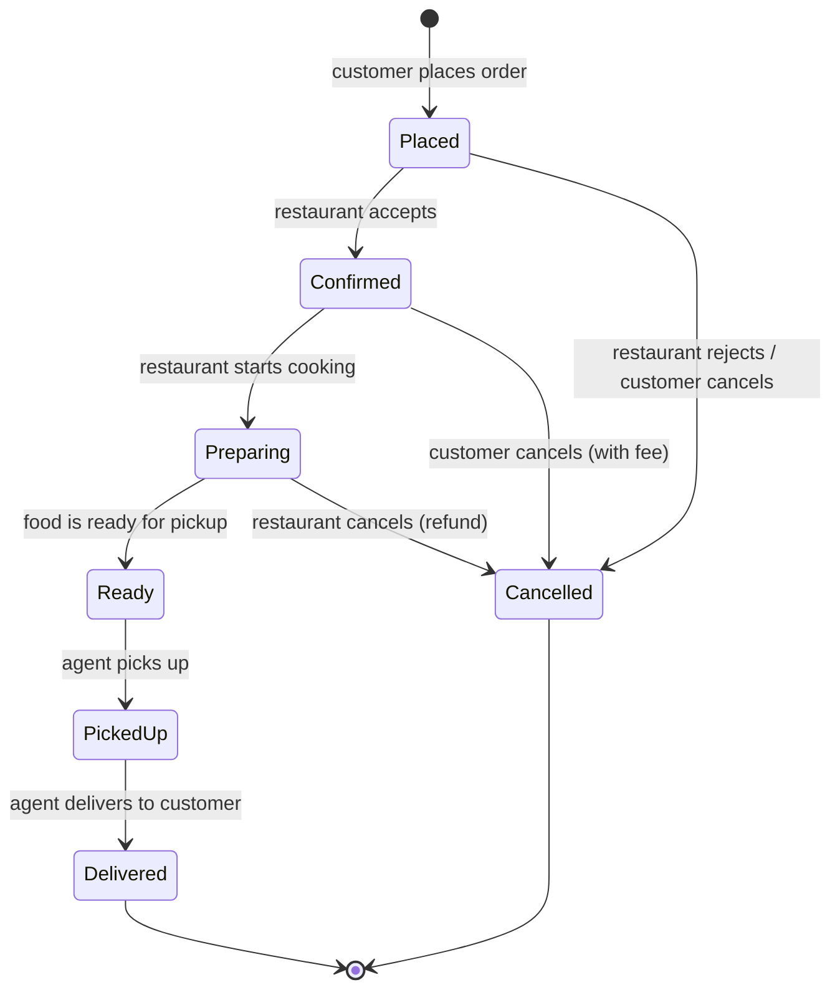
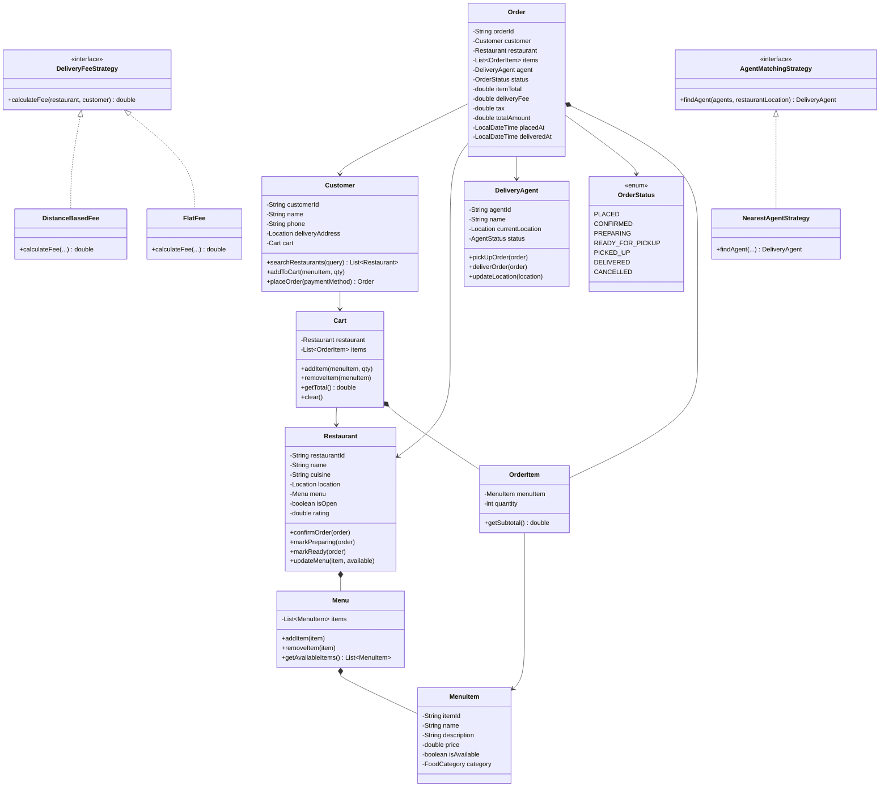
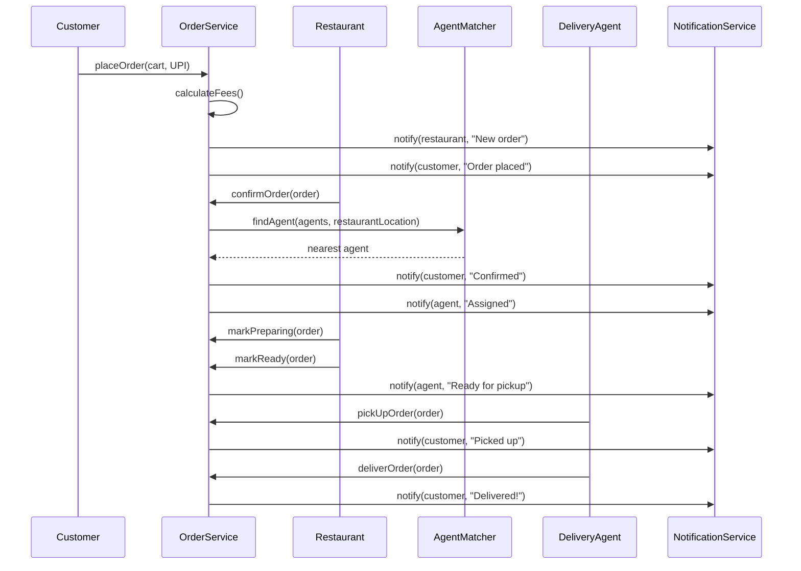

# Module 12 — LLD Problem: Food Delivery (Swiggy/Zomato)

> **Prerequisites**: Modules [01–07](./00_README.md), [Module 11 → Ride-sharing](./11_LLD_Ride_Sharing.md) (similar patterns)  
> **Next**: [Module 13 → Concurrency in LLD](./13_Concurrency_in_LLD.md)

---

## Why This Problem?

Food delivery combines concepts from Parking Lot (slot management), Library (lifecycle), and Ride-sharing (matching, notifications, pricing). It adds new challenges:
- **Multi-party coordination** — Customer, Restaurant, Delivery Agent — three stakeholders per order
- **Order lifecycle** — more complex than a ride (involves restaurant preparation time)
- **Menu management** — restaurants have menus with items, availability, pricing
- **Delivery assignment** — match the best delivery agent (nearest to restaurant, not customer)
- **Restaurant search** — filter by cuisine, rating, distance

This is frequently asked at Swiggy, Zomato, DoorDash, and Uber Eats interviews.

---

## Table of Contents

1. [Step 1: Requirements Gathering](#step-1-requirements-gathering)
2. [Step 2: Identify Core Objects](#step-2-identify-core-objects)
3. [Step 3: Order Lifecycle](#step-3-order-lifecycle)
4. [Step 4: Class Diagram](#step-4-class-diagram)
5. [Step 5: Code Implementation](#step-5-code-implementation)
6. [Step 6: Patterns Applied & Interview Follow-ups](#step-6-patterns-applied--interview-follow-ups)

---

## Step 1: Requirements Gathering

### Functional Requirements

1. **Customers** can search for restaurants by name, cuisine, or rating
2. Customers can browse a restaurant's **menu** and add items to a **cart**
3. Customers can place an **order** from a single restaurant
4. The system calculates the **bill** (item total + delivery fee + taxes)
5. **Restaurants** can update their menu (add/remove items, mark unavailable)
6. Once an order is placed, the **restaurant confirms** and starts preparing
7. The system assigns a **delivery agent** (nearest to the restaurant)
8. The delivery agent picks up the order and delivers to the customer
9. **Real-time notifications** at each stage (order confirmed, preparing, picked up, delivered)
10. Customers and delivery agents can **rate** each other after delivery
11. Support **multiple payment methods** (Cash, UPI, Card)
12. Customers can **cancel** an order (with conditions based on order status)

### Non-Functional Requirements

- Concurrent order placement from many customers
- Restaurant menus can update in real-time
- Low-latency delivery agent matching

---

## Step 2: Identify Core Objects

| Noun | Class | Notes |
|------|-------|-------|
| Customer | `Customer` | Searches, orders, rates |
| Restaurant | `Restaurant` | Has menu, location, rating |
| Menu | `Menu` | Collection of menu items |
| Menu Item | `MenuItem` | Name, price, availability |
| Cart | `Cart` | Customer's cart before ordering |
| Order | `Order` | Central lifecycle entity |
| Order Item | `OrderItem` | MenuItem + quantity in an order |
| Delivery Agent | `DeliveryAgent` | Picks up and delivers |
| Order Status | `OrderStatus` (enum) | PLACED → CONFIRMED → PREPARING → READY → PICKED_UP → DELIVERED / CANCELLED |
| Agent Status | `AgentStatus` (enum) | AVAILABLE, ON_DELIVERY, OFFLINE |
| Delivery Fee | `DeliveryFeeStrategy` (interface) | Strategy for fee calculation |
| Agent Matching | `AgentMatchingStrategy` (interface) | Strategy for agent assignment |
| Payment | `PaymentMethod` (interface) | Cash, UPI, Card |
| Notification | `NotificationService` (interface) | Push notifications |
| Order Service | `OrderService` | Orchestrator |

---

## Step 3: Order Lifecycle



### Key Design Decision: Who Triggers Each Transition?

| Transition | Triggered by |
|---|---|
| Placed → Confirmed | Restaurant |
| Confirmed → Preparing | Restaurant |
| Preparing → Ready | Restaurant |
| Ready → PickedUp | Delivery Agent |
| PickedUp → Delivered | Delivery Agent |
| Any → Cancelled | Customer (early stages), Restaurant (preparation issues), System (timeout) |

---

## Step 4: Class Diagram



---

## Step 5: Code Implementation

### Enums

```java
public enum OrderStatus {
    PLACED, CONFIRMED, PREPARING, READY_FOR_PICKUP, PICKED_UP, DELIVERED, CANCELLED
}
public enum AgentStatus { AVAILABLE, ON_DELIVERY, OFFLINE }
public enum FoodCategory { STARTER, MAIN_COURSE, DESSERT, BEVERAGE, SNACK }
```

### MenuItem, Menu, OrderItem

```java
public class MenuItem {
    private final String itemId;
    private final String name;
    private final String description;
    private double price;
    private boolean isAvailable;
    private final FoodCategory category;

    public MenuItem(String itemId, String name, String description,
                    double price, FoodCategory category) {
        this.itemId = itemId;
        this.name = name;
        this.description = description;
        this.price = price;
        this.category = category;
        this.isAvailable = true;
    }

    public void setAvailable(boolean available) { this.isAvailable = available; }
    public boolean isAvailable() { return isAvailable; }
    public String getItemId() { return itemId; }
    public String getName() { return name; }
    public double getPrice() { return price; }
    public void setPrice(double price) { this.price = price; }
}

public class Menu {
    private final List<MenuItem> items = new ArrayList<>();

    public void addItem(MenuItem item) { items.add(item); }

    public void removeItem(MenuItem item) { items.remove(item); }

    public List<MenuItem> getAvailableItems() {
        return items.stream()
                .filter(MenuItem::isAvailable)
                .collect(Collectors.toList());
    }

    public MenuItem findById(String itemId) {
        return items.stream()
                .filter(i -> i.getItemId().equals(itemId))
                .findFirst()
                .orElse(null);
    }
}

public class OrderItem {
    private final MenuItem menuItem;
    private final int quantity;

    public OrderItem(MenuItem menuItem, int quantity) {
        this.menuItem = menuItem;
        this.quantity = quantity;
    }

    public double getSubtotal() { return menuItem.getPrice() * quantity; }
    public MenuItem getMenuItem() { return menuItem; }
    public int getQuantity() { return quantity; }
}
```

### Cart

```java
public class Cart {
    private Restaurant restaurant;
    private final List<OrderItem> items = new ArrayList<>();

    public void addItem(Restaurant restaurant, MenuItem menuItem, int quantity) {
        // Enforce single-restaurant cart
        if (this.restaurant != null && !this.restaurant.equals(restaurant)) {
            throw new IllegalStateException(
                "Cart already has items from " + this.restaurant.getName() +
                ". Clear cart before ordering from another restaurant.");
        }
        this.restaurant = restaurant;

        if (!menuItem.isAvailable()) {
            throw new IllegalStateException(menuItem.getName() + " is not available.");
        }

        // Check if item already in cart — update quantity
        for (int i = 0; i < items.size(); i++) {
            if (items.get(i).getMenuItem().getItemId().equals(menuItem.getItemId())) {
                items.set(i, new OrderItem(menuItem, items.get(i).getQuantity() + quantity));
                return;
            }
        }
        items.add(new OrderItem(menuItem, quantity));
    }

    public void removeItem(String itemId) {
        items.removeIf(i -> i.getMenuItem().getItemId().equals(itemId));
        if (items.isEmpty()) restaurant = null;
    }

    public double getTotal() {
        return items.stream().mapToDouble(OrderItem::getSubtotal).sum();
    }

    public void clear() {
        items.clear();
        restaurant = null;
    }

    public boolean isEmpty() { return items.isEmpty(); }
    public Restaurant getRestaurant() { return restaurant; }
    public List<OrderItem> getItems() { return Collections.unmodifiableList(items); }
}
```

### Restaurant & Customer

```java
public class Restaurant {
    private final String restaurantId;
    private final String name;
    private final String cuisine;
    private final Location location;
    private final Menu menu;
    private boolean isOpen;
    private double rating;

    public Restaurant(String id, String name, String cuisine, Location location) {
        this.restaurantId = id;
        this.name = name;
        this.cuisine = cuisine;
        this.location = location;
        this.menu = new Menu();
        this.isOpen = true;
        this.rating = 4.0;
    }

    public void addMenuItem(MenuItem item) { menu.addItem(item); }

    public void setItemAvailability(String itemId, boolean available) {
        MenuItem item = menu.findById(itemId);
        if (item != null) item.setAvailable(available);
    }

    // Getters
    public String getRestaurantId() { return restaurantId; }
    public String getName() { return name; }
    public String getCuisine() { return cuisine; }
    public Location getLocation() { return location; }
    public Menu getMenu() { return menu; }
    public boolean isOpen() { return isOpen; }
    public void setOpen(boolean open) { this.isOpen = open; }
    public double getRating() { return rating; }
}

public class Customer {
    private final String customerId;
    private final String name;
    private final String phone;
    private Location deliveryAddress;
    private final Cart cart = new Cart();

    public Customer(String id, String name, String phone, Location address) {
        this.customerId = id;
        this.name = name;
        this.phone = phone;
        this.deliveryAddress = address;
    }

    public void addToCart(Restaurant restaurant, MenuItem item, int qty) {
        cart.addItem(restaurant, item, qty);
    }

    public Cart getCart() { return cart; }
    public String getCustomerId() { return customerId; }
    public String getName() { return name; }
    public Location getDeliveryAddress() { return deliveryAddress; }
}
```

### DeliveryAgent

```java
public class DeliveryAgent {
    private final String agentId;
    private final String name;
    private final String phone;
    private Location currentLocation;
    private AgentStatus status;

    public DeliveryAgent(String id, String name, String phone) {
        this.agentId = id;
        this.name = name;
        this.phone = phone;
        this.status = AgentStatus.AVAILABLE;
    }

    public void updateLocation(Location location) { this.currentLocation = location; }

    public boolean isAvailable() { return status == AgentStatus.AVAILABLE; }
    public String getAgentId() { return agentId; }
    public String getName() { return name; }
    public Location getCurrentLocation() { return currentLocation; }
    public AgentStatus getStatus() { return status; }
    public void setStatus(AgentStatus status) { this.status = status; }
}
```

### Order

```java
public class Order {
    private final String orderId;
    private final Customer customer;
    private final Restaurant restaurant;
    private final List<OrderItem> items;
    private DeliveryAgent agent;
    private OrderStatus status;

    private final double itemTotal;
    private final double deliveryFee;
    private final double tax;
    private final double totalAmount;

    private final LocalDateTime placedAt;
    private LocalDateTime deliveredAt;

    public Order(Customer customer, Restaurant restaurant, List<OrderItem> items,
                 double deliveryFee, double taxRate) {
        this.orderId = "ORD-" + UUID.randomUUID().toString().substring(0, 6).toUpperCase();
        this.customer = customer;
        this.restaurant = restaurant;
        this.items = new ArrayList<>(items);
        this.status = OrderStatus.PLACED;
        this.placedAt = LocalDateTime.now();

        this.itemTotal = items.stream().mapToDouble(OrderItem::getSubtotal).sum();
        this.deliveryFee = deliveryFee;
        this.tax = itemTotal * taxRate;
        this.totalAmount = itemTotal + this.deliveryFee + this.tax;
    }

    public void confirm() { this.status = OrderStatus.CONFIRMED; }
    public void markPreparing() { this.status = OrderStatus.PREPARING; }
    public void markReady() { this.status = OrderStatus.READY_FOR_PICKUP; }
    public void markPickedUp() { this.status = OrderStatus.PICKED_UP; }

    public void markDelivered() {
        this.status = OrderStatus.DELIVERED;
        this.deliveredAt = LocalDateTime.now();
    }

    public void cancel() { this.status = OrderStatus.CANCELLED; }

    public void assignAgent(DeliveryAgent agent) { this.agent = agent; }

    // Getters
    public String getOrderId() { return orderId; }
    public Customer getCustomer() { return customer; }
    public Restaurant getRestaurant() { return restaurant; }
    public DeliveryAgent getAgent() { return agent; }
    public OrderStatus getStatus() { return status; }
    public double getTotalAmount() { return totalAmount; }
    public double getItemTotal() { return itemTotal; }
    public double getDeliveryFee() { return deliveryFee; }
    public double getTax() { return tax; }
}
```

### Strategies

```java
// Delivery Fee Strategy
public interface DeliveryFeeStrategy {
    double calculateFee(Location restaurantLocation, Location customerLocation);
}

public class DistanceBasedFee implements DeliveryFeeStrategy {
    private static final double BASE_FEE = 20.0;
    private static final double PER_KM_FEE = 5.0;
    private static final double FREE_DELIVERY_RADIUS_KM = 3.0;

    @Override
    public double calculateFee(Location restaurant, Location customer) {
        double distance = restaurant.distanceTo(customer);
        if (distance <= FREE_DELIVERY_RADIUS_KM) return BASE_FEE;
        return BASE_FEE + (distance - FREE_DELIVERY_RADIUS_KM) * PER_KM_FEE;
    }
}

// Agent Matching Strategy
public interface AgentMatchingStrategy {
    DeliveryAgent findAgent(List<DeliveryAgent> agents, Location restaurantLocation);
}

public class NearestAgentStrategy implements AgentMatchingStrategy {
    @Override
    public DeliveryAgent findAgent(List<DeliveryAgent> agents, Location restaurantLoc) {
        return agents.stream()
                .filter(DeliveryAgent::isAvailable)
                .filter(a -> a.getCurrentLocation() != null)
                .min(Comparator.comparingDouble(
                        a -> a.getCurrentLocation().distanceTo(restaurantLoc)))
                .orElse(null);
    }
}
```

### OrderService (Orchestrator)

```java
public class OrderService {
    private final List<Restaurant> restaurants = new ArrayList<>();
    private final List<DeliveryAgent> agents = new ArrayList<>();
    private final DeliveryFeeStrategy feeStrategy;
    private final AgentMatchingStrategy agentStrategy;
    private final NotificationService notificationService;
    private static final double TAX_RATE = 0.05;  // 5% GST

    public OrderService(DeliveryFeeStrategy feeStrategy,
                        AgentMatchingStrategy agentStrategy,
                        NotificationService notificationService) {
        this.feeStrategy = feeStrategy;
        this.agentStrategy = agentStrategy;
        this.notificationService = notificationService;
    }

    public void registerRestaurant(Restaurant r) { restaurants.add(r); }
    public void registerAgent(DeliveryAgent a) { agents.add(a); }

    // --- Search ---
    public List<Restaurant> searchByName(String query) {
        return restaurants.stream()
                .filter(Restaurant::isOpen)
                .filter(r -> r.getName().toLowerCase().contains(query.toLowerCase()))
                .collect(Collectors.toList());
    }

    public List<Restaurant> searchByCuisine(String cuisine) {
        return restaurants.stream()
                .filter(Restaurant::isOpen)
                .filter(r -> r.getCuisine().equalsIgnoreCase(cuisine))
                .sorted(Comparator.comparingDouble(Restaurant::getRating).reversed())
                .collect(Collectors.toList());
    }

    // --- Place Order ---
    public Order placeOrder(Customer customer, PaymentMethod paymentMethod) {
        Cart cart = customer.getCart();
        if (cart.isEmpty()) {
            throw new IllegalStateException("Cart is empty");
        }

        Restaurant restaurant = cart.getRestaurant();
        double deliveryFee = feeStrategy.calculateFee(
                restaurant.getLocation(), customer.getDeliveryAddress());

        Order order = new Order(customer, restaurant, cart.getItems(), deliveryFee, TAX_RATE);

        System.out.printf("\n🛒 Order %s placed by %s from %s\n", order.getOrderId(),
                customer.getName(), restaurant.getName());
        System.out.printf("   Items: ₹%.2f | Delivery: ₹%.2f | Tax: ₹%.2f | Total: ₹%.2f\n",
                order.getItemTotal(), order.getDeliveryFee(),
                order.getTax(), order.getTotalAmount());

        // Process payment
        paymentMethod.pay(order.getTotalAmount(), customer);

        cart.clear();

        notificationService.notify(restaurant.getRestaurantId(),
                "New order " + order.getOrderId() + " received!");
        notificationService.notify(customer.getCustomerId(),
                "Order " + order.getOrderId() + " placed successfully!");

        return order;
    }

    // --- Restaurant confirms and prepares ---
    public void confirmOrder(Order order) {
        order.confirm();
        System.out.printf("   ✅ Restaurant confirmed order %s\n", order.getOrderId());

        notificationService.notify(order.getCustomer().getCustomerId(),
                "Your order is confirmed!");

        // Assign delivery agent
        DeliveryAgent agent = agentStrategy.findAgent(
                agents, order.getRestaurant().getLocation());
        if (agent != null) {
            order.assignAgent(agent);
            agent.setStatus(AgentStatus.ON_DELIVERY);
            System.out.printf("   🏍 Agent %s assigned (%.1f km from restaurant)\n",
                    agent.getName(),
                    agent.getCurrentLocation().distanceTo(order.getRestaurant().getLocation()));
        } else {
            System.out.println("   ⚠️ No delivery agent available. Will retry...");
        }
    }

    public void markPreparing(Order order) {
        order.markPreparing();
        System.out.printf("   🍳 Order %s is being prepared\n", order.getOrderId());
        notificationService.notify(order.getCustomer().getCustomerId(),
                "Your food is being prepared!");
    }

    public void markReady(Order order) {
        order.markReady();
        System.out.printf("   ✅ Order %s is ready for pickup\n", order.getOrderId());
        if (order.getAgent() != null) {
            notificationService.notify(order.getAgent().getAgentId(),
                    "Order " + order.getOrderId() + " is ready. Please pick up.");
        }
    }

    // --- Delivery Agent actions ---
    public void pickUpOrder(Order order) {
        order.markPickedUp();
        System.out.printf("   📦 Agent %s picked up order %s\n",
                order.getAgent().getName(), order.getOrderId());
        notificationService.notify(order.getCustomer().getCustomerId(),
                order.getAgent().getName() + " has picked up your order!");
    }

    public void deliverOrder(Order order) {
        order.markDelivered();
        order.getAgent().setStatus(AgentStatus.AVAILABLE);
        System.out.printf("   🎉 Order %s delivered!\n", order.getOrderId());
        notificationService.notify(order.getCustomer().getCustomerId(),
                "Your order has been delivered! Enjoy your meal.");
    }

    // --- Cancel ---
    public void cancelOrder(Order order, String reason) {
        OrderStatus currentStatus = order.getStatus();
        boolean canCancel = (currentStatus == OrderStatus.PLACED
                || currentStatus == OrderStatus.CONFIRMED);

        if (!canCancel) {
            System.out.println("   ❌ Cannot cancel — order is already " + currentStatus);
            return;
        }

        order.cancel();
        if (order.getAgent() != null) {
            order.getAgent().setStatus(AgentStatus.AVAILABLE);
        }
        System.out.printf("   ❌ Order %s cancelled. Reason: %s\n",
                order.getOrderId(), reason);
    }
}
```

### Putting It Together

```java
public class Main {
    public static void main(String[] args) {
        // Notification (simplified)
        NotificationService notifier = (id, msg) ->
                System.out.printf("   [Notify → %s] %s\n", id, msg);

        // Payment
        PaymentMethod upi = new PaymentMethod() {
            public boolean pay(double amount, Customer c) {
                System.out.printf("   💳 UPI payment of ₹%.2f successful\n", amount);
                return true;
            }
            public String getType() { return "UPI"; }
        };

        // Service setup
        OrderService service = new OrderService(
                new DistanceBasedFee(),
                new NearestAgentStrategy(),
                notifier
        );

        // Restaurant
        Restaurant biryaniHouse = new Restaurant("R1", "Paradise Biryani",
                "Indian", new Location(12.9716, 77.5946));
        MenuItem biryani = new MenuItem("M1", "Hyderabadi Biryani",
                "Aromatic rice with spices", 350.0, FoodCategory.MAIN_COURSE);
        MenuItem raita = new MenuItem("M2", "Raita",
                "Yogurt side", 60.0, FoodCategory.STARTER);
        biryaniHouse.addMenuItem(biryani);
        biryaniHouse.addMenuItem(raita);
        service.registerRestaurant(biryaniHouse);

        // Delivery Agent
        DeliveryAgent agent = new DeliveryAgent("A1", "Suresh", "9999999999");
        agent.updateLocation(new Location(12.9730, 77.5960));
        service.registerAgent(agent);

        // Customer
        Customer priya = new Customer("C1", "Priya", "9123456789",
                new Location(12.9350, 77.6240));

        // --- Full Order Flow ---
        priya.addToCart(biryaniHouse, biryani, 2);
        priya.addToCart(biryaniHouse, raita, 1);

        Order order = service.placeOrder(priya, upi);
        service.confirmOrder(order);
        service.markPreparing(order);
        service.markReady(order);
        service.pickUpOrder(order);
        service.deliverOrder(order);
    }
}
```

**Expected output:**
```
🛒 Order ORD-A1B2C3 placed by Priya from Paradise Biryani
   Items: ₹760.00 | Delivery: ₹30.00 | Tax: ₹38.00 | Total: ₹828.00
   💳 UPI payment of ₹828.00 successful
   [Notify → R1] New order ORD-A1B2C3 received!
   [Notify → C1] Order ORD-A1B2C3 placed successfully!
   ✅ Restaurant confirmed order ORD-A1B2C3
   [Notify → C1] Your order is confirmed!
   🏍 Agent Suresh assigned (0.2 km from restaurant)
   🍳 Order ORD-A1B2C3 is being prepared
   [Notify → C1] Your food is being prepared!
   ✅ Order ORD-A1B2C3 is ready for pickup
   [Notify → A1] Order ORD-A1B2C3 is ready. Please pick up.
   📦 Agent Suresh picked up order ORD-A1B2C3
   [Notify → C1] Suresh has picked up your order!
   🎉 Order ORD-A1B2C3 delivered!
   [Notify → C1] Your order has been delivered! Enjoy your meal.
```

---

## Step 6: Patterns Applied & Interview Follow-ups

### Patterns Summary

| Pattern | Where | Why |
|---------|-------|-----|
| **Strategy** | `DeliveryFeeStrategy` | Distance-based, flat fee, free delivery promo — swappable |
| **Strategy** | `AgentMatchingStrategy` | Nearest, highest-rated, load-balanced — swappable |
| **Strategy** | `PaymentMethod` | Cash, UPI, Card, Wallet |
| **Observer** | `NotificationService` | Customer, restaurant, agent get notified at each status change |
| **State** | `OrderStatus` transitions | Could refactor to State Pattern (each status controls allowed transitions) |
| **Composition** | `Cart *-- OrderItem --> MenuItem` | Cart composes order items, which reference menu items |

### Full System Flow



### Interview Follow-ups

**"How would you handle ordering from multiple restaurants?"**
> Two approaches: (a) Separate orders — one order per restaurant, each with its own delivery agent and fee. (b) Multi-restaurant order — a parent `GroupOrder` that contains multiple `Order` objects. Each sub-order is tracked independently. The system coordinates delivery timing.

**"How would you implement restaurant recommendations?"**
> Create a `RecommendationStrategy` interface with implementations: `PopularityBased`, `CollaborativeFiltering` (users who liked X also liked Y), `LocationBased`. Combine them with a `HybridRecommendation` that weights multiple strategies.

**"How would you handle delivery agent unavailability?"**
> Implement a retry mechanism with exponential backoff. If no agent is found within 3 attempts, expand the search radius. If still none, notify the customer with an ETA for agent availability. Use a `DeliveryAgentPool` with a `BlockingQueue` pattern.

**"How would you handle restaurant closing mid-order?"**
> Add a `canAcceptOrders()` check before `placeOrder()`. If the restaurant closes after an order is placed but before confirmation, auto-cancel with full refund. If food is already being prepared, let it complete but block new orders.

**"How would you implement coupons/discounts?"**
> Use the **Decorator pattern** on pricing: `DiscountedOrder` wraps a regular `Order` and overrides `getTotalAmount()` to apply the coupon. Or use a separate `CouponService` with validation logic (one-time use, minimum order, specific restaurant, etc.).

---

> ✅ **Module 12 Complete**  
> **Next**: [Module 13 → Concurrency in LLD](./13_Concurrency_in_LLD.md) — how LLD meets multi-threading.
