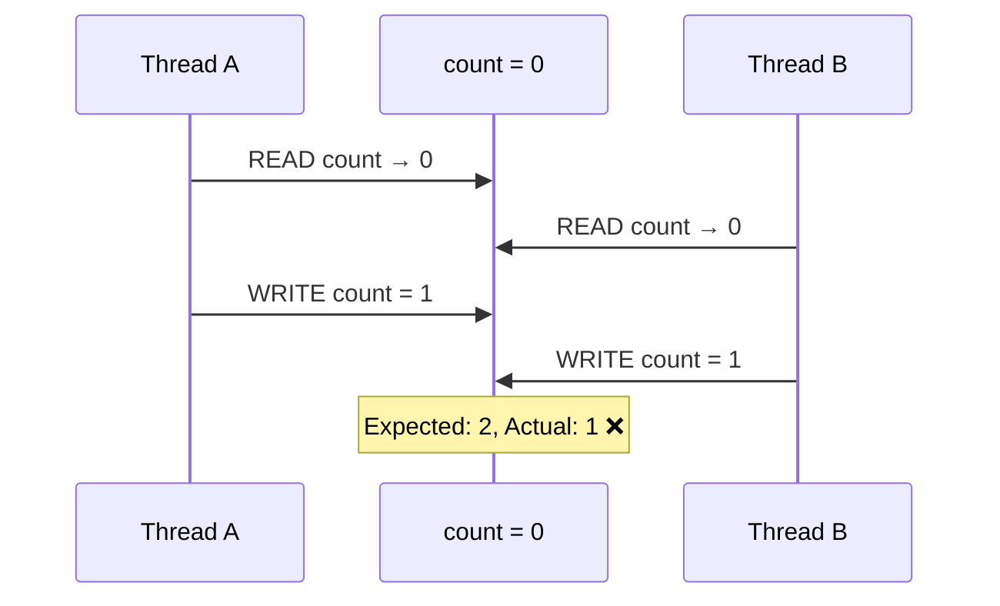
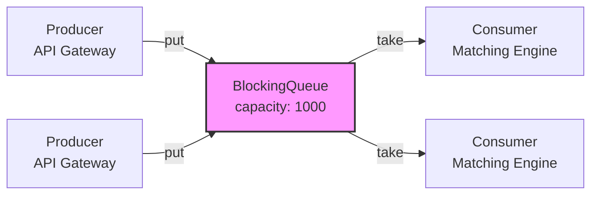
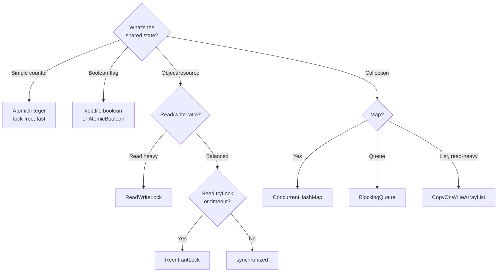

# Module 13 — Concurrency in LLD

> **Prerequisites**: Modules [01–07](./00_README.md) (all patterns), [Modules 08–12](./00_README.md) (LLD problems — they reference concurrency)  
> **Next**: [Module 14 → LLD Interview Playbook](./14_Interview_Playbook.md)

---

## Why Does This Module Exist?

Every LLD problem you've solved so far has a hidden assumption: **single-threaded execution**. In reality:
- Two cars arrive at the parking lot entrance **simultaneously** → both get assigned the same spot?
- Two riders request rides at the **same instant** → both get matched to the same driver?
- Two customers checkout the **last book copy** at the same time → both succeed?

These are **race conditions**, and they cause real production bugs. In a senior-level LLD interview, the interviewer will often ask: *"How would you handle concurrency here?"*

This module equips you with the concurrency patterns and primitives you need to answer that question confidently.

---

## Table of Contents

1. [The Fundamental Problem: Race Conditions](#1-the-fundamental-problem-race-conditions)
2. [synchronized & Intrinsic Locks](#2-synchronized--intrinsic-locks)
3. [ReentrantLock](#3-reentrantlock)
4. [Atomic Variables](#4-atomic-variables)
5. [volatile Keyword](#5-volatile-keyword)
6. [Producer-Consumer Pattern](#6-producer-consumer-pattern)
7. [Read-Write Locks](#7-read-write-locks)
8. [ConcurrentHashMap & Thread-Safe Collections](#8-concurrenthashmap--thread-safe-collections)
9. [Applying Concurrency to LLD Problems](#9-applying-concurrency-to-lld-problems)
10. [Common Pitfalls](#10-common-pitfalls)
11. [Interview Cheatsheet](#11-interview-cheatsheet)

---

## 1. The Fundamental Problem: Race Conditions

### What Is a Race Condition?

A race condition occurs when two or more threads access shared mutable state concurrently, and at least one thread modifies it. The result depends on the unpredictable order of execution.

```java
// ❌ NOT THREAD-SAFE
class Counter {
    private int count = 0;

    public void increment() {
        count++;  // This is NOT atomic!
        // Actually 3 operations:
        // 1. READ count from memory
        // 2. ADD 1
        // 3. WRITE result back to memory
    }

    public int getCount() { return count; }
}

// Two threads incrementing simultaneously:
// Thread A: READ count (0)
// Thread B: READ count (0)     ← both read 0
// Thread A: WRITE count (1)
// Thread B: WRITE count (1)    ← should be 2, but it's 1!
```

### Visual



---

## 2. synchronized & Intrinsic Locks

### The Solution

The `synchronized` keyword ensures that only **one thread at a time** can execute a block of code that accesses shared state.

```java
class ThreadSafeCounter {
    private int count = 0;

    // Method-level synchronization — locks on 'this' object
    public synchronized void increment() {
        count++;  // only one thread executes this at a time
    }

    public synchronized int getCount() {
        return count;
    }
}
```

### Block-Level Synchronization (More Granular)

```java
class ParkingSpot {
    private boolean isAvailable = true;
    private Vehicle parkedVehicle;
    private final Object lock = new Object();  // dedicated lock object

    public boolean assignVehicle(Vehicle vehicle) {
        synchronized (lock) {  // only lock this critical section, not the whole object
            if (!isAvailable) return false;
            this.parkedVehicle = vehicle;
            this.isAvailable = false;
            return true;
        }
    }

    public void removeVehicle() {
        synchronized (lock) {
            this.parkedVehicle = null;
            this.isAvailable = true;
        }
    }

    // This method doesn't modify state — no lock needed
    public boolean isAvailable() {
        return isAvailable;
    }
}
```

### Key Insight

> `synchronized` is the simplest concurrency tool. Use it when:
> - The critical section is short
> - You don't need advanced features (tryLock, timeout, fairness)
> - Performance under high contention isn't a concern

---

## 3. ReentrantLock

### When synchronized Isn't Enough

`synchronized` blocks unconditionally — if the lock is held, the thread waits forever. `ReentrantLock` gives you more control.

```java
import java.util.concurrent.locks.ReentrantLock;

class DriverPool {
    private final List<Driver> availableDrivers = new ArrayList<>();
    private final ReentrantLock lock = new ReentrantLock();

    public Driver assignDriver(Location pickup) {
        lock.lock();
        try {
            Driver nearest = availableDrivers.stream()
                    .min(Comparator.comparingDouble(
                            d -> d.getLocation().distanceTo(pickup)))
                    .orElse(null);

            if (nearest != null) {
                availableDrivers.remove(nearest);
            }
            return nearest;
        } finally {
            lock.unlock();  // ALWAYS unlock in finally — even if exception occurs
        }
    }

    public void releaseDriver(Driver driver) {
        lock.lock();
        try {
            availableDrivers.add(driver);
        } finally {
            lock.unlock();
        }
    }
}
```

### tryLock — Non-Blocking Attempt

```java
class SharedResource {
    private final ReentrantLock lock = new ReentrantLock();

    public boolean tryProcess() {
        // Try to acquire lock — return immediately if can't
        if (lock.tryLock()) {
            try {
                // do work
                return true;
            } finally {
                lock.unlock();
            }
        } else {
            System.out.println("Resource busy, skipping...");
            return false;
        }
    }

    // With timeout
    public boolean tryProcessWithTimeout() throws InterruptedException {
        if (lock.tryLock(500, TimeUnit.MILLISECONDS)) {
            try {
                // do work
                return true;
            } finally {
                lock.unlock();
            }
        }
        return false;
    }
}
```

### synchronized vs ReentrantLock

| Feature | synchronized | ReentrantLock |
|---------|-------------|---------------|
| Lock/unlock | Automatic (block scope) | Manual (`lock()`/`unlock()`) |
| Try without blocking | ❌ | ✅ `tryLock()` |
| Timeout | ❌ | ✅ `tryLock(timeout)` |
| Fairness (FIFO order) | ❌ | ✅ `new ReentrantLock(true)` |
| Interruptible | ❌ | ✅ `lockInterruptibly()` |
| Multiple conditions | One (via `wait/notify`) | Multiple `Condition` objects |
| Risk of forgetting unlock | None (auto) | ⚠️ Must use `finally` block |

---

## 4. Atomic Variables

### When You Just Need a Counter

For simple operations like increment/decrement/compare-and-swap, `java.util.concurrent.atomic` classes are lock-free and much faster than `synchronized`.

```java
import java.util.concurrent.atomic.AtomicInteger;
import java.util.concurrent.atomic.AtomicBoolean;

class ParkingFloor {
    private final AtomicInteger availableSmallSpots = new AtomicInteger(20);
    private final AtomicInteger availableMediumSpots = new AtomicInteger(30);
    private final AtomicInteger availableLargeSpots = new AtomicInteger(10);

    public boolean occupySpot(SpotSize size) {
        AtomicInteger counter = getCounter(size);
        while (true) {
            int current = counter.get();
            if (current <= 0) return false;  // no spots available
            // CAS — Compare And Swap: only update if value hasn't changed
            if (counter.compareAndSet(current, current - 1)) {
                return true;  // successfully decremented
            }
            // If CAS failed, another thread changed the value — retry
        }
    }

    public void freeSpot(SpotSize size) {
        getCounter(size).incrementAndGet();
    }

    private AtomicInteger getCounter(SpotSize size) {
        return switch (size) {
            case SMALL -> availableSmallSpots;
            case MEDIUM -> availableMediumSpots;
            case LARGE -> availableLargeSpots;
        };
    }
}
```

### Key Insight

> Atomic operations use hardware-level **Compare-And-Swap (CAS)** — no locking overhead. Use them when:
> - You need a simple counter, flag, or reference
> - Operations are independent (no multi-variable invariants)
> - High contention is expected

---

## 5. volatile Keyword

### The Visibility Problem

Even without race conditions, threads can see **stale values** because each CPU core caches variables locally.

```java
class Singleton {
    // Without volatile, Thread B might see a partially constructed object
    // because the JVM can reorder instructions
    private static volatile Singleton instance;

    public static Singleton getInstance() {
        if (instance == null) {
            synchronized (Singleton.class) {
                if (instance == null) {
                    instance = new Singleton();
                    // Without volatile, this assignment might be visible
                    // to other threads BEFORE the constructor finishes
                }
            }
        }
        return instance;
    }
}
```

### What volatile Does

1. **Visibility**: Changes to a `volatile` variable are immediately visible to all threads
2. **Prevents reordering**: The JVM can't reorder reads/writes around a volatile access

### What volatile Does NOT Do

- It does **not** make `count++` atomic (still READ-INCREMENT-WRITE)
- It does **not** replace synchronization for compound operations

```java
// ✅ Good use: a simple boolean flag
class GracefulShutdown {
    private volatile boolean running = true;

    public void run() {
        while (running) {  // other thread can set running = false
            // do work
        }
        System.out.println("Shut down gracefully.");
    }

    public void stop() {
        running = false;  // immediately visible to the run() thread
    }
}
```

---

## 6. Producer-Consumer Pattern

### The Problem

One thread produces data (e.g., incoming ride requests), another thread consumes it (e.g., matching engine). Without coordination, the consumer might process the same item twice, or miss items.

### The Solution: BlockingQueue

```java
import java.util.concurrent.BlockingQueue;
import java.util.concurrent.LinkedBlockingQueue;

class RideRequest {
    String riderId;
    Location pickup;
    // ...
}

class RideRequestProducer implements Runnable {
    private final BlockingQueue<RideRequest> queue;

    public RideRequestProducer(BlockingQueue<RideRequest> queue) {
        this.queue = queue;
    }

    @Override
    public void run() {
        try {
            while (true) {
                RideRequest request = receiveFromAPI();  // blocking call
                queue.put(request);  // blocks if queue is full
                System.out.println("Enqueued: " + request.riderId);
            }
        } catch (InterruptedException e) {
            Thread.currentThread().interrupt();
        }
    }

    private RideRequest receiveFromAPI() { return new RideRequest(); }
}

class RideRequestConsumer implements Runnable {
    private final BlockingQueue<RideRequest> queue;
    private final RideService rideService;

    public RideRequestConsumer(BlockingQueue<RideRequest> queue, RideService rideService) {
        this.queue = queue;
        this.rideService = rideService;
    }

    @Override
    public void run() {
        try {
            while (true) {
                RideRequest request = queue.take();  // blocks if queue is empty
                rideService.processRequest(request);
            }
        } catch (InterruptedException e) {
            Thread.currentThread().interrupt();
        }
    }
}

// Wiring
BlockingQueue<RideRequest> queue = new LinkedBlockingQueue<>(1000);  // capacity 1000
new Thread(new RideRequestProducer(queue)).start();
new Thread(new RideRequestConsumer(queue, rideService)).start();
```

### Diagram



---

## 7. Read-Write Locks

### The Problem

A restaurant menu is read 1000x more often than it's updated. Using `synchronized` for reads means only one thread can read at a time — unnecessary bottleneck.

### The Solution

`ReadWriteLock` allows **multiple concurrent readers** but **exclusive access for writers**.

```java
import java.util.concurrent.locks.ReadWriteLock;
import java.util.concurrent.locks.ReentrantReadWriteLock;

class Menu {
    private final List<MenuItem> items = new ArrayList<>();
    private final ReadWriteLock rwLock = new ReentrantReadWriteLock();

    // Multiple threads can read simultaneously
    public List<MenuItem> getAvailableItems() {
        rwLock.readLock().lock();
        try {
            return items.stream()
                    .filter(MenuItem::isAvailable)
                    .collect(Collectors.toList());
        } finally {
            rwLock.readLock().unlock();
        }
    }

    public MenuItem findById(String id) {
        rwLock.readLock().lock();
        try {
            return items.stream()
                    .filter(i -> i.getItemId().equals(id))
                    .findFirst().orElse(null);
        } finally {
            rwLock.readLock().unlock();
        }
    }

    // Only one thread can write — blocks all readers and writers
    public void addItem(MenuItem item) {
        rwLock.writeLock().lock();
        try {
            items.add(item);
        } finally {
            rwLock.writeLock().unlock();
        }
    }

    public void updateAvailability(String itemId, boolean available) {
        rwLock.writeLock().lock();
        try {
            items.stream()
                    .filter(i -> i.getItemId().equals(itemId))
                    .findFirst()
                    .ifPresent(i -> i.setAvailable(available));
        } finally {
            rwLock.writeLock().unlock();
        }
    }
}
```

### When to Use

| Scenario | Best Tool |
|----------|-----------|
| Reads >> Writes | `ReadWriteLock` |
| Reads ≈ Writes | `ReentrantLock` or `synchronized` |
| Simple counter | `AtomicInteger` |
| Boolean flag | `volatile` or `AtomicBoolean` |

---

## 8. ConcurrentHashMap & Thread-Safe Collections

### The Problem

`HashMap` is not thread-safe. Using `Collections.synchronizedMap()` locks the entire map on every operation — poor concurrency.

### ConcurrentHashMap

```java
import java.util.concurrent.ConcurrentHashMap;

class ActiveTicketStore {
    // ConcurrentHashMap: segment-level locking → multiple threads can
    // read/write different segments simultaneously
    private final ConcurrentHashMap<String, ParkingTicket> activeTickets =
            new ConcurrentHashMap<>();

    public void addTicket(ParkingTicket ticket) {
        activeTickets.put(ticket.getTicketId(), ticket);
    }

    public ParkingTicket getTicket(String ticketId) {
        return activeTickets.get(ticketId);
    }

    public ParkingTicket removeTicket(String ticketId) {
        return activeTickets.remove(ticketId);
    }

    // Atomic compute operations
    public void updateTicketStatus(String ticketId, TicketStatus newStatus) {
        activeTickets.computeIfPresent(ticketId, (key, ticket) -> {
            ticket.setStatus(newStatus);  // atomic read-modify-write
            return ticket;
        });
    }

    public int getActiveCount() {
        return (int) activeTickets.values().stream()
                .filter(t -> t.getStatus() == TicketStatus.ACTIVE)
                .count();
    }
}
```

### Thread-Safe Collection Summary

| Need | Use | Why |
|------|-----|-----|
| Thread-safe Map | `ConcurrentHashMap` | Segment-level locking, high throughput |
| Thread-safe List | `CopyOnWriteArrayList` | Great for read-heavy, write-rare |
| Thread-safe Queue | `ConcurrentLinkedQueue` | Non-blocking, lock-free |
| Thread-safe Blocking Queue | `LinkedBlockingQueue` | Producer-consumer |
| Thread-safe Set | `ConcurrentHashMap.newKeySet()` | Backed by ConcurrentHashMap |

---

## 9. Applying Concurrency to LLD Problems

### Parking Lot

```java
// Problem: Two cars arrive simultaneously, both assigned the same spot
// Solution: synchronized on ParkingSpot.assignVehicle()

public class ParkingSpot {
    public synchronized boolean assignVehicle(Vehicle vehicle) {
        if (!isAvailable) return false;   // check
        this.parkedVehicle = vehicle;     // assign
        this.isAvailable = false;         // update
        return true;
    }
}

// Also: ConcurrentHashMap for activeTickets
```

### Ride-Sharing

```java
// Problem: Two riders matched to the same driver
// Solution: AtomicReference + CAS on driver status

class Driver {
    private final AtomicReference<DriverStatus> status =
            new AtomicReference<>(DriverStatus.AVAILABLE);

    // CAS: only one thread can flip AVAILABLE → ON_RIDE
    public boolean tryAssign() {
        return status.compareAndSet(DriverStatus.AVAILABLE, DriverStatus.ON_RIDE);
    }

    public void release() {
        status.set(DriverStatus.AVAILABLE);
    }
}
```

### Elevator System

```java
// Problem: Multiple floors press buttons simultaneously
// Solution: BlockingQueue for requests + ReentrantLock per elevator

class ElevatorController {
    private final BlockingQueue<ElevatorRequest> requestQueue =
            new LinkedBlockingQueue<>();

    // Requests are queued, processed sequentially per elevator
    public void submitRequest(ElevatorRequest request) {
        requestQueue.offer(request);
    }
}
```

### Summary Table

| LLD Problem | Concurrency Challenge | Solution |
|---|---|---|
| Parking Lot | Same spot assigned twice | `synchronized` on `assignVehicle()` |
| Library | Last book copy checked out twice | `synchronized` on `BookItem.checkout()` |
| Elevator | Concurrent button presses | `BlockingQueue` + lock per elevator |
| Ride-sharing | Same driver matched to two riders | `AtomicReference` + CAS |
| Food Delivery | Concurrent order placement | `ConcurrentHashMap` for orders |

---

## 10. Common Pitfalls

### Deadlock

```java
// ❌ Thread A locks lockA then tries lockB
// Thread B locks lockB then tries lockA → DEADLOCK
class DeadlockExample {
    final Object lockA = new Object();
    final Object lockB = new Object();

    void method1() {
        synchronized (lockA) {
            synchronized (lockB) { /* work */ }
        }
    }

    void method2() {
        synchronized (lockB) {     // ← opposite order!
            synchronized (lockA) { /* work */ }
        }
    }
}

// ✅ Fix: Always acquire locks in the SAME ORDER
void method2Fixed() {
    synchronized (lockA) {         // ← same order as method1
        synchronized (lockB) { /* work */ }
    }
}
```

### Other Pitfalls

| Pitfall | Description | Prevention |
|---------|------------|------------|
| **Deadlock** | Two threads wait for each other's locks forever | Always acquire locks in the same order |
| **Livelock** | Threads keep responding to each other but make no progress | Add randomized backoff |
| **Starvation** | A thread never gets the lock (unfair scheduling) | Use `ReentrantLock(true)` (fair) |
| **Over-synchronization** | Locking too much, killing parallelism | Lock only the critical section, not the whole method |
| **Forgetting unlock** | `ReentrantLock` not unlocked → all threads blocked | Always `unlock()` in `finally` |

---

## 11. Interview Cheatsheet

### "How would you handle concurrency?" — Template Answer

> *"I'd identify the shared mutable state — in this case, [X]. I'd use [synchronized/ReentrantLock/AtomicVariable] to protect it. Specifically, [brief explanation]. For read-heavy data like [Y], I'd use a ReadWriteLock. For collections shared across threads, I'd use ConcurrentHashMap instead of HashMap."*

### Quick Decision Guide



---

> ✅ **Module 13 Complete**  
> **Next**: [Module 14 → LLD Interview Playbook](./14_Interview_Playbook.md)
